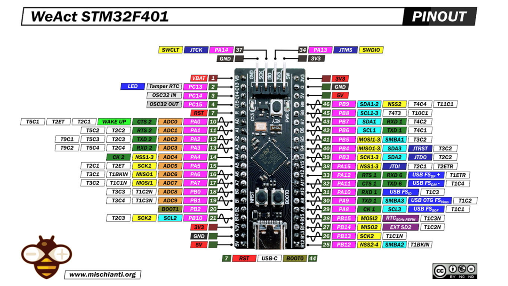
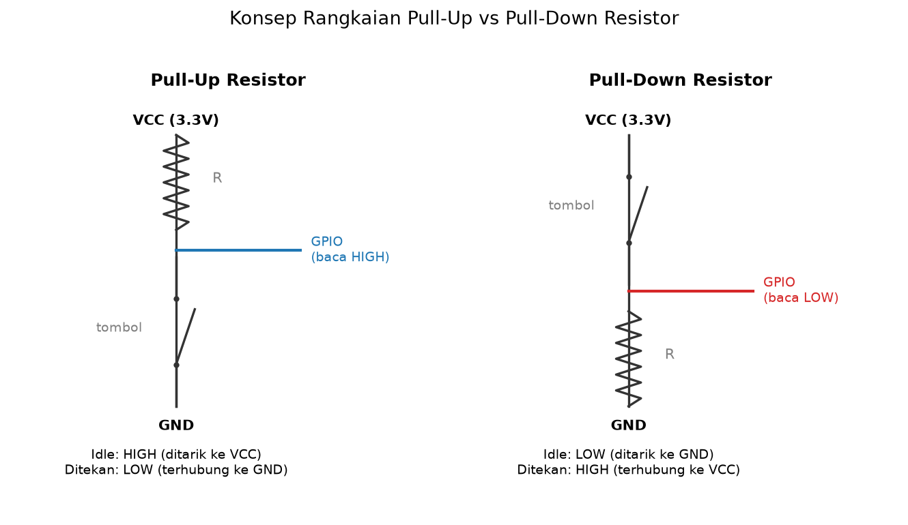
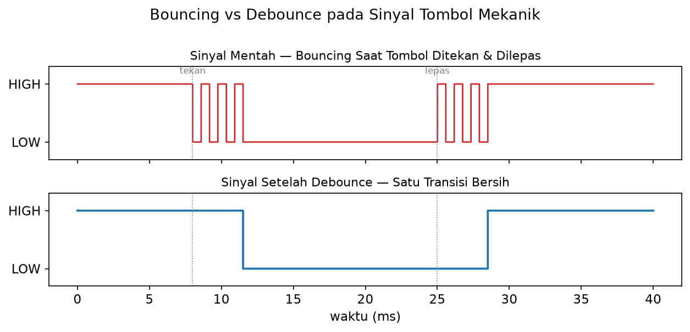
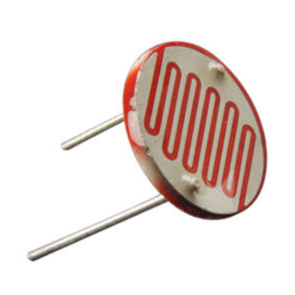

# MODUL 1
# PENGANTAR MIKROKONTROLER & DASAR PEMROGRAMAN

**Mata Kuliah:** Praktikum Mikrokontroler & Embedded System
**Alokasi Waktu:** 5 x Percobaan (@ 100–150 menit)
**Platform:** STM32 Blackpill (Framework Arduino) & ESP32 (Framework ESP-IDF dan Arduino)
**IDE:** VSCode + PlatformIO

---

## Daftar Isi
- [MODUL 1](#modul-1)
- [PENGANTAR MIKROKONTROLER \& DASAR PEMROGRAMAN](#pengantar-mikrokontroler--dasar-pemrograman)
  - [Daftar Isi](#daftar-isi)
  - [A. Capaian Pembelajaran](#a-capaian-pembelajaran)
  - [B. Alat dan Bahan](#b-alat-dan-bahan)
  - [C. Dasar Teori](#c-dasar-teori)
    - [C.1 PlatformIO dan VSCode sebagai Lingkungan Pengembangan](#c1-platformio-dan-vscode-sebagai-lingkungan-pengembangan)
    - [C.2 STM32 Blackpill dan Framework Arduino](#c2-stm32-blackpill-dan-framework-arduino)
    - [C.3 ESP32 dan Framework ESP-IDF](#c3-esp32-dan-framework-esp-idf)
    - [C.4 Konfigurasi Pull-up dan Pull-down Resistor pada Tombol](#c4-konfigurasi-pull-up-dan-pull-down-resistor-pada-tombol)
    - [C.5 Debouncing](#c5-debouncing)
    - [C.6 ADC sebagai Mode Akses GPIO Ketiga](#c6-adc-sebagai-mode-akses-gpio-ketiga)
  - [D. Persiapan Sebelum Praktikum](#d-persiapan-sebelum-praktikum)
  - [E. Kegiatan Praktikum](#e-kegiatan-praktikum)
    - [PERCOBAAN 1 — Pengenalan STM32 Blackpill (Blink)](#percobaan-1--pengenalan-stm32-blackpill-blink)
    - [PERCOBAAN 2 — Pengenalan ESP32 dengan Framework ESP-IDF (Blink)](#percobaan-2--pengenalan-esp32-dengan-framework-esp-idf-blink)
    - [PERCOBAAN 3 — Pull-up dan Pull-down: Eksternal vs Internal (ESP32 + Framework Arduino)](#percobaan-3--pull-up-dan-pull-down-eksternal-vs-internal-esp32--framework-arduino)
    - [PERCOBAAN 4 — Debouncing pada Input Tombol GPIO (ESP32 + Framework Arduino)](#percobaan-4--debouncing-pada-input-tombol-gpio-esp32--framework-arduino)
    - [PERCOBAAN 5 — Akses GPIO Analog: Pembacaan ADC dengan LDR (ESP32 + Framework Arduino)](#percobaan-5--akses-gpio-analog-pembacaan-adc-dengan-ldr-esp32--framework-arduino)
  - [F. Tugas Modul](#f-tugas-modul)
  - [G. Referensi](#g-referensi)

---

## A. Capaian Pembelajaran

Setelah menyelesaikan Modul 1, praktikan mampu:
1. Melakukan instalasi dan konfigurasi PlatformIO pada VSCode sebagai lingkungan pengembangan
2. Menjelaskan arsitektur board STM32 Blackpill dan ESP32, serta membedakan karakteristik framework Arduino dan ESP-IDF
3. Melakukan flashing program Blink ke STM32 Blackpill menggunakan ST-Link (framework Arduino)
4. Melakukan flashing program Blink ke ESP32 menggunakan framework ESP-IDF
5. Mengidentifikasi dan membedakan konfigurasi pembacaan tombol menggunakan pull-up dan pull-down resistor, baik secara eksternal maupun internal
6. Mengimplementasikan pembacaan GPIO untuk konfigurasi pull-up/pull-down eksternal dan internal pada ESP32 menggunakan framework Arduino
7. Mengimplementasikan debouncing pada input tombol berbasis GPIO
8. Menjelaskan ADC sebagai mode akses GPIO ketiga (analog input), selain digital output dan digital input, serta mengimplementasikan pembacaan nilai analog sederhana menggunakan LDR

---

## B. Alat dan Bahan

| No | Nama Komponen | Spesifikasi | Jumlah |
|---|---|---|---|
| 1 | Board STM32 Blackpill | STM32F401CCU6 / STM32F411CEU6 | 1 |
| 2 | ST-Link V2 | programmer/debugger via SWD | 1 |
| 3 | Board ESP32 DevKit | ESP32 DevKit v1 | 1 |
| 4 | Kabel jumper female-female | untuk ST-Link ke Blackpill | 4 |
| 5 | Kabel USB Micro/USB-C | untuk ST-Link dan ESP32 ke PC | 2 |
| 6 | Breadboard | 830 titik | 1 |
| 7 | Kabel jumper male-male | — | secukupnya |
| 8 | LED + resistor 220Ω | untuk uji Blink ESP32 (bila tidak ada LED onboard) | 1 |
| 9 | Pushbutton (tactile) | untuk pull-up/pull-down eksternal & internal (Percobaan 3) dan debouncing (Percobaan 4) | 2 |
| 10 | Resistor | 10kΩ, untuk pull-up eksternal, pull-down eksternal (Percobaan 3), dan pembagi tegangan LDR (Percobaan 5) | 3 |
| 11 | LDR (Light Dependent Resistor) | — | 1 |
| 12 | Laptop/PC | Windows/Mac/Linux, VSCode terinstal | 1 |

---

## C. Dasar Teori

### C.1 PlatformIO dan VSCode sebagai Lingkungan Pengembangan
PlatformIO adalah ekosistem pengembangan embedded yang bersifat cross-platform, mendukung ratusan board dan berbagai framework (Arduino, STM32Cube/HAL, ESP-IDF, dll.) dalam satu antarmuka yang seragam. Satu keunggulan penting PlatformIO adalah kemampuannya menjalankan **framework berbeda pada chip yang sama** — misalnya ESP32 dapat diprogram baik menggunakan framework Arduino (sederhana) maupun ESP-IDF (native, lebih mendalam) — cukup dengan mengubah konfigurasi pada `platformio.ini`.

Struktur project PlatformIO terdiri atas:
- `platformio.ini` — file konfigurasi board, framework, dan upload protocol
- `src/` — folder berisi kode program utama
- `include/` — folder header file
- `lib/` — folder library tambahan

### C.2 STM32 Blackpill dan Framework Arduino
Blackpill adalah development board berbasis mikrokontroler STM32F401/F411 (ARM Cortex-M4, 32-bit). Karakteristik utama:
- CPU ARM Cortex-M4 dengan FPU, clock hingga 84–100 MHz
- Memori Flash 256–512 KB, RAM 64–128 KB
- LED onboard di pin **PC13** (aktif LOW), tombol user di pin **PA0**
- Tidak memiliki programmer onboard — memerlukan **ST-Link** eksternal via protokol **SWD** (SWDIO, SWCLK, GND, 3.3V)

STM32 dapat diprogram menggunakan **framework Arduino** (dikenal sebagai **STM32duino**) — lapisan abstraksi yang menyediakan fungsi-fungsi familiar seperti `pinMode()`, `digitalWrite()`, dan `delay()`, sama seperti pada board Arduino/ESP32 pada umumnya. Framework ini memudahkan pemula memulai pemrograman STM32 tanpa perlu memahami detail register/HAL terlebih dahulu — meskipun di balik layar, framework Arduino ini tetap dibangun di atas **HAL (Hardware Abstraction Layer)**, pustaka resmi STMicroelectronics untuk mengakses peripheral.

Salah satu ciri khas STM32duino adalah dukungan penamaan pin langsung sesuai label port fisik pada board, misalnya `PC13` atau `PA0`, alih-alih hanya nomor pin generik seperti pada board Arduino biasa.



### C.3 ESP32 dan Framework ESP-IDF
ESP32 adalah mikrokontroler 32-bit dual-core (Xtensa LX6) dengan WiFi dan Bluetooth terintegrasi, serta dilengkapi USB-to-Serial bawaan sehingga dapat langsung diprogram melalui kabel USB tanpa programmer eksternal.


**ESP-IDF (Espressif IoT Development Framework)** adalah framework resmi dan native dari Espressif, dibangun di atas FreeRTOS. Berbeda dengan framework Arduino yang menyederhanakan program menjadi `setup()` dan `loop()`, ESP-IDF menggunakan struktur berbasis **task/component** dengan titik masuk program berupa fungsi `app_main()`. ESP-IDF memberi akses lebih penuh ke fitur ESP32 (mis. konfigurasi low-level WiFi, task scheduling FreeRTOS secara langsung) dan umum digunakan pada pengembangan produk IoT tingkat lanjut.

| Aspek | Framework Arduino | Framework ESP-IDF |
|---|---|---|
| Titik masuk program | `setup()` dan `loop()` | `app_main()` |
| Delay/timing | `delay(ms)` | `vTaskDelay(pdMS_TO_TICKS(ms))` |
| Tingkat abstraksi | Tinggi (mudah dipelajari) | Rendah–menengah (lebih native, lebih kuat) |
| Akses fitur RTOS | Tersembunyi/terbatas | Langsung (task, semaphore, queue) |

### C.4 Konfigurasi Pull-up dan Pull-down Resistor pada Tombol
Saat sebuah tombol/pushbutton tidak ditekan dan kedua kakinya tidak terhubung ke jalur tegangan mana pun, pin GPIO yang membacanya berada dalam kondisi ***floating*** — nilainya tidak pasti (bisa terbaca HIGH atau LOW secara acak akibat noise). Untuk mengatasi hal ini, pin GPIO perlu "ditarik" (*pulled*) ke salah satu level tegangan tertentu ketika tombol tidak ditekan, menggunakan resistor:
- **Pull-up Resistor:** menghubungkan pin GPIO ke VCC (3.3V) melalui resistor (umumnya 10kΩ). Saat tombol tidak ditekan, pin terbaca **HIGH**; saat tombol ditekan (menghubungkan pin ke GND), pin terbaca **LOW**.
- **Pull-down Resistor:** menghubungkan pin GPIO ke GND melalui resistor. Saat tombol tidak ditekan, pin terbaca **LOW**; saat tombol ditekan (menghubungkan pin ke VCC), pin terbaca **HIGH** — logika ini berkebalikan dengan konfigurasi pull-up.

Resistor pull-up/pull-down di atas dapat dipasang secara **eksternal** (komponen resistor fisik pada breadboard), maupun diaktifkan secara **internal** melalui firmware tanpa resistor tambahan. ESP32 menyediakan keduanya pada framework Arduino: `pinMode(pin, INPUT_PULLUP)` untuk pull-up internal, dan `pinMode(pin, INPUT_PULLDOWN)` untuk pull-down internal. Perlu diperhatikan bahwa **tidak semua pin GPIO ESP32 mendukung resistor pull internal** — pin input-only (GPIO 34–39) sama sekali tidak memiliki resistor pull-up/pull-down internal, sehingga wajib menggunakan resistor eksternal jika digunakan sebagai input tombol.



### C.5 Debouncing
Kontak mekanik pada tombol/saklar menghasilkan beberapa transisi sinyal HIGH-LOW dalam waktu sangat singkat akibat getaran fisik saat kontak bersentuhan/terlepas ("bouncing"). Tanpa penanganan, satu kali aksi tekan dapat terbaca sebagai beberapa kali event. **Debouncing** memastikan hanya satu transisi valid yang terdeteksi, dengan menunggu sinyal stabil selama periode waktu tertentu (mis. 20–50ms) sebelum event dianggap sah.



### C.6 ADC sebagai Mode Akses GPIO Ketiga
Sejauh ini, GPIO telah digunakan dalam dua mode: **digital output** (Percobaan 1–2, menyalakan LED) dan **digital input** (Percobaan 3–4, membaca status tombol/saklar — hanya mengenal dua kondisi, HIGH atau LOW). Mode ketiga yang juga umum digunakan adalah **analog input**, yaitu membaca tegangan yang berubah secara kontinu (bukan hanya dua kondisi), melalui peripheral **ADC (Analog-to-Digital Converter)**.

ADC mengubah tegangan analog pada suatu pin menjadi nilai digital yang dapat diolah program. ESP32 memiliki ADC internal dengan resolusi default **12-bit** (rentang nilai 0–4095) dan referensi tegangan sekitar **0–3.3V**, diakses melalui fungsi `analogRead(pin)` pada framework Arduino. Perlu diperhatikan bahwa **tidak semua pin GPIO mendukung ADC** — pada ESP32, pin yang mendukung ADC1 (mis. GPIO32–39) lebih disarankan digunakan dibanding ADC2, karena ADC2 memiliki keterbatasan saat modul WiFi sedang aktif.

> **Catatan:** Percobaan ADC pada modul ini hanya memperkenalkan *cara mengakses* GPIO sebagai input analog menggunakan satu sensor sederhana (LDR). Pembahasan lebih lanjut mengenai klasifikasi sensor berdasarkan basis pengukurannya (resistif, kapasitif, induktif, dan basis lain) beserta ragam sensor/aktuator lain akan dibahas lebih mendalam pada **Modul 2**.



---

## D. Persiapan Sebelum Praktikum

Instalasi Visual Studio Code, ekstensi PlatformIO, cara membuat project baru, mengenal toolbar PlatformIO, dan instalasi driver USB (ST-Link untuk STM32, CP2102/CH340 untuk ESP32) sudah dibahas lengkap dan bergambar pada dokumen terpisah: **[setup_vscode_platformio.md](setup_vscode_platformio.md)**. Pastikan seluruh langkah pada dokumen tersebut sudah selesai sebelum melanjutkan ke Bagian E.

Sebelum memulai kegiatan praktikum:
1. Siapkan board STM32 Blackpill + ST-Link, dan board ESP32 DevKit, namun **jangan disambungkan terlebih dahulu** sebelum instruksi pada masing-masing percobaan

---

## E. Kegiatan Praktikum

### PERCOBAAN 1 — Pengenalan STM32 Blackpill (Blink)

**Tujuan:**
Mahasiswa mampu memahami arsitektur board STM Blackpill, dan berhasil melakukan flashing program Blink menggunakan ST-Link (framework Arduino).

**Langkah Kerja:**
1. Pastikan PlatformIO IDE sudah terinstal di VSCode 
2. Buat project baru: **PlatformIO Home → New Project** 
   - Name: `modul1-blink-blackpill`
   - Board: **"Blackpill F411CE"** (atau **"Blackpill F401CC"** sesuai chip pada board)
   - Framework: **Arduino**
3. Pastikan `platformio.ini` berisi:
   ```ini
   [env:blackpill_f411ce]
   platform = ststm32
   board = blackpill_f411ce
   framework = arduino
   upload_protocol = stlink
   debug_tool = stlink
   ```
4. Sambungkan ST-Link ke Blackpill (SWDIO, SWCLK, GND, 3.3V), lalu ST-Link ke PC via USB
5. Tulis kode Blink berikut pada `src/main.cpp` (perhatikan: framework Arduino menggunakan ekstensi `.cpp`)

**Kode Program (Blink STM32 Arduino):**
```cpp
#include <Arduino.h>

#define LED_PIN PC13

void setup()
{
  pinMode(LED_PIN, OUTPUT);
}

void loop()
{
  digitalWrite(LED_PIN, LOW);  // LED onboard aktif LOW -> LOW berarti menyala
  delay(500);
  digitalWrite(LED_PIN, HIGH); // HIGH berarti mati
  delay(500);
}
```

6. **Build**, lalu **Upload** — amati proses flashing pada terminal PlatformIO
7. Amati LED onboard (PC13) berkedip setiap 500ms


**Penjelasan Kode:**
| Baris | Penjelasan |
|---|---|
| `#define LED_PIN PC13` | Framework Arduino pada STM32 (STM32duino) mendukung penamaan pin langsung sesuai label port fisik pada board, tanpa perlu mengonfigurasi struct `GPIO_InitTypeDef` seperti pada HAL |
| `pinMode(LED_PIN, OUTPUT)` | Mengonfigurasi pin sebagai output digital — clock peripheral GPIO diaktifkan otomatis oleh framework di balik layar |
| `digitalWrite(LED_PIN, LOW/HIGH)` | Mengatur level tegangan pin; karena LED onboard Blackpill aktif LOW, nilai `LOW` berarti menyala |
| `delay(500)` | Fungsi delay standar Arduino, satuan milidetik |

**Analisis Setelah Program Berjalan:**
1. Amati kecepatan kedip LED onboard — pastikan sesuai ekspektasi (nyala 500ms, mati 500ms, sehingga berkedip 1 kali per detik)
2. Ubah nilai `delay(500)` menjadi `delay(100)`, **Build & Upload** ulang, lalu amati apakah kecepatan kedip LED 

---

### PERCOBAAN 2 — Pengenalan ESP32 dengan Framework ESP-IDF (Blink)

**Tujuan:**
Mahasiswa mampu memahami arsitektur ESP32 dan struktur program berbasis ESP-IDF, serta berhasil menjalankan program Blink menggunakan framework tersebut.

**Langkah Kerja:**
1. Buat project baru di PlatformIO:
   - Name: `modul1-blink-esp32-idf`
   - Board: **"Espressif ESP32 Dev Module"**
   - Framework: **Espressif IoT Development Framework (ESP-IDF)**
2. Pastikan `platformio.ini` berisi:
   ```ini
   [env:esp32dev]
   platform = espressif32
   board = esp32dev
   framework = espidf
   ```

3. Sambungkan ESP32 ke PC via USB, pastikan port terdeteksi
4. Tulis kode Blink berikut pada `src/main.c`

**Kode Program (Blink ESP32 ESP-IDF):**
```c
#include "freertos/FreeRTOS.h"
#include "freertos/task.h"
#include "driver/gpio.h"

#define LED_PIN GPIO_NUM_2

void app_main(void)
{
  gpio_reset_pin(LED_PIN);
  gpio_set_direction(LED_PIN, GPIO_MODE_OUTPUT);

  while (1)
  {
    gpio_set_level(LED_PIN, 1);
    vTaskDelay(pdMS_TO_TICKS(500));
    gpio_set_level(LED_PIN, 0);
    vTaskDelay(pdMS_TO_TICKS(500));
  }
}
```
5. **Build** dan **Upload**, amati LED pada board ESP32 DevKit berkedip setiap 500ms

**Penjelasan Kode:**
| Baris | Penjelasan |
|---|---|
| `app_main(void)` | Titik masuk program pada ESP-IDF, setara dengan `setup()+loop()` pada Arduino, namun berjalan sebagai task FreeRTOS |
| `gpio_set_direction()` | Mengatur arah pin (output), analog dengan `pinMode()` pada Arduino |
| `gpio_set_level()` | Mengatur level tegangan pin, analog dengan `digitalWrite()` |
| `vTaskDelay(pdMS_TO_TICKS(500))` | Delay berbasis FreeRTOS tick, bukan `delay()` biasa — tidak memblokir task lain |

**Analisis Setelah Program Berjalan:**
1. Amati kecepatan kedip LED, bandingkan dengan hasil Percobaan 1 — seharusnya sama-sama 1 kali kedip per detik meskipun frameworknya berbeda
2. Uji dengan menghapus salah satu baris `vTaskDelay()` pada `loop()`, amati perubahan perilaku LED setelah di-upload ulang

---

### PERCOBAAN 3 — Pull-up dan Pull-down: Eksternal vs Internal (ESP32 + Framework Arduino)

**Tujuan:**
Mahasiswa mampu memahami, mengimplementasikan, dan membandingkan pembacaan tombol menggunakan resistor pull-up/pull-down yang dipasang secara **eksternal** maupun diaktifkan secara **internal** pada ESP32 dengan framework Arduino, menggunakan 2 pushbutton yang sama untuk kedua kondisi.

**Langkah Kerja:**
1. Buat project baru di PlatformIO:
   - Name: `modul1-pullup-pulldown-eksternal-internal`
   - Board: **"Espressif ESP32 Dev Module"**
   - Framework: **Arduino**
2. Pastikan `platformio.ini` berisi:
   ```ini
   [env:esp32dev]
   platform = espressif32
   board = esp32dev
   framework = arduino
   ```
3. Rangkai kedua pushbutton pada GPIO 32 dan GPIO 33 **beserta resistor eksternalnya** sesuai skema Bagian A di bawah
4. Upload **Kode Program A (Eksternal)**, uji kedua tombol, dan catat hasilnya pada Serial Monitor
5. Lepas kedua resistor eksternal (kabel tombol ke GPIO, GND, dan 3.3V tetap terpasang) sesuai skema Bagian B
6. Upload **Kode Program B (Internal)**, uji kedua tombol yang sama, dan catat hasilnya pada Serial Monitor
7. Bandingkan hasil Kode Program A dan B untuk pin yang sama — keduanya seharusnya menunjukkan **logika identik** (pull-up: default HIGH, LOW saat ditekan; pull-down: default LOW, HIGH saat ditekan), meskipun cara pemasangan resistornya berbeda. Jika hasilnya berkebalikan atau tidak konsisten, periksa kembali apakah resistor eksternal benar-benar sudah dilepas sebelum menguji Kode Program B

**Skema Rangkaian — Bagian A (Pull-up/Pull-down Eksternal):**

| Komponen | Pin ESP32 | Keterangan |
|---|---|---|
| Pushbutton 1 (pull-up eksternal) | GPIO 32 | Satu kaki ke GPIO **dan** ke 3.3V melalui resistor 10kΩ (pull-up), kaki lain ke GND |
| Pushbutton 2 (pull-down eksternal) | GPIO 33 | Satu kaki ke GPIO **dan** ke GND melalui resistor 10kΩ (pull-down), kaki lain ke 3.3V |

**Kode Program A (Pull-up & Pull-down Eksternal):**
```cpp
#define BUTTON_PULLUP_PIN 32   // pull-up eksternal
#define BUTTON_PULLDOWN_PIN 33 // pull-down eksternal

void setup() {
  Serial.begin(115200);
  pinMode(BUTTON_PULLUP_PIN, INPUT);   // resistor pull-up dipasang eksternal, bukan INPUT_PULLUP internal
  pinMode(BUTTON_PULLDOWN_PIN, INPUT); // resistor pull-down dipasang eksternal
}

void loop() {
  int stateUp = digitalRead(BUTTON_PULLUP_PIN);
  int stateDown = digitalRead(BUTTON_PULLDOWN_PIN);

  Serial.printf("[EKSTERNAL] Pull-up (GPIO32): %s | Pull-down (GPIO33): %s\n",
                stateUp == LOW ? "DITEKAN" : "TIDAK DITEKAN",
                stateDown == HIGH ? "DITEKAN" : "TIDAK DITEKAN");
  delay(200);
}
```


**Skema Rangkaian — Bagian B (Pull-up/Pull-down Internal, tanpa resistor):**
| Komponen | Pin ESP32 | Keterangan |
|---|---|---|
| Pushbutton 1 (pull-up internal) | GPIO 32 | Satu kaki ke GPIO, kaki lain ke GND — gunakan `INPUT_PULLUP` internal, resistor eksternal dilepas |
| Pushbutton 2 (pull-down internal) | GPIO 33 | Satu kaki ke GPIO, kaki lain ke 3.3V — gunakan `INPUT_PULLDOWN` internal, resistor eksternal dilepas |


**Kode Program B (Pull-up & Pull-down Internal):**
```cpp
#define BUTTON_PULLUP_PIN 32   // pull-up internal, pin sama seperti Kode Program A
#define BUTTON_PULLDOWN_PIN 33 // pull-down internal, pin sama seperti Kode Program A

void setup() {
  Serial.begin(115200);
  pinMode(BUTTON_PULLUP_PIN, INPUT_PULLUP);     // pull-up internal ESP32, tanpa resistor eksternal
  pinMode(BUTTON_PULLDOWN_PIN, INPUT_PULLDOWN); // pull-down internal ESP32, tanpa resistor eksternal
}

void loop() {
  int stateUp = digitalRead(BUTTON_PULLUP_PIN);
  int stateDown = digitalRead(BUTTON_PULLDOWN_PIN);

  Serial.printf("[INTERNAL] Pull-up (GPIO32): %s | Pull-down (GPIO33): %s\n",
                stateUp == LOW ? "DITEKAN" : "TIDAK DITEKAN",
                stateDown == HIGH ? "DITEKAN" : "TIDAK DITEKAN");
  delay(200);
}
```

**Penjelasan Kode:**
| Bagian | Penjelasan |
|---|---|
| Kode A — `pinMode(pin, INPUT)` | Kedua pin dikonfigurasi sebagai input biasa tanpa mengaktifkan pull-up/pull-down internal ESP32, karena resistor sudah dipasang secara eksternal pada rangkaian |
| Kode B — `pinMode(pin, INPUT_PULLUP/INPUT_PULLDOWN)` | Mengaktifkan resistor pull-up/pull-down **internal** ESP32 pada pin yang sama, sehingga resistor eksternal tidak lagi diperlukan |
| `stateUp == LOW` | Kondisi default pull-up (tidak ditekan) adalah HIGH karena pin ditarik ke 3.3V; saat ditekan, pin terhubung ke GND sehingga terbaca LOW — berlaku sama pada Kode A maupun Kode B |
| `stateDown == HIGH` | Kondisi default pull-down (tidak ditekan) adalah LOW karena pin ditarik ke GND; saat ditekan, pin terhubung ke 3.3V sehingga terbaca HIGH — kebalikan dari pull-up, berlaku sama pada Kode A maupun Kode B |

**Analisis Setelah Program Berjalan:**
1. Bandingkan hasil **Kode Program A (eksternal)** dengan **Kode Program B (internal)** pada GPIO 32 (pull-up) — verifikasi keduanya menghasilkan logika yang identik (default HIGH, LOW saat ditekan)
2. Bandingkan hasil **Kode Program A (eksternal)** dengan **Kode Program B (internal)** pada GPIO 33 (pull-down) — verifikasi keduanya menghasilkan logika yang identik (default LOW, HIGH saat ditekan)
3. Diskusikan kelebihan dan keterbatasan masing-masing pendekatan: eksternal (butuh resistor tambahan, tetapi bisa dipasang di pin mana pun termasuk GPIO 34–39) dibanding internal (tanpa komponen tambahan, tetapi tidak tersedia pada pin input-only GPIO 34–39)

---

### PERCOBAAN 4 — Debouncing pada Input Tombol GPIO (ESP32 + Framework Arduino)

**Tujuan:**
Mahasiswa mampu mengidentifikasi permasalahan bouncing pada tombol mekanik dan mengimplementasikan debouncing berbasis software pada ESP32 dengan framework Arduino.

**Skema Rangkaian:**

| Komponen | Pin ESP32 | Keterangan |
|---|---|---|
| Pushbutton (tactile) | GPIO 25 | Satu kaki ke GPIO, kaki lain ke GND, gunakan `INPUT_PULLUP` |

**Langkah Kerja:**
1. Rangkai pushbutton sesuai skema di atas
2. Implementasikan program dengan **dua variabel counter sekaligus** — satu tanpa debouncing (`counterNoDebounce`) dan satu dengan debouncing (`counterWithDebounce`) — sesuai kode di bawah
3. Tekan tombol satu kali secara normal, amati dan bandingkan kedua nilai counter yang tampil bersamaan pada Serial Monitor
4. Ulangi penekanan beberapa kali — amati bahwa `counterNoDebounce` sering bertambah lebih dari 1 untuk satu kali tekan (indikasi bouncing), sedangkan `counterWithDebounce` konsisten bertambah tepat 1
5. Terapkan konsep debouncing yang sama (bagian "Dengan Debouncing" pada kode) pada tombol pull-down eksternal (GPIO 33) dari Percobaan 3 — perhatikan bahwa logikanya aktif HIGH, kebalikan dari pushbutton pada percobaan ini. Sesuaikan kondisi pemicu counter dari `stableState == LOW` menjadi `stableState == HIGH`, lalu verifikasi dengan cara yang sama seperti poin 3–4: counter harus bertambah tepat 1 per tekanan, tanpa duplikasi akibat bouncing

**Kode Program (Perbandingan Counter Tanpa vs Dengan Debouncing):**
```cpp
#define BUTTON_PIN 25
#define DEBOUNCE_DELAY 50 // ms

// Tanpa debouncing
int rawLastState = HIGH;
unsigned long counterNoDebounce = 0;

// Dengan debouncing
int lastFlickerableState = HIGH;
int stableState = HIGH;
unsigned long lastDebounceTime = 0;
unsigned long counterWithDebounce = 0;

void setup() {
  Serial.begin(115200);
  pinMode(BUTTON_PIN, INPUT_PULLUP);
}

void loop() {
  int reading = digitalRead(BUTTON_PIN);

  // ===== Tanpa Debouncing =====
  // Langsung dihitung setiap transisi HIGH->LOW, tanpa validasi waktu
  if (reading == LOW && rawLastState == HIGH) {
    counterNoDebounce++;
  }
  rawLastState = reading;

  // ===== Dengan Debouncing =====
  if (reading != lastFlickerableState) {
    lastDebounceTime = millis();
  }
  if ((millis() - lastDebounceTime) > DEBOUNCE_DELAY) {
    if (reading != stableState) {
      stableState = reading;
      if (stableState == LOW) {
        counterWithDebounce++;
      }
    }
  }
  lastFlickerableState = reading;

  // ===== Tampilkan kedua nilai secara bersamaan =====
  static unsigned long lastPrintedNoDebounce = 0, lastPrintedWithDebounce = 0;
  if (counterNoDebounce != lastPrintedNoDebounce || counterWithDebounce != lastPrintedWithDebounce) {
    Serial.printf("Tanpa Debounce: %lu\t| Dengan Debounce: %lu\n", counterNoDebounce, counterWithDebounce);
    lastPrintedNoDebounce = counterNoDebounce;
    lastPrintedWithDebounce = counterWithDebounce;
  }
}
```

**Penjelasan Kode:**
| Bagian | Penjelasan |
|---|---|
| `counterNoDebounce` | Bertambah langsung setiap kali terdeteksi transisi HIGH→LOW tanpa validasi waktu — merepresentasikan efek bouncing apa adanya |
| `lastDebounceTime = millis()` | Menyimpan waktu (ms) saat terjadi perubahan sinyal (`lastFlickerableState`), sebagai acuan awal periode debounce |
| `(millis() - lastDebounceTime) > DEBOUNCE_DELAY` | Memastikan sinyal sudah stabil minimal 50ms sebelum `stableState` diperbarui |
| `counterWithDebounce` | Hanya bertambah saat `stableState` benar-benar berubah menjadi LOW setelah melewati periode debounce |
| Blok "Tampilkan kedua nilai" | Mencetak kedua counter ke Serial Monitor hanya saat salah satu nilainya berubah, agar keduanya mudah dibandingkan secara langsung |

**Analisis Setelah Program Berjalan:**
1. Tekan tombol satu kali secara normal, catat nilai `counterNoDebounce` dan `counterWithDebounce` — hitung selisihnya 
2. Ulangi pengujian dengan gaya penekanan berbeda (cepat/tegas vs pelan/ragu-ragu), amati apakah pola bouncing pada `counterNoDebounce` berbeda
3. Ubah nilai `DEBOUNCE_DELAY` menjadi 10ms, **Build & Upload** ulang dan amati apakah bouncing mulai lolos tidak tersaring, lalu ubah menjadi 200ms dan amati apakah respons tombol mulai terasa lambat

---

### PERCOBAAN 5 — Akses GPIO Analog: Pembacaan ADC dengan LDR (ESP32 + Framework Arduino)

**Tujuan:**
Mahasiswa mampu memahami ADC sebagai mode akses GPIO ketiga (analog input) — melengkapi digital output (Percobaan 1–2) dan digital input (Percobaan 3–4) — serta mengimplementasikan pembacaan nilai analog sederhana menggunakan LDR.

**Skema Rangkaian:**

| Komponen | Pin ESP32 | Keterangan |
|---|---|---|
| LDR (pembagi tegangan dengan resistor 10kΩ) | GPIO 34 | Titik tengah pembagi tegangan ke ADC |

**`platformio.ini`:**
```ini
[env:esp32dev]
platform = espressif32
board = esp32dev
framework = arduino
```

**Langkah Kerja:**
1. Rangkai LDR sebagai pembagi tegangan sesuai skema (satu ujung ke 3.3V, satu ujung lagi ke GND melalui resistor 10kΩ), hubungkan titik tengah ke GPIO 34
2. Tulis program pembacaan nilai ADC mentah (raw) sekaligus konversinya ke tegangan
3. **Build** dan **Upload**, buka Serial Monitor
4. Tutup LDR dengan tangan (gelap) lalu sinari langsung dengan cahaya (mis. senter HP), amati perubahan nilai raw (0–4095) dan tegangan (0–3.3V) secara kontinu
5. Diskusi: bandingkan dengan pembacaan digital pada Percobaan 3–4 — GPIO analog dapat merepresentasikan lebih dari dua kondisi (bukan hanya HIGH/LOW)

**Kode Program (Pembacaan ADC dengan LDR):**
```cpp
#include <Arduino.h>

#define LDR_PIN 34

void setup() {
  Serial.begin(115200);
}

void loop() {
  int raw = analogRead(LDR_PIN);
  float voltage = raw * (3.3 / 4095.0);

  Serial.printf("LDR raw: %d | Tegangan: %.2fV\n", raw, voltage);
  delay(300);
}
```

**Penjelasan Kode:**
| Bagian | Penjelasan |
|---|---|
| `analogRead(LDR_PIN)` | Membaca nilai ADC 12-bit (0–4095) pada pin yang terhubung ke titik tengah pembagi tegangan LDR |
| `voltage = raw * (3.3 / 4095.0)` | Mengonversi nilai digital ADC menjadi perkiraan tegangan aktual |
| GPIO 34 | Salah satu pin input-only pada ESP32 klasik yang mendukung ADC1 — lebih disarankan dibanding ADC2, terutama saat WiFi aktif |

**Analisis Setelah Program Berjalan:**
1. Catat nilai raw ADC dan tegangan hasil konversi pada kondisi **gelap** (LDR ditutup) dan **terang** (LDR disinari langsung)
2. Amati apakah nilai ADC tetap **stabil** saat LDR tidak disentuh/kondisi cahaya konstan, atau justru berfluktuasi kecil (noise) antar pembacaan
3. Diskusikan mengapa nilai LDR tidak bisa langsung diartikan sebagai satuan fisik (mis. lux) tanpa kalibrasi lebih lanjut — topik klasifikasi sensor berdasarkan basis pengukuran (termasuk sensor resistif seperti LDR ini) akan dibahas lebih mendalam pada **Modul 2**

---

## F. Tugas Modul

**Matrix Pushbutton 3x3 Mengendalikan Matrix LED 3x3:**

Buatlah simulasi di Wokwi untuk Matrix Pushbutton 3x3 yang mengendalikan Matrix LED 3x3, dimana tombol pada posisi (baris, kolom) tertentu menyalakan LED pada posisi yang sama — mis. tombol baris 1 kolom 1 menyalakan LED baris 1 kolom 1. Program **wajib menerapkan debouncing** pada setiap tombol (mengacu pada Percobaan 4), sehingga LED hanya berubah status setelah pembacaan tombol benar-benar stabil, bukan langsung mengikuti setiap perubahan sinyal mentah yang masih mungkin bouncing.

**Pertanyaan Analisis:**
1. Jelaskan mengapa debouncing tetap diperlukan pada rangkaian matrix pushbutton ini, walaupun pada satu waktu hanya satu tombol yang biasanya ditekan — kaitkan dengan penyebab bouncing pada C.5 Debouncing
2. Jelaskan konfigurasi pull-up atau pull-down (sesuai rancangan Anda) yang digunakan pada pembacaan kolom tombol — apa kondisi (HIGH/LOW) pin tersebut saat tombol **tidak** ditekan, dan mengapa kondisi tersebut tidak boleh dibiarkan *floating*?
3. Andaikan salah satu LED pada matrix ini digantikan dengan LDR yang dibaca melalui ADC (seperti Percobaan 5), jelaskan perbedaan mendasar antara membaca GPIO sebagai **digital input** (tombol, hanya HIGH/LOW) dan sebagai **analog input** (ADC) — mengapa ADC dapat merepresentasikan lebih dari dua kondisi?

**Pengumpulan:** Sertakan project (folder PlatformIO beserta `diagram.json`, atau link project Wokwi mode *share* dengan visibility public/unlisted bila dikerjakan lewat browser) beserta jawaban Pertanyaan Analisis pada laporan singkat.

---

## G. Referensi
1. STMicroelectronics, *STM32F4 Reference Manual (RM0383/RM0368)*
2. STMicroelectronics, *UM1724 — ST-Link/V2 User Manual*
3. STM32duino, *Arduino Core for STM32 — Documentation*, https://github.com/stm32duino/Arduino_Core_STM32
4. Espressif Systems, *ESP-IDF Programming Guide*, https://docs.espressif.com/
5. PlatformIO Documentation, https://docs.platformio.org/
6. Arduino Official Documentation, https://docs.arduino.cc/
7. Espressif Systems, *Arduino-ESP32 Core Documentation — Analog (ADC)*, https://docs.espressif.com/projects/arduino-esp32/
