# MODUL 2
# SENSOR BERDASARKAN BASIS PENGUKURAN & AKTUATOR MOTOR

**Mata Kuliah:** Praktikum Mikrokontroler & Embedded System
**Alokasi Waktu:** 6 x Percobaan (@ 100–150 menit)
**Platform:** ESP32 (Framework Arduino)
**IDE:** VSCode + PlatformIO

> **Catatan:** Modul ini melanjutkan penggunaan ESP32 dengan framework Arduino seperti pada Percobaan 3–5 Modul 1. Langkah instalasi VSCode, PlatformIO, dan driver USB-to-Serial tidak diulang di sini — lihat **[setup_vscode_platformio.md](setup_vscode_platformio.md)**.

---

## Daftar Isi
- [MODUL 2](#modul-2)
- [SENSOR BERDASARKAN BASIS PENGUKURAN \& AKTUATOR MOTOR](#sensor-berdasarkan-basis-pengukuran--aktuator-motor)
  - [Daftar Isi](#daftar-isi)
  - [A. Capaian Pembelajaran](#a-capaian-pembelajaran)
  - [B. Alat dan Bahan](#b-alat-dan-bahan)
  - [C. Dasar Teori](#c-dasar-teori)
    - [C.1 Sensor Resistif — Joystick 2-Axis sebagai Input Kontrol](#c1-sensor-resistif--joystick-2-axis-sebagai-input-kontrol)
    - [C.2 Sensor Kapasitif](#c2-sensor-kapasitif)
    - [C.3 Sensor Induktif](#c3-sensor-induktif)
    - [C.4 Sensor Basis Lain (Akustik \& Optik)](#c4-sensor-basis-lain-akustik--optik)
    - [C.5 PWM (Pulse Width Modulation) — Kontrol Kecepatan Motor DC](#c5-pwm-pulse-width-modulation--kontrol-kecepatan-motor-dc)
    - [C.6 Kontrol Posisi Motor Servo](#c6-kontrol-posisi-motor-servo)
    - [C.7 Motor Stepper](#c7-motor-stepper)
    - [C.8 ESC (Electronic Speed Controller) dan Motor Brushless](#c8-esc-electronic-speed-controller-dan-motor-brushless)
  - [D. Persiapan Sebelum Praktikum](#d-persiapan-sebelum-praktikum)
  - [E. Kegiatan Praktikum](#e-kegiatan-praktikum)
    - [PERCOBAAN 1 — Sensor Resistif, Kapasitif, dan Induktif](#percobaan-1--sensor-resistif-kapasitif-dan-induktif)
    - [PERCOBAAN 2 — Sensor Basis Lain (Ultrasonik \& IR Obstacle)](#percobaan-2--sensor-basis-lain-ultrasonik--ir-obstacle)
    - [PERCOBAAN 3 — Aktuator Motor DC](#percobaan-3--aktuator-motor-dc)
    - [PERCOBAAN 4 — Aktuator Motor Stepper](#percobaan-4--aktuator-motor-stepper)
    - [PERCOBAAN 5 — Aktuator Motor Servo (Dikendalikan Joystick)](#percobaan-5--aktuator-motor-servo-dikendalikan-joystick)
    - [PERCOBAAN 6 — Aktuator ESC \& Motor Brushless (BLDC) (Dikendalikan Joystick)](#percobaan-6--aktuator-esc--motor-brushless-bldc-dikendalikan-joystick)
  - [F. Tugas Modul](#f-tugas-modul)
  - [G. Referensi](#g-referensi)

---

## A. Capaian Pembelajaran

Setelah menyelesaikan Modul 2, praktikan mampu:
1. Menjelaskan prinsip kerja sensor berdasarkan basis transduksi (resistif — sebagai aplikasi kontrol interaktif melalui joystick 2-axis, kapasitif, induktif, dan basis lain) — melanjutkan basis resistif yang sudah diperkenalkan di Modul 1
2. Mengimplementasikan joystick 2-axis (KY-023) sebagai input kontrol interaktif untuk mengendalikan aktuator motor
3. Mengimplementasikan pembacaan sensor kapasitif dan induktif
4. Mengimplementasikan pembacaan sensor berbasis akustik (ultrasonik) dan optik (inframerah)
5. Mengimplementasikan kontrol kecepatan dan arah motor DC menggunakan sinyal PWM, dikendalikan secara interaktif melalui joystick
6. Mengimplementasikan kontrol motor stepper menggunakan sinyal step/direction, dikendalikan secara interaktif melalui joystick
7. Mengimplementasikan kontrol posisi motor servo menggunakan sinyal PWM, dikendalikan secara interaktif melalui joystick
8. Menjelaskan prinsip kerja ESC (Electronic Speed Controller) serta mengimplementasikan proses arming dan kontrol kecepatan motor brushless (BLDC) menggunakan sinyal PWM, dikendalikan secara interaktif melalui joystick

---

## B. Alat dan Bahan

| No | Nama Komponen | Spesifikasi | Jumlah |
|---|---|---|---|
| 1 | Board ESP32 DevKit | ESP32 DevKit v1 | 1 |
| 2 | Kabel USB Micro/USB-C | untuk ESP32 ke PC | 1 |
| 3 | Breadboard | 830 titik | 1 |
| 4 | Kabel jumper male-male | — | secukupnya |
| 5 | Modul joystick 2-axis KY-023 | Dual potensiometer (VRx/VRy) + tombol tekan (SW) | 1 |
| 6 | Modul touch sensor TTP223 | Capacitive touch sensor, output digital | 1 |
| 7 | Hall effect sensor module | mis. A3144/KY-003 | 1 |
| 8 | Magnet kecil | untuk uji hall effect | 1 |
| 9 | Sensor ultrasonik | HC-SR04 | 1 |
| 10 | Sensor IR obstacle | — | 1 |
| 11 | Motor DC + driver | Motor: JGA25-370 (1000RPM), kabel M1 (Merah, +) / M2 (Putih, −); Driver: L298N | 1 |
| 12 | Motor stepper | 28BYJ-48 (unipolar, 5V) — sesuai kode Percobaan 4 | 1 |
| 13 | Driver motor stepper | ULN2003 (modul driver 4-fasa bawaan 28BYJ-48) — sesuai kode Percobaan 4 | 1 |
| 14 | Servo motor | SG90 | 1 |
| 15 | Catu daya eksternal | sesuai kebutuhan motor DC/stepper (jangan gunakan 5V dari USB langsung) | 1 |
| 16 | ESC (Electronic Speed Controller) | ESC brushless 20A (RC hobby) | 1 |
| 17 | Motor brushless (BLDC) | Motor brushless RC 2200KV, **tanpa propeller/baling-baling terpasang** | 1 |
| 18 | Baterai LiPo | 2S–3S (7.4V–11.1V), sesuai spesifikasi ESC dan motor | 1 |
| 19 | Laptop/PC | VSCode + PlatformIO terinstal | 1 |

---

## C. Dasar Teori

### C.1 Sensor Resistif — Joystick 2-Axis sebagai Input Kontrol
**Modul 1 Percobaan 5** telah memperkenalkan sensor resistif melalui LDR — sebuah resistor variabel yang dibaca lewat rangkaian pembagi tegangan ke ADC. **Joystick 2-axis (mis. modul KY-023)** bekerja dengan basis transduksi yang **sama persis (resistif)**, namun memperluas penerapannya: di dalam modul terdapat **dua potensiometer** (masing-masing untuk sumbu X dan sumbu Y) yang porosnya digerakkan secara mekanis oleh gerakan stick, ditambah satu **tombol tekan (push button, SW)** yang aktif saat stick ditekan ke bawah.

Perbedaan mendasar dengan LDR terletak pada **peran** sensor tersebut dalam sistem: LDR di Modul 1 murni berfungsi sebagai sensor pasif (membaca besaran lingkungan berupa intensitas cahaya), sedangkan joystick di sini berfungsi sebagai **input kontrol interaktif (Human-Machine Interface/HMI)** — nilai ADC yang dihasilkan tidak merepresentasikan besaran fisik lingkungan, melainkan **perintah** yang diberikan pengguna secara langsung untuk mengendalikan aktuator (motor DC, stepper, servo, dan BLDC pada Percobaan 3–6 modul ini).

Setiap sumbu joystick menghasilkan nilai ADC 12-bit (0–4095) dengan **titik tengah (netral)** di sekitar nilai 2048 saat stick tidak disentuh — nilai ini umumnya tidak presisi tepat 2048 karena toleransi komponen, sehingga diperlukan **dead zone** (rentang toleransi di sekitar titik tengah yang dianggap "netral") agar motor tidak bergerak sendiri akibat noise pembacaan ADC saat stick dalam posisi diam.

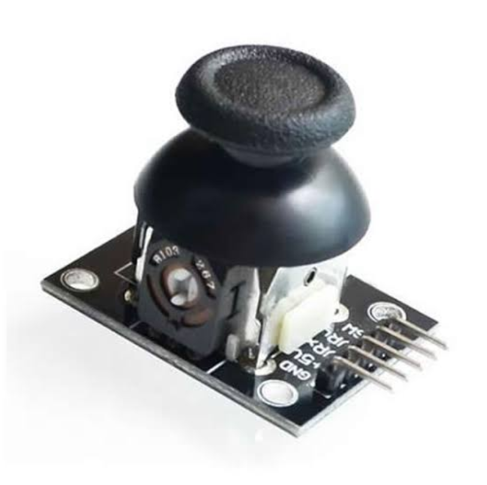

### C.2 Sensor Kapasitif
Sensor kapasitif mendeteksi besaran fisik (sentuhan, kelembapan, jarak dekat) melalui **perubahan nilai kapasitansi**. Pada praktikum ini digunakan modul **touch sensor TTP223** — modul berbasis IC TTP223 yang sudah mengintegrasikan rangkaian deteksi kapasitansi dan pembanding ambang batas (threshold) secara internal, sehingga cukup menghasilkan **output digital HIGH/LOW** siap pakai (umumnya aktif HIGH saat pad disentuh) tanpa perlu kalibrasi nilai analog secara manual — berbeda dengan fitur *touch* bawaan ESP32 (`touchRead()`) yang mengembalikan nilai mentah dan memerlukan penentuan threshold sendiri. Sensor kapasitif lain (mis. capacitive soil moisture, capacitive proximity) bekerja dengan prinsip serupa — mengukur perubahan kapasitansi pada elektroda sensor — namun umumnya berbentuk modul terpisah dengan output analog.

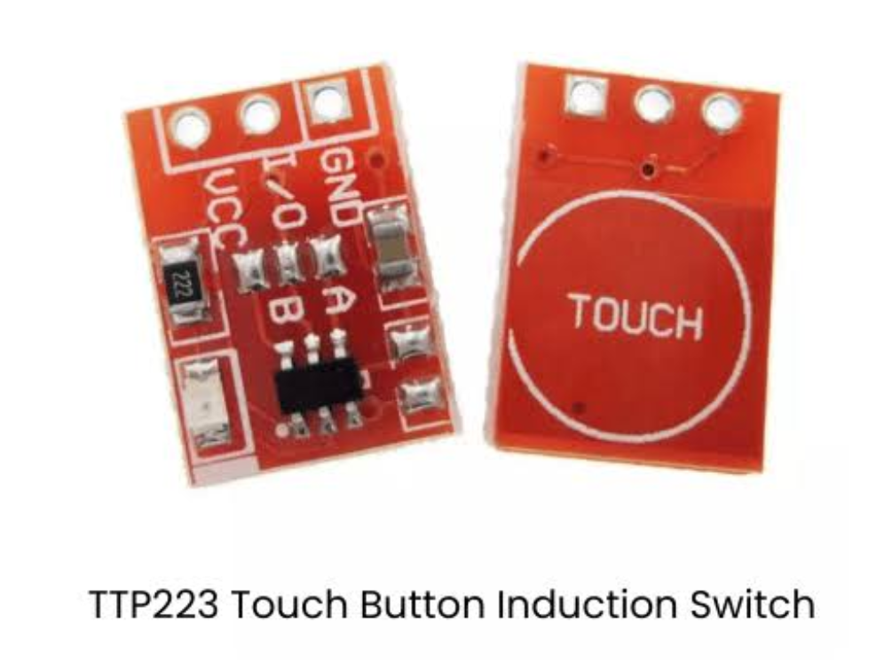

### C.3 Sensor Induktif
Sensor induktif mendeteksi objek logam atau perubahan medan magnet melalui **perubahan induktansi/medan magnet**. Pada praktikum ini digunakan **hall effect sensor**, yang mendeteksi keberadaan/kekuatan medan magnet secara langsung — umum digunakan untuk mendeteksi posisi magnet atau kecepatan putar (bersama magnet pada objek berputar). Contoh sensor induktif lain adalah *inductive proximity sensor*, yang menghasilkan medan elektromagnetik osilasi dan mendeteksi benda logam melalui redaman (eddy current) pada medan tersebut.

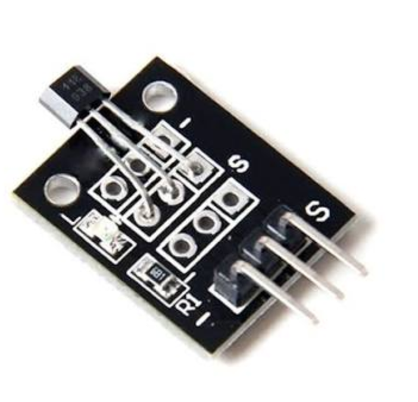

### C.4 Sensor Basis Lain (Akustik & Optik)
- **Ultrasonik (akustik):** mengukur jarak berdasarkan waktu tempuh gelombang suara (pulsa dipancarkan, dipantulkan objek, lalu diterima kembali); jarak dihitung dari selisih waktu dan kecepatan suara di udara
- **Inframerah/optik:** mendeteksi objek berdasarkan pantulan cahaya inframerah; umum digunakan sebagai sensor jarak dekat/obstacle dengan output digital

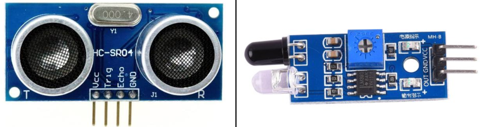

### C.5 PWM (Pulse Width Modulation) — Kontrol Kecepatan Motor DC
PWM adalah teknik menghasilkan sinyal digital yang menyerupai sinyal analog dengan mengatur **duty cycle** (persentase waktu sinyal HIGH dalam satu periode). Semakin besar duty cycle, semakin besar "rata-rata" tegangan yang dirasakan oleh beban (mis. motor DC), sehingga kecepatan putarnya meningkat. Pada ESP32 framework Arduino, PWM diakses melalui API **LEDC** berbasis **channel**: `ledcSetup(channel, freq, resolution)` untuk mengonfigurasi sebuah channel PWM (frekuensi & resolusi), `ledcAttachPin(pin, channel)` untuk menghubungkan channel tersebut ke pin fisik, dan `ledcWrite(channel, duty)` untuk mengatur duty cycle-nya berdasarkan nomor channel (bukan nomor pin). Arah putar motor DC diatur secara terpisah melalui driver motor (mis. L298N) menggunakan dua pin digital (IN1/IN2).

> **Catatan versi:** Seluruh contoh kode pada modul ini (dan modul-modul lain dalam rangkaian praktikum) menggunakan **platform PlatformIO resmi `espressif32`** tanpa mengunci versi khusus, yang secara default membawa **Arduino-ESP32 core versi 2.0.x**. API LEDC berbasis channel (`ledcSetup`/`ledcAttachPin`) adalah API yang tersedia pada core versi ini. Core versi 3.x (dengan API LEDC berbasis pin seperti `ledcAttach()`) memerlukan platform komunitas terpisah (mis. fork *pioarduino*) dan **tidak dibahas** pada praktikum ini agar tetap konsisten dan kompatibel dengan library lain (mis. ESP32Servo) yang digunakan di modul-modul ini.

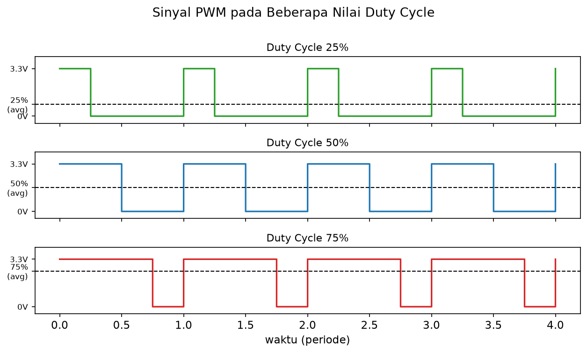

### C.6 Kontrol Posisi Motor Servo
Motor servo juga dikendalikan menggunakan sinyal PWM, namun dengan prinsip yang berbeda dari kontrol kecepatan motor DC — pada servo, **lebar pulsa (pulse width)** itu sendiri yang menentukan posisi sudut, bukan rata-rata duty cycle. Umumnya sinyal kontrol servo memiliki periode 20ms (frekuensi 50Hz), dengan lebar pulsa sekitar 1ms merepresentasikan sudut 0° dan 2ms merepresentasikan sudut 180°. Pada framework Arduino, detail ini diabstraksi oleh library seperti **ESP32Servo**, sehingga cukup memanggil fungsi `.write(angle)` untuk menggerakkan servo ke sudut tertentu.

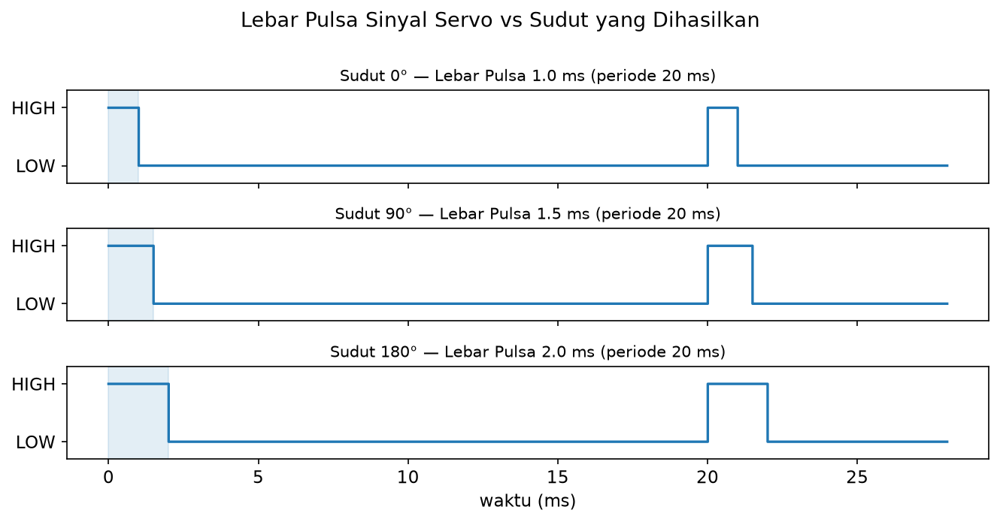

### C.7 Motor Stepper
Berbeda dengan motor DC yang berputar kontinu, motor stepper bergerak dalam **langkah-langkah diskret (step)** sesuai jumlah pulsa yang diberikan — misalnya 1.8° per step pada motor stepper standar (200 step per putaran penuh). Motor stepper dikendalikan melalui **driver motor stepper** (mis. A4988, DRV8825), yang menerima sinyal:
- **STEP:** setiap pulsa (transisi LOW→HIGH) menyebabkan motor berputar satu step
- **DIR:** menentukan arah putaran motor
- **EN (Enable):** mengaktifkan/menonaktifkan driver — saat dinonaktifkan, motor dapat diputar bebas secara manual
- **RESET/SLEEP:** beberapa driver memiliki pin ini untuk mereset atau menonaktifkan mode tidur driver, umumnya perlu ditarik HIGH agar driver aktif normal

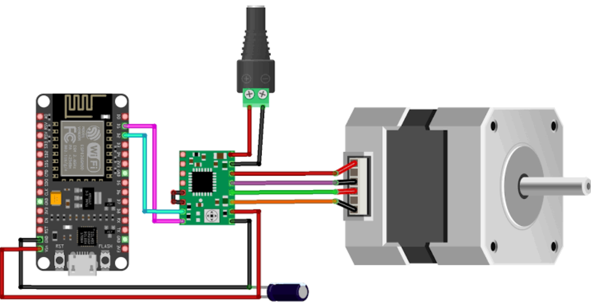

### C.8 ESC (Electronic Speed Controller) dan Motor Brushless
Motor **brushless (BLDC — Brushless DC Motor)** tidak dapat dikendalikan langsung oleh driver H-bridge sederhana seperti motor DC biasa, karena memerlukan **komutasi elektronik** — pengaturan urutan pemberian arus ke tiga lilitan stator secara presisi agar rotor berputar. Tugas ini dilakukan oleh **ESC (Electronic Speed Controller)**, rangkaian elektronik yang menerima sinyal kontrol sederhana dari mikrokontroler dan menerjemahkannya menjadi pola komutasi 3-fasa untuk motor.

Sinyal kontrol ESC **identik dengan sinyal kontrol servo**: pulsa periodik 50Hz (periode 20ms), dengan lebar pulsa menentukan besar throttle — umumnya **1000µs merepresentasikan throttle minimum** (motor berhenti/idle) dan **2000µs merepresentasikan throttle maksimum**. Karena kesamaan format sinyal ini, ESC dapat dikendalikan menggunakan library yang sama dengan motor servo (mis. **ESP32Servo**), cukup menggunakan fungsi `writeMicroseconds()` untuk mengatur lebar pulsa secara langsung (dalam mikrodetik), alih-alih `write(angle)` yang bekerja dalam satuan derajat.

**Arming ESC:** hampir seluruh ESC mengharuskan proses **arming** sebelum dapat menjalankan motor — yaitu mengirim sinyal throttle minimum (1000µs) secara stabil selama beberapa detik setelah ESC dinyalakan. Ini adalah mekanisme keamanan: ESC akan menolak menjalankan motor pada throttle sembarang saat pertama kali menyala, untuk mencegah motor tiba-tiba berputar kencang akibat sinyal acak/tidak valid (mis. saat mikrokontroler baru boot). Banyak ESC memberikan bunyi *beep* khas sebagai indikasi proses arming berhasil.

**Catu daya:** ESC menerima daya utama untuk motor langsung dari baterai (umumnya **LiPo 2S–4S, 7.4V–14.8V**) melalui jalur terpisah dari jalur sinyal kontrol. Jalur sinyal tetap berada pada level logika rendah (3.3V/5V) yang aman bagi ESP32. **GND sinyal dan GND baterai harus disatukan (common ground)** agar referensi tegangan sinyal PWM konsisten dengan ESC.

> ⚠️ **Peringatan Keselamatan:** Motor brushless berputar sangat cepat dan bertenaga. **Selalu lepas propeller/baling-baling** sebelum menguji program, dan pastikan motor terpasang aman (tidak bisa terlempar) sebelum menyambungkan baterai. Jangan pernah menyentuh motor atau ESC saat baterai terhubung dan program sedang berjalan.

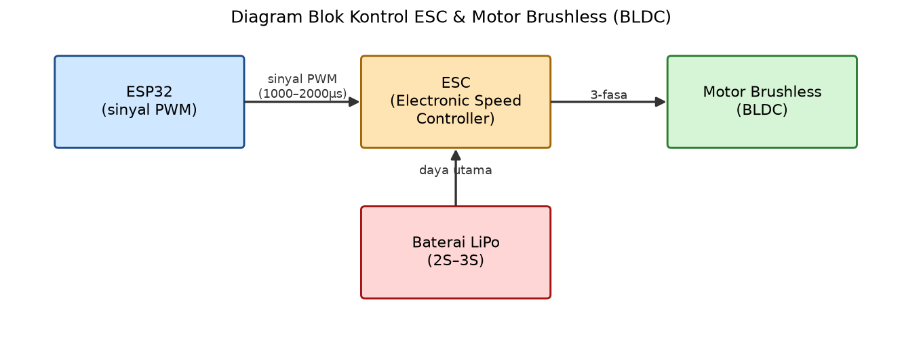

---

## D. Persiapan Sebelum Praktikum

1. Pastikan PlatformIO sudah terinstal (lihat **[setup_vscode_platformio.md](setup_vscode_platformio.md)**)
2. Buat project baru untuk Modul 2:
   - Name: `modul2-sensor-aktuator`
   - Board: **"Espressif ESP32 Dev Module"**
   - Framework: **Arduino**
3. Pastikan `platformio.ini` berisi:
   ```ini
   [env:esp32dev]
   platform = espressif32
   board = esp32dev
   framework = arduino
   ```
4. Untuk Percobaan 5 (Motor Servo), tambahkan library **ESP32Servo** melalui PlatformIO Library Manager atau tambahkan pada `platformio.ini` (Percobaan 6/ESC tidak memerlukan library ini — lihat catatan pada Percobaan 6):
   ```ini
   lib_deps = madhephaestus/ESP32Servo@^3.0.0
   ```

---

## E. Kegiatan Praktikum

### PERCOBAAN 1 — Sensor Resistif, Kapasitif, dan Induktif

**Tujuan:**
Mahasiswa mampu memahami dan mengimplementasikan pembacaan sensor resistif melalui joystick 2-axis KY-023 (VRx, VRy, dan tombol SW), kapasitif (touch sensor TTP223), dan induktif (hall effect sensor).

**Skema Rangkaian:**

| Komponen | Pin ESP32 | Keterangan |
|---|---|---|
| Joystick KY-023 — VRx | GPIO 34 | Output analog sumbu X (ADC1) |
| Joystick KY-023 — VRy | GPIO 35 | Output analog sumbu Y (ADC1) |
| Joystick KY-023 — SW | GPIO 27 | Tombol tekan, aktif LOW (gunakan `INPUT_PULLUP`) |
| Joystick KY-023 — VCC/GND | 3.3V, GND | Sesuai datasheet modul |
| Modul TTP223 — OUT | GPIO 4 | Output digital, umumnya aktif HIGH saat pad disentuh |
| Modul TTP223 — VCC/GND | 3.3V, GND | Sesuai datasheet modul |
| Hall effect sensor module | GPIO 26 | Output digital |

> **Catatan:** Pin **GPIO 34, 35, 27** yang digunakan joystick pada Percobaan ini sengaja dipertahankan **konsisten** di seluruh Percobaan 3–6 modul ini, karena joystick akan dipakai berulang sebagai input kontrol aktuator pada Percobaan-Percobaan tersebut.

<!-- 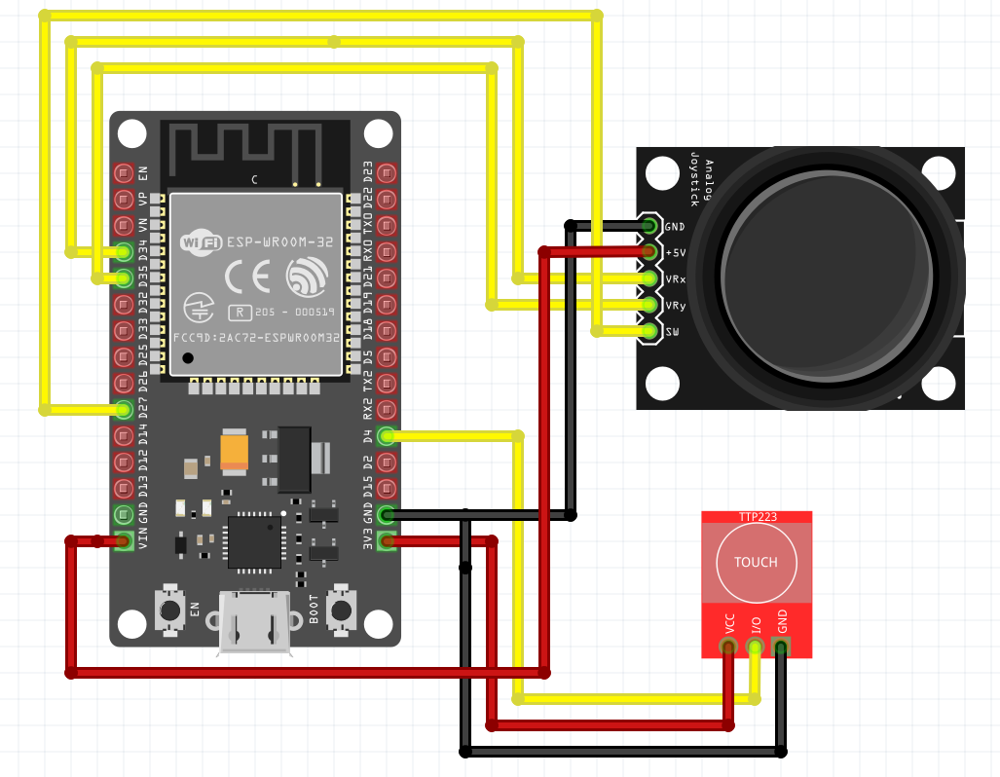 -->

<!-- *Gambar 9: Diagram wiring joystick KY-023 dan modul touch TTP223 ke ESP32 (hall effect sensor tidak ditampilkan, rangkai sesuai tabel di atas)* -->

**`platformio.ini`:**
```ini
[env:esp32dev]
platform = espressif32
board = esp32dev
framework = arduino
```

**Langkah Kerja:**
1. Rangkai joystick KY-023 (VCC, GND, VRx→GPIO34, VRy→GPIO35, SW→GPIO27)
2. Rangkai modul TTP223 (VCC, GND, OUT→GPIO4)
3. Rangkai hall effect sensor module pada GPIO 26
4. Upload program gabungan, amati kelima pembacaan sekaligus di Serial Monitor
5. Uji tiap sensor (gerakkan/tekan joystick, sentuh TTP223, dekatkan magnet ke hall effect) — catat hasilnya
6. Lepas joystick ke posisi netral, catat VRx/VRy 3 kali — apakah selalu tepat 2048?
7. Analisis mengapa dibutuhkan *dead zone* toleransi, bukan sekadar memeriksa `== 2048`
8. Bandingkan basis transduksi ketiga sensor — analisis mengapa TTP223 dan hall effect langsung digital, sedangkan joystick analog

**Kode Program (Joystick KY-023, TTP223, & Hall Effect):**
```cpp
#define JOY_VRX 34
#define JOY_VRY 35
#define JOY_SW  27
#define TOUCH_PIN 4  // OUT modul TTP223
#define HALL_PIN 26

void setup() {
  Serial.begin(115200);
  pinMode(JOY_SW, INPUT_PULLUP); // SW terhubung ke GND saat ditekan
  pinMode(TOUCH_PIN, INPUT);
  pinMode(HALL_PIN, INPUT);
}

void loop() {
  int vrx = analogRead(JOY_VRX);
  int vry = analogRead(JOY_VRY);
  bool pressed = (digitalRead(JOY_SW) == LOW); // aktif LOW (internal pull-up)

  bool touched = (digitalRead(TOUCH_PIN) == HIGH); // TTP223 umumnya aktif HIGH
  bool magnetDetected = (digitalRead(HALL_PIN) == LOW); // umumnya aktif LOW, cek datasheet modul

  Serial.printf("Joystick VRx: %d | VRy: %d | SW: %s | Touch (TTP223): %s | Hall Effect: %s\n",
                vrx, vry,
                pressed ? "DITEKAN" : "idle",
                touched ? "TERSENTUH" : "idle",
                magnetDetected ? "MAGNET TERDETEKSI" : "idle");
  delay(300);
}
```

**Penjelasan Kode:**
| Bagian | Penjelasan |
|---|---|
| `analogRead(JOY_VRX)` / `analogRead(JOY_VRY)` | Membaca nilai ADC 12-bit (0–4095) dari masing-masing potensiometer sumbu X dan Y joystick — sama prinsipnya dengan pembacaan LDR di Modul 1, namun di sini nilainya diinterpretasikan sebagai **perintah kontrol**, bukan besaran lingkungan |
| `pinMode(JOY_SW, INPUT_PULLUP)` | Tombol SW pada joystick umumnya bertipe *active-low* (menghubungkan pin ke GND saat ditekan), sehingga memerlukan pull-up (internal atau eksternal) agar terbaca HIGH saat tidak ditekan |
| `digitalRead(TOUCH_PIN) == HIGH` | Modul TTP223 sudah mengeluarkan output digital siap pakai — tidak perlu `touchRead()` maupun threshold manual seperti fitur touch bawaan ESP32 |
| `digitalRead(HALL_PIN) == LOW` | Sebagian besar modul hall effect bersifat aktif LOW — perlu diverifikasi pada datasheet modul yang digunakan |

---

### PERCOBAAN 2 — Sensor Basis Lain (Ultrasonik & IR Obstacle)

**Tujuan:**
Mahasiswa mampu mengimplementasikan pembacaan sensor ultrasonik (basis akustik) dan sensor IR obstacle (basis optik).

**Skema Rangkaian:**

| Komponen | Pin ESP32 | Keterangan |
|---|---|---|
| HC-SR04 — Trig | GPIO 5 | Output dari ESP32 ke sensor |
| HC-SR04 — Echo | GPIO 18 | Input ke ESP32 (gunakan pembagi tegangan jika sensor 5V) |
| Sensor IR obstacle | GPIO 19 | Output digital |

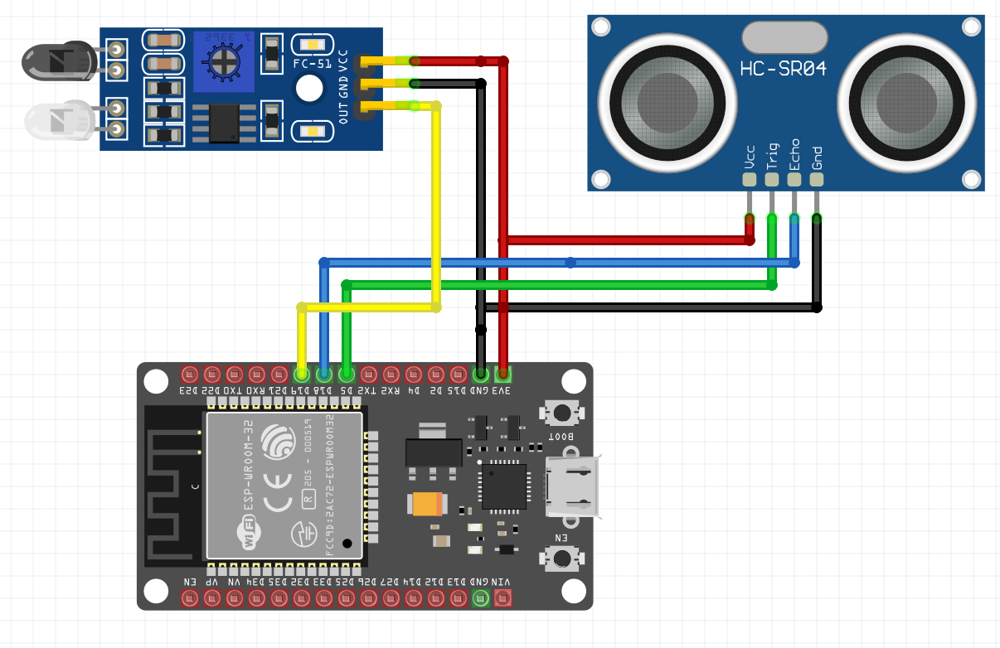

*Gambar 10: Diagram wiring sensor ultrasonik HC-SR04 dan sensor IR obstacle ke ESP32*

**`platformio.ini`:**
```ini
[env:esp32dev]
platform = espressif32
board = esp32dev
framework = arduino
```

**Langkah Kerja:**
1. Rangkai HC-SR04, tulis program pengukuran jarak berbasis `pulseIn()`
2. Rangkai sensor IR obstacle, uji pembacaan status halangan
3. Amati keduanya bersamaan di Serial Monitor, uji berbagai jarak dan objek
4. Ukur 3 jarak nyata dengan penggaris (mis. 10, 30, 60 cm), bandingkan dengan Serial Monitor, catat selisihnya
5. Uji IR obstacle pada jarak sama dengan beberapa permukaan (terang/gelap, halus/kasar)
6. Analisis mengapa sensor optik terpengaruh warna/tekstur permukaan, beda dari ultrasonik

**Kode Program (Ultrasonik HC-SR04 & IR Obstacle):**
```cpp
#define TRIG_PIN 5
#define ECHO_PIN 18
#define IR_PIN 19

void setup() {
  Serial.begin(115200);
  pinMode(TRIG_PIN, OUTPUT);
  pinMode(ECHO_PIN, INPUT);
  pinMode(IR_PIN, INPUT);
  digitalWrite(TRIG_PIN, LOW);
}

float readDistanceCM() {
  // Pastikan TRIG LOW
  digitalWrite(TRIG_PIN, LOW);
  delayMicroseconds(2);

  // Kirim pulsa 10 us
  digitalWrite(TRIG_PIN, HIGH);
  delayMicroseconds(10);
  digitalWrite(TRIG_PIN, LOW);

  // Baca durasi pantulan
  long duration = pulseIn(ECHO_PIN, HIGH, 30000); // timeout 30 ms

  if (duration == 0)
    return -1.0; // tidak ada objek dalam jangkauan

  // Konversi ke cm
  return duration * 0.0343 / 2.0;
}

void loop() {
  float distance = readDistanceCM();
  bool obstacle = (digitalRead(IR_PIN) == LOW); // umumnya aktif LOW

  if (distance < 0) {
    Serial.print("Jarak: tidak ada objek");
  } else {
    Serial.printf("Jarak: %.1f cm", distance);
  }
  Serial.printf(" | IR Obstacle: %s\n", obstacle ? "TERDETEKSI" : "idle");
  delay(100);
}
```

**Penjelasan Kode:**
| Bagian | Penjelasan |
|---|---|
| `pulseIn(ECHO_PIN, HIGH, 30000)` | Mengukur durasi (mikrodetik) pin ECHO berada pada kondisi HIGH, dengan batas timeout 30ms |
| `duration == 0` | Menandakan tidak ada pantulan yang diterima dalam batas timeout, sehingga dianggap tidak ada objek pada jangkauan sensor |
| `digitalRead(IR_PIN) == LOW` | Sebagian besar modul IR obstacle bersifat aktif LOW saat mendeteksi halangan |

---

### PERCOBAAN 3 — Aktuator Motor DC 

**Tujuan:**
Mahasiswa mampu mengimplementasikan kontrol kecepatan dan arah putar motor DC menggunakan sinyal PWM, dikendalikan secara interaktif melalui sumbu X joystick KY-023.

**Prinsip Kontrol:** Posisi joystick VRx (0–4095) dipetakan sebagai berikut — nilai di sekitar titik tengah (**dead zone**) berarti motor berhenti; deviasi ke satu sisi menggerakkan motor maju dengan kecepatan proporsional terhadap besar deviasi tersebut; deviasi ke sisi berlawanan menggerakkan motor mundur. Tombol **SW** berfungsi sebagai **stop darurat** — selama ditekan, motor dipaksa berhenti apa pun posisi joystick.

**Skema Rangkaian:**

| Komponen | Pin ESP32 | Keterangan |
|---|---|---|
| Joystick KY-023 — VRx | GPIO 34 | Kecepatan & arah (sama seperti Percobaan 1) |
| Joystick KY-023 — SW | GPIO 27 | Stop darurat, aktif LOW |
| Driver motor (ENA) | GPIO 25 | Sinyal PWM kecepatan |
| Driver motor (IN1) | GPIO 26 | Arah putar motor |
| Driver motor (IN2) | GPIO 33 | Arah putar motor |
| Motor DC — M1 (kabel Merah, +) | Driver OUT1 | Menukar M1/M2 membalik arah putar default motor |
| Motor DC — M2 (kabel Putih, −) | Driver OUT2 | — |

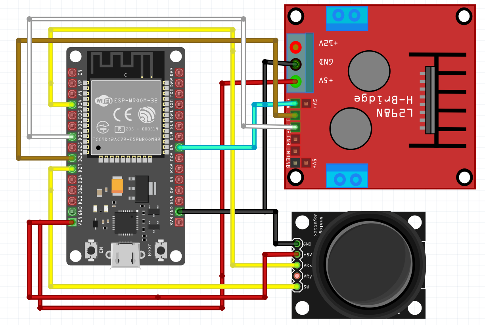

*Gambar 11: Contoh wiring motor DC via driver L298N dikendalikan joystick (nomor GPIO pada gambar ilustratif, ikuti tabel di atas untuk pin yang sesuai kode)*

**`platformio.ini`:**
```ini
[env:esp32dev]
platform = espressif32
board = esp32dev
framework = arduino
```

**Langkah Kerja:**
1. Rangkai motor DC via driver L298N, pakai catu daya eksternal (bukan 5V USB)
2. Rangkai joystick (VRx→GPIO34, SW→GPIO27) — sama seperti Percobaan 1
3. Implementasikan kontrol PWM (ENA) dan arah (IN1/IN2) berdasarkan posisi joystick
4. Gerakkan joystick ke kedua sisi, amati kecepatan dan arah putar berubah sesuai deviasi
5. Uji SW sebagai stop darurat — motor harus langsung berhenti selama ditekan
6. Analisis mengapa arah (`IN1`/`IN2`) harus diset **sebelum** PWM (`ENA`) — apa yang terjadi kalau urutannya terbalik?

**Kode Program (Kontrol Motor DC via Joystick):**
```cpp
#include <Arduino.h>

//==================== JOYSTICK ====================
#define JOY_VRX 34
#define JOY_SW  27

const int JOY_CENTER = 2048;
const int JOY_DEADZONE = 300; // toleransi di sekitar titik tengah

//==================== MOTOR ====================
#define ENA 25
#define IN1 26
#define IN2 33

const int pwmChannel = 0;
const int pwmFreq = 1000;
const int pwmResolution = 8;

//================================================

void motorForward(uint8_t speed) {
  digitalWrite(IN1, HIGH);
  digitalWrite(IN2, LOW);
  ledcWrite(pwmChannel, speed);
}

void motorBackward(uint8_t speed) {
  digitalWrite(IN1, LOW);
  digitalWrite(IN2, HIGH);
  ledcWrite(pwmChannel, speed);
}

void motorStop() {
  digitalWrite(IN1, LOW);
  digitalWrite(IN2, LOW);
  ledcWrite(pwmChannel, 0);
}

//================================================

void setup() {
  Serial.begin(115200);

  pinMode(IN1, OUTPUT);
  pinMode(IN2, OUTPUT);
  pinMode(JOY_SW, INPUT_PULLUP);

  ledcSetup(pwmChannel, pwmFreq, pwmResolution); // konfigurasi channel PWM (core 2.x)
  ledcAttachPin(ENA, pwmChannel);                // hubungkan channel ke pin ENA

  Serial.println("--------------------------------");
  Serial.println("ESP32 Motor DC via Joystick");
  Serial.println("Geser VRx untuk maju/mundur, tekan SW untuk stop darurat");
  Serial.println("--------------------------------");

  motorStop();
}

//================================================

void loop() {
  bool emergencyStop = (digitalRead(JOY_SW) == LOW);

  if (emergencyStop) {
    motorStop();
    Serial.println("STOP DARURAT (SW ditekan)");
    delay(50);
    return;
  }

  int vrx = analogRead(JOY_VRX);
  int deviation = vrx - JOY_CENTER;

  if (abs(deviation) < JOY_DEADZONE) {
    motorStop();
    Serial.println("Motor: idle (joystick netral)");
  } else if (deviation > 0) {
    uint8_t speed = map(deviation, JOY_DEADZONE, JOY_CENTER, 0, 255);
    motorForward(speed);
    Serial.printf("Motor: MAJU, PWM = %d\n", speed);
  } else {
    uint8_t speed = map(-deviation, JOY_DEADZONE, JOY_CENTER, 0, 255);
    motorBackward(speed);
    Serial.printf("Motor: MUNDUR, PWM = %d\n", speed);
  }

  delay(100);
}
```

**Penjelasan Kode:**
| Bagian | Penjelasan |
|---|---|
| `JOY_CENTER`, `JOY_DEADZONE` | Titik tengah nominal ADC (2048) dan rentang toleransi di sekitarnya — deviasi di bawah nilai ini dianggap joystick dalam posisi netral (motor berhenti) |
| `deviation = vrx - JOY_CENTER` | Selisih posisi VRx terhadap titik tengah — nilai positif berarti stick digeser ke satu sisi (maju), negatif ke sisi berlawanan (mundur) |
| `map(deviation, JOY_DEADZONE, JOY_CENTER, 0, 255)` | Memetakan besar deviasi (setelah dikurangi dead zone) menjadi nilai PWM 0–255, sehingga kecepatan motor proporsional terhadap seberapa jauh joystick digeser dari titik tengah |
| `digitalRead(JOY_SW) == LOW` diperiksa di awal `loop()` | Tombol SW berfungsi sebagai **stop darurat** dengan prioritas tertinggi — diperiksa sebelum logika kecepatan/arah, dan langsung `return` agar motor pasti berhenti selama tombol ditekan |

---

### PERCOBAAN 4 — Aktuator Motor Stepper 

**Tujuan:**
Mahasiswa mampu mengimplementasikan kontrol motor stepper menggunakan sinyal step melalui driver motor stepper, termasuk profil akselerasi/deselerasi, dikendalikan secara interaktif melalui sumbu X joystick KY-023.

**Prinsip Kontrol:** Selama joystick digeser melewati dead zone, motor berputar dalam **burst step** (sejumlah step berturut-turut) ke arah sesuai sisi deviasi, dengan jumlah step per burst proporsional terhadap besar deviasi (deviasi besar → burst lebih panjang, terasa seperti kecepatan lebih tinggi). Setiap burst tetap menerapkan profil akselerasi–kecepatan maksimum–deselerasi seperti pada kode aslinya, agar motor tidak kehilangan step akibat perubahan kecepatan mendadak. Tombol **SW** menonaktifkan driver (EN) sebagai stop darurat.

**Skema Rangkaian:**

| Komponen | Pin ESP32 | Keterangan |
|---|---|---|
| Joystick KY-023 — VRx | GPIO 34 | Arah & besar burst step |
| Joystick KY-023 — SW | GPIO 27 | Stop darurat (nonaktifkan driver), aktif LOW |
| Driver stepper — IN1 | GPIO 16 (RX2) | Fasa koil 1 |
| Driver stepper — IN2 | GPIO 17 (TX2) | Fasa koil 1 |
| Driver stepper — IN3 | GPIO 18 | Fasa koil 2 |
| Driver stepper — IN4 | GPIO 19 | Fasa koil 2 |

> **Catatan:** Skema ini menggunakan driver stepper 4-fasa (mis. ULN2003 untuk motor stepper 28BYJ-48), sesuai kode program yang mengatur `stepSequence` 4-bit secara langsung — berbeda dari driver STEP/DIR (A4988/DRV8825) yang dibahas pada **C.7 Motor Stepper**. Jika menggunakan driver STEP/DIR, sesuaikan fungsi `setStep()`/`stopMotor()` menjadi pulsa pada pin STEP dan level pada pin DIR.

**`platformio.ini`:**
```ini
[env:esp32dev]
platform = espressif32
board = esp32dev
framework = arduino
```

**Langkah Kerja:**
1. Rangkai motor stepper melalui driver, pakai catu daya eksternal
2. Rangkai joystick (VRx→GPIO34, SW→GPIO27) — sama seperti Percobaan 1
3. Upload kode, amati motor **diam** saat joystick di posisi tengah
4. Geser joystick ke tiap sisi, amati arah CW/CCW dan bagaimana besar deviasi memengaruhi "rasa" kecepatan
5. Uji SW sebagai stop darurat
6. Latihan tambahan: turunkan `MIN_DELAY_US` bertahap (`600` → `400` → `200`), cari nilai terendah yang motornya masih lancar
7. Analisis mengapa motor kehilangan step saat `MIN_DELAY_US` terlalu kecil — kaitkan dengan waktu kumparan berpindah fasa

**Kode Program (Kontrol Motor Stepper via Joystick, dengan Profil Akselerasi):**
```cpp
#include <Arduino.h>

//==================== JOYSTICK ====================
#define JOY_VRX 34
#define JOY_SW  27

const int JOY_CENTER = 2048;
const int JOY_DEADZONE = 300;

//==================== MOTOR STEPPER ====================
#define IN1 16
#define IN2 17
#define IN3 18
#define IN4 19

const int motorPins[4] = {IN1, IN2, IN3, IN4};

const int stepSequence[8][4] = {
    {1, 0, 0, 0},
    {1, 1, 0, 0},
    {0, 1, 0, 0},
    {0, 1, 1, 0},
    {0, 0, 1, 0},
    {0, 0, 1, 1},
    {0, 0, 0, 1},
    {1, 0, 0, 1}
};

// ==================== SPEED ====================
const int START_DELAY_US = 2000; // delay saat mulai (akselerasi)
const int MIN_DELAY_US = 600;    // delay pada kecepatan maksimum
const int ACCEL_STEPS = 30;      // jumlah step untuk akselerasi/deselerasi per burst

// ==================== MOTOR ====================
void setStep(int step) {
  for (int i = 0; i < 4; i++) {
    digitalWrite(motorPins[i], stepSequence[step][i]);
  }
}

void stopMotor() {
  for (int i = 0; i < 4; i++) {
    digitalWrite(motorPins[i], LOW);
  }
}

int calculateDelay(int currentStep, int totalSteps) {
  if (currentStep < ACCEL_STEPS) {
    return map(currentStep, 0, ACCEL_STEPS, START_DELAY_US, MIN_DELAY_US);
  }
  if (currentStep > totalSteps - ACCEL_STEPS) {
    return map(currentStep, totalSteps - ACCEL_STEPS, totalSteps, MIN_DELAY_US, START_DELAY_US);
  }
  return MIN_DELAY_US;
}

void rotateCW(int steps) {
  for (int i = 0; i < steps; i++) {
    setStep(i % 8);
    delayMicroseconds(calculateDelay(i, steps));
  }
  stopMotor();
}

void rotateCCW(int steps) {
  for (int i = 0; i < steps; i++) {
    setStep(7 - (i % 8));
    delayMicroseconds(calculateDelay(i, steps));
  }
  stopMotor();
}

// ==================== SETUP ====================
void setup() {
  Serial.begin(115200);

  pinMode(IN1, OUTPUT);
  pinMode(IN2, OUTPUT);
  pinMode(IN3, OUTPUT);
  pinMode(IN4, OUTPUT);
  pinMode(JOY_SW, INPUT_PULLUP);

  stopMotor();

  Serial.println("==========================");
  Serial.println("STEPPER VIA JOYSTICK");
  Serial.println("==========================");
}

// ==================== LOOP ====================
void loop() {
  if (digitalRead(JOY_SW) == LOW) { // stop darurat
    stopMotor();
    Serial.println("STOP DARURAT (SW ditekan)");
    delay(50);
    return;
  }

  int vrx = analogRead(JOY_VRX);
  int deviation = vrx - JOY_CENTER;

  if (abs(deviation) < JOY_DEADZONE) {
    stopMotor();
    return;
  }

  // Besar deviasi menentukan panjang burst step (kesan "kecepatan")
  int burstSteps = map(abs(deviation), JOY_DEADZONE, JOY_CENTER, 50, 800);

  if (deviation > 0) {
    Serial.printf("CW, burst = %d step\n", burstSteps);
    rotateCW(burstSteps);
  } else {
    Serial.printf("CCW, burst = %d step\n", burstSteps);
    rotateCCW(burstSteps);
  }
}
```

**Penjelasan Kode:**
| Bagian | Penjelasan |
|---|---|
| `stepSequence[8][4]` | Urutan pengaktifan 4 koil driver (mis. ULN2003) untuk metode *half-step*, menghasilkan resolusi step lebih halus dibanding *full-step* |
| `calculateDelay()` | Menghitung delay antar pulsa berdasarkan posisi step saat ini dalam satu burst — delay besar (lambat) di awal/akhir burst (akselerasi/deselerasi), delay minimum (cepat) di tengah burst |
| `burstSteps = map(abs(deviation), JOY_DEADZONE, JOY_CENTER, 50, 800)` | Memetakan besar deviasi joystick (setelah dikurangi dead zone) menjadi jumlah step per burst — semakin jauh joystick digeser dari titik tengah, semakin panjang burst (kesan motor "lebih cepat" karena berputar lebih jauh sebelum `loop()` mengevaluasi ulang posisi joystick) |
| `rotateCW()` / `rotateCCW()` | Menjalankan satu burst step lengkap (dengan profil akselerasi) searah/berlawanan arah jarum jam, lalu memanggil `stopMotor()` di akhir burst |
| `digitalRead(JOY_SW) == LOW` diperiksa di awal `loop()` | Tombol SW sebagai stop darurat prioritas tertinggi, sama seperti pada Percobaan 3 |


---

### PERCOBAAN 5 — Aktuator Motor Servo (Dikendalikan Joystick)

**Tujuan:**
Mahasiswa mampu mengimplementasikan kontrol posisi sudut motor servo menggunakan sinyal PWM melalui library ESP32Servo, dikendalikan secara langsung melalui sumbu X joystick KY-023.

**Prinsip Kontrol:** Posisi joystick VRx (0–4095) dipetakan langsung secara linear menjadi sudut servo (0°–180°) — posisi joystick paling kiri menghasilkan sudut 0°, paling kanan menghasilkan 180°, dan posisi tengah menghasilkan sekitar 90°. Tombol **SW** digunakan untuk **melepas (detach)** servo — saat ditekan, servo kehilangan torsi (dapat diputar bebas dengan tangan); saat dilepas, servo kembali mengunci pada posisi sesuai joystick.

**Skema Rangkaian:**

| Komponen | Pin ESP32 | Keterangan |
|---|---|---|
| Joystick KY-023 — VRx | GPIO 34 | Posisi sudut servo (dipetakan langsung 0–180°) |
| Joystick KY-023 — SW | GPIO 27 | Toggle detach/attach servo, aktif LOW |
| Servo motor (sinyal) | GPIO 13 | Sinyal PWM servo (50Hz) |

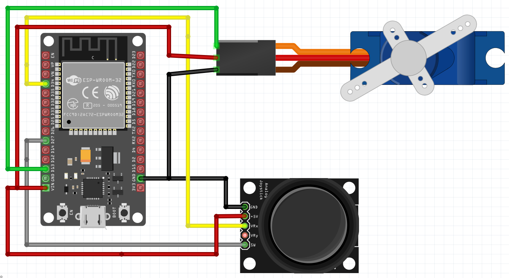

*Gambar 12: Contoh wiring motor servo dan joystick ke ESP32 (nomor GPIO pada gambar ilustratif, ikuti tabel di atas untuk pin yang sesuai kode)*

**`platformio.ini`:**
```ini
[env:esp32dev]
platform = espressif32
board = esp32dev
framework = arduino
lib_deps = madhephaestus/ESP32Servo@^3.0.0
```

**Langkah Kerja:**
1. Rangkai servo motor (sinyal→GPIO13)
2. Rangkai joystick (VRx→GPIO34, SW→GPIO27) — sama seperti Percobaan 1
3. Upload, geser joystick ujung ke ujung, amati servo mengikuti posisi (0°–180°)
4. Tahan SW, coba putar servo dengan tangan (harus bebas) — lepas SW, amati servo mengunci lagi
5. Catat sudut servo di 3 posisi joystick (kiri, tengah, kanan) — apakah sesuai ekspektasi (0°/~90°/180°)?
6. Analisis mengapa servo tak perlu encoder eksternal, beda dari motor DC di Percobaan 3 (kaitkan dengan potensiometer umpan balik internal servo)

**Kode Program (Kontrol Motor Servo via Joystick):**
```cpp
#include <ESP32Servo.h>

#define JOY_VRX 34
#define JOY_SW  27
#define SERVO_PIN 13

Servo myServo;
bool attached = true;

void setup() {
  Serial.begin(115200);
  pinMode(JOY_SW, INPUT_PULLUP);
  myServo.attach(SERVO_PIN);
}

void loop() {
  bool releasePressed = (digitalRead(JOY_SW) == LOW);

  if (releasePressed && attached) {
    myServo.detach(); // lepas torsi, servo bebas diputar tangan
    attached = false;
    Serial.println("Servo DETACH (bebas)");
  } else if (!releasePressed && !attached) {
    myServo.attach(SERVO_PIN);
    attached = true;
    Serial.println("Servo ATTACH (terkunci)");
  }

  if (attached) {
    int vrx = analogRead(JOY_VRX);
    int angle = map(vrx, 0, 4095, 0, 180);
    myServo.write(angle);
    Serial.printf("Sudut: %d\n", angle);
  }

  delay(50);
}
```

**Penjelasan Kode:**
| Bagian | Penjelasan |
|---|---|
| `map(vrx, 0, 4095, 0, 180)` | Memetakan langsung rentang ADC penuh (0–4095) joystick menjadi rentang sudut servo (0–180°) — berbeda dari Percobaan 3/4 yang menggunakan dead zone di tengah, karena di sini posisi joystick merepresentasikan **posisi**, bukan kecepatan |
| `myServo.detach()` / `myServo.attach(SERVO_PIN)` | Melepas dan menghubungkan kembali kendali PWM pada servo — saat *detach*, motor internal servo tidak menerima sinyal sehingga tidak melawan gaya luar (bebas diputar tangan) |
| `attached` (flag) | Mencegah pemanggilan `attach()`/`detach()` berulang kali setiap iterasi `loop()` selagi status tombol tidak berubah |

---

### PERCOBAAN 6 — Aktuator ESC & Motor Brushless (BLDC) (Dikendalikan Joystick)

**Tujuan:**
Mahasiswa mampu memahami prinsip kerja ESC sebagai pengendali motor brushless, serta mengimplementasikan proses arming dan kontrol kecepatan motor secara langsung melalui **LEDC** (tanpa library ESP32Servo), dikendalikan secara interaktif melalui sumbu X joystick KY-023.

**Prinsip Kontrol:** Setelah proses arming selesai, posisi joystick VRx dipetakan langsung menjadi throttle (1000–2000µs) — posisi paling kiri menghasilkan throttle minimum (motor idle/berhenti), semakin ke kanan semakin besar throttle. Tombol **SW** berfungsi sebagai **kill switch**: selama ditekan, throttle dipaksa ke nilai minimum (1000µs) terlepas dari posisi joystick — penting sebagai mekanisme keselamatan untuk motor bertenaga besar seperti BLDC.


**Skema Rangkaian:**

| Komponen | Pin ESP32 / Sumber | Keterangan |
|---|---|---|
| Joystick KY-023 — VRx | GPIO 34 | Besar throttle (setelah arming) |
| Joystick KY-023 — SW | GPIO 27 | Kill switch (paksa throttle minimum), aktif LOW |
| ESC — Sinyal (PWM) | GPIO 25 | Sinyal kontrol dari ESP32 ke ESC, via channel LEDC |
| ESC — GND (sinyal) | GND | Disatukan dengan GND ESP32 (**common ground** dengan baterai) |
| ESC — Power (input daya) | Baterai LiPo 2S–3S (7.4V–11.1V) | Jalur daya utama motor, **terpisah** dari power ESP32 |

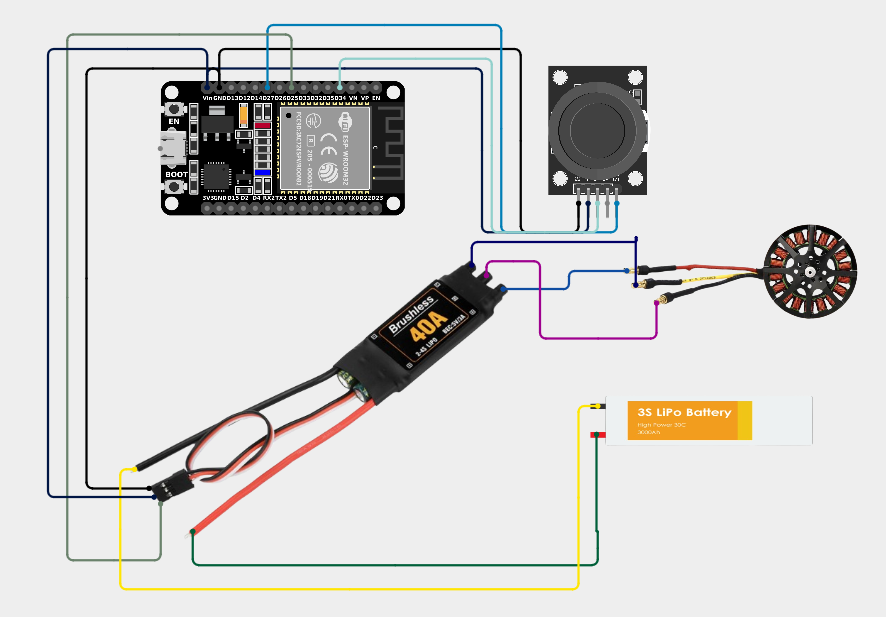

*Gambar 13: Contoh wiring ESC, motor brushless (BLDC), baterai LiPo, dan joystick ke ESP32 (nomor GPIO pada gambar ilustratif, ikuti tabel di atas untuk pin yang sesuai kode)*

**`platformio.ini`:**
```ini
[env:esp32dev]
platform = espressif32
board = esp32dev
framework = arduino
```

> **Catatan:** Percobaan ini **tidak memerlukan** library ESP32Servo — sinyal PWM 50Hz untuk ESC dibangkitkan langsung melalui API **LEDC** (`ledcSetup`/`ledcAttachPin`/`ledcWrite`), sebagai kontras dengan pendekatan Percobaan 5 (Servo) yang menggunakan abstraksi library. Keduanya menghasilkan sinyal yang identik (pulsa 1000–2000µs pada periode 20ms) — hanya berbeda pada tingkat abstraksi API yang dipakai.

**Langkah Kerja:**
1. Pastikan propeller **sudah dilepas** dari motor brushless
2. Rangkai ESC (sinyal→GPIO25, GND disatukan dengan ESP32, daya dari baterai LiPo **terpisah**)
3. Rangkai joystick (VRx→GPIO34, SW→GPIO27) — sama seperti Percobaan 1
4. Pastikan joystick di posisi paling kiri **sebelum** menyalakan baterai ESC, lalu upload
5. Amati Serial Monitor: **arming** (throttle minimum 1000µs, 5 detik) berjalan otomatis, ditandai *beep* dari ESC
6. Setelah arming, geser joystick pelan dari kiri ke kanan, amati kecepatan motor naik
7. Uji SW sebagai kill switch — tekan saat motor berputar, analisis apakah transisinya mulus atau menyentak
8. Analisis mengapa proses arming penting bagi ESC, dan risikonya bila dilewati
9. Bandingkan LEDC manual (`pulseToDuty()`) di percobaan ini dengan `writeMicroseconds()` (ESP32Servo, Percobaan 5) — diskusikan kelebihan/kekurangannya

**Kode Program (Arming ESC & Kontrol Kecepatan Motor Brushless via Joystick, berbasis LEDC):**
```cpp
#include <Arduino.h>

//==================== JOYSTICK ====================
#define JOY_VRX 34
#define JOY_SW  27

//==================== ESC ====================
#define ESC_PIN 25
#define ESC_CHANNEL 0

const uint32_t PWM_FREQ = 50;
const uint8_t PWM_RESOLUTION = 16;

const uint16_t THROTTLE_MIN = 1000; // us
const uint16_t THROTTLE_MAX = 2000; // us

uint32_t pulseToDuty(uint16_t pulseUs) {
  return ((uint32_t)pulseUs * 65535UL) / 20000UL;
}

void setThrottle(uint16_t pulseUs) {
  uint32_t duty = pulseToDuty(pulseUs);
  ledcWrite(ESC_CHANNEL, duty);
}

void setup() {
  Serial.begin(115200);
  pinMode(JOY_SW, INPUT_PULLUP);

  ledcSetup(ESC_CHANNEL, PWM_FREQ, PWM_RESOLUTION);
  ledcAttachPin(ESC_PIN, ESC_CHANNEL);

  Serial.println("=======================");
  Serial.println("BLDC VIA JOYSTICK");
  Serial.println("=======================");

  // Harus sudah aktif SEBELUM ESC dinyalakan
  setThrottle(THROTTLE_MIN);

  Serial.println("PWM minimum aktif.");
  Serial.println("Sekarang nyalakan PSU ESC.");

  // Beri ESC waktu untuk arming
  delay(5000);

  Serial.println("Arming selesai. Kontrol joystick aktif.");
}

void loop() {
  bool killSwitch = (digitalRead(JOY_SW) == LOW);

  uint16_t throttle;
  if (killSwitch) {
    throttle = THROTTLE_MIN;
  } else {
    int vrx = analogRead(JOY_VRX);
    throttle = map(vrx, 0, 4095, THROTTLE_MIN, THROTTLE_MAX);
  }

  setThrottle(throttle);
  Serial.printf("Throttle = %d us %s\n", throttle, killSwitch ? "(KILL SWITCH)" : "");

  delay(100);
}
```

**Penjelasan Kode:**
| Bagian | Penjelasan |
|---|---|
| `pulseToDuty(pulseUs)` | Mengonversi lebar pulsa (mikrodetik) menjadi nilai duty cycle LEDC 16-bit (0–65535) relatif terhadap periode 20ms (`20000` mikrodetik) — rumus manual yang digantikan abstraksinya oleh `writeMicroseconds()` pada library ESP32Servo |
| `ledcSetup(ESC_CHANNEL, PWM_FREQ, PWM_RESOLUTION)` | Mengonfigurasi channel LEDC 0 dengan frekuensi 50Hz dan resolusi 16-bit — resolusi tinggi diperlukan agar pemetaan mikrodetik ke duty cycle cukup presisi |
| `setThrottle(THROTTLE_MIN)` diikuti `delay(5000)` | Proses **arming** — menahan sinyal throttle minimum selama 5 detik sebelum ESC menerima perintah throttle lain, sama seperti prinsip arming pada Percobaan sebelumnya |
| `map(vrx, 0, 4095, THROTTLE_MIN, THROTTLE_MAX)` | Memetakan posisi joystick langsung menjadi nilai throttle dalam mikrodetik, tanpa dead zone (seluruh rentang joystick digunakan sebagai skala throttle 0–100%) |
| `killSwitch` diperiksa sebelum `setThrottle()` | Tombol SW pada joystick berfungsi sebagai kill switch — memaksa throttle minimum kapan pun ditekan, mekanisme keselamatan penting untuk motor bertenaga besar |


---

## F. Tugas Modul

[Wokwi](https://wokwi.com) menyediakan part siap pakai untuk ESP32 beserta potensiometer, servo motor, driver stepper (A4988), dan motor stepper — cukup lengkap untuk mensimulasikan sebagian besar rangkaian pada modul ini tanpa hardware fisik. Kerjakan tugas berikut **setelah** kegiatan praktikum selesai.

**Tugas 1 — Potensiometer Ganda Mengendalikan Servo & Stepper Terintegrasi:**

Buatlah simulasi Wokwi di mana **dua potensiometer** mengendalikan servo dan motor stepper secara terintegrasi (rangkaian dan kode program bebas dirancang sendiri):
1. Potensiometer 1 menentukan **posisi sudut servo** (0°–180°, boleh kontinu atau dibatasi ke beberapa posisi diskrit sesuai pilihan Anda)
2. **Arah** motor stepper ditentukan oleh **posisi servo dari titik tengah (90°)** — Jika posisi servo berada pada sudut lebih dari 90°, maka motor stepper akan berputar searah jarum jam (CW). Jika posisi servo berada pada sudut kurang dari 90°, maka motor stepper akan berputar berlawanan arah jarum jam (CCW). Jika posisi servo sama dengan 90°, maka motor stepper berhenti total **(Terapkan mekanisme dead zone)**. 
3. Potensiometer 2 menentukan **kecepatan dasar** (base frequency) putaran stepper.

**Pertanyaan Analisis:**
1. Analisis bagaimana rancangan Anda menggabungkan dua nilai (kecepatan dasar dari potensiometer 2, dan arah dair posisi servo) menjadi satu nilai kecepatan akhir stepper — apa fungsi *dead zone* di sekitar 90° pada rancangan ini?
2. Sinyal kontrol servo dan sinyal STEP pada driver stepper sama-sama berbasis PWM, namun diinterpretasikan berbeda oleh masing-masing aktuator — analisis apa yang direpresentasikan oleh sinyal PWM pada servo dibanding pada stepper.
3. Analisis mengapa pin EN (enable) pada driver stepper perlu dinonaktifkan (motor dibiarkan bebas berputar/*freewheel*) saat servo berada tepat di titik tengah, bukan hanya menghentikan pulsa STEP saja.

**Pengumpulan:** Sertakan project (folder PlatformIO beserta `diagram.json`, atau link project Wokwi mode *share* dengan visibility public/unlisted bila dikerjakan lewat browser) beserta jawaban Pertanyaan Analisis pada laporan singkat.

---

## G. Referensi
1. Espressif Systems, *ESP32 Technical Reference Manual*
2. Espressif Systems, *ESP32 Arduino Core Documentation — Analog, Touch, LEDC*, https://docs.espressif.com/projects/arduino-esp32/
3. Datasheet Modul Joystick 2-Axis KY-023 (dual potensiometer + push button)
4. Datasheet HC-SR04 Ultrasonic Sensor
5. Datasheet Hall Effect Sensor Module (mis. A3144/KY-003)
6. Datasheet Driver Motor Stepper A4988/DRV8825 dan ULN2003
7. ESP32Servo Library Documentation, https://github.com/madhephaestus/ESP32Servo
8. PlatformIO Documentation, https://docs.platformio.org/
9. Oscar Liang, *How Does an ESC / BLDC Motor Work*, https://oscarliang.com/esc-firmware-protocol/ — referensi prinsip kerja ESC dan proses arming
