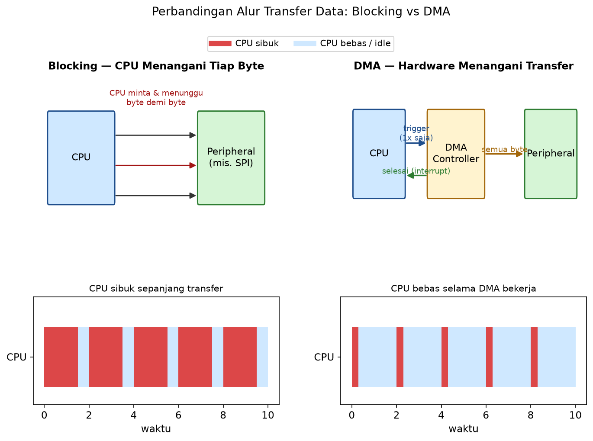
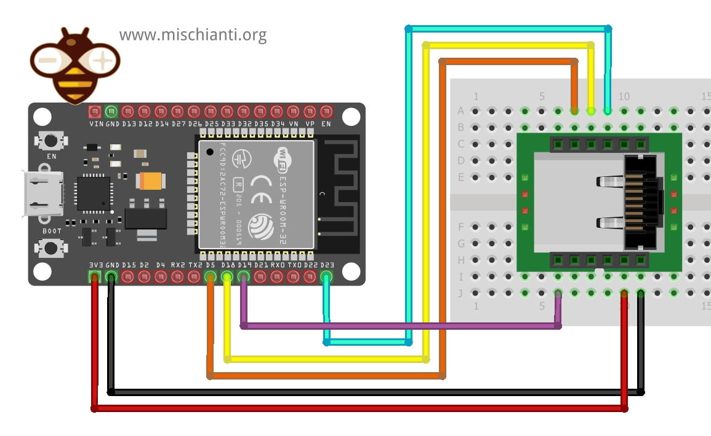
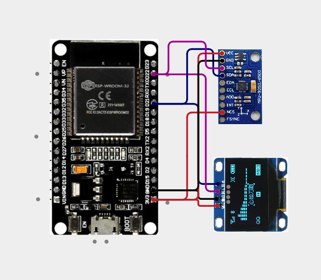
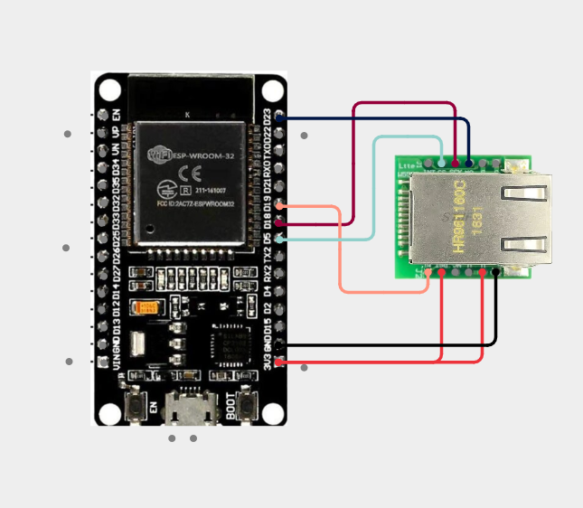

# MODUL 3
# KOMUNIKASI SERIAL & INTERFACING MODUL (UART/I2C/SPI/DMA)

**Mata Kuliah:** Praktikum Mikrokontroler & Embedded System
**Alokasi Waktu:** 5 x Percobaan (@ 100–150 menit)
**Platform:** ESP32 (Framework Arduino)
**IDE:** VSCode + PlatformIO

> **Catatan:** Modul ini melanjutkan penggunaan ESP32 dengan framework Arduino seperti pada Modul 1–2. Langkah instalasi VSCode, PlatformIO, dan driver USB-to-Serial tidak diulang di sini — lihat **[setup_vscode_platformio.md](setup_vscode_platformio.md)**. Percobaan 1 (UART) membutuhkan **dua board ESP32** yang saling berkomunikasi.

---

## Daftar Isi
- [A. Capaian Pembelajaran](#a-capaian-pembelajaran)
- [B. Alat dan Bahan](#b-alat-dan-bahan)
- [C. Dasar Teori](#c-dasar-teori)
  - [C.1 UART (Universal Asynchronous Receiver-Transmitter)](#c1-uart-universal-asynchronous-receiver-transmitter)
  - [C.2 I2C (Inter-Integrated Circuit)](#c2-i2c-inter-integrated-circuit)
  - [C.3 SPI (Serial Peripheral Interface)](#c3-spi-serial-peripheral-interface)
  - [C.4 DMA (Direct Memory Access)](#c4-dma-direct-memory-access)
  - [C.5 SPI ke Ethernet (W5500)](#c5-spi-ke-ethernet-w5500)
- [D. Persiapan Sebelum Praktikum](#d-persiapan-sebelum-praktikum)
- [E. Kegiatan Praktikum](#e-kegiatan-praktikum)
  - [PERCOBAAN 1 — Komunikasi UART Antar ESP32](#percobaan-1--komunikasi-uart-antar-esp32)
  - [PERCOBAAN 2 — Interfacing Multi-Device I2C: OLED + MPU6500](#percobaan-2--interfacing-multi-device-i2c-oled--mpu6500)
  - [PERCOBAAN 3 — Interfacing SPI: IMU MPU6500 (Pembacaan Register SPI Manual)](#percobaan-3--interfacing-spi-imu-mpu6500-pembacaan-register-spi-manual)
  - [PERCOBAAN 4 — DMA: Pembacaan IMU MPU6500 via SPI dengan DMA](#percobaan-4--dma-pembacaan-imu-mpu6500-via-spi-dengan-dma)
  - [PERCOBAAN 5 — Komunikasi Ethernet via SPI (W5500)](#percobaan-5--komunikasi-ethernet-via-spi-w5500)
- [F. Tugas Modul](#f-tugas-modul)
- [G. Referensi](#g-referensi)

---

## A. Capaian Pembelajaran

Setelah menyelesaikan Modul 3, praktikan mampu:
1. Menjelaskan prinsip kerja protokol komunikasi UART, I2C, dan SPI
2. Mengimplementasikan komunikasi UART antar dua board ESP32
3. Mengimplementasikan interfacing lebih dari satu modul I2C sekaligus pada satu bus (OLED display + IMU MPU6500)
4. Mengimplementasikan interfacing modul eksternal melalui SPI (IMU MPU6500)
5. Menjelaskan konsep DMA dan mengimplementasikan pembacaan data IMU melalui SPI dengan DMA diaktifkan, serta membandingkannya dengan metode pembacaan blocking biasa
6. Mengimplementasikan komunikasi Ethernet melalui SPI menggunakan modul W5500, serta memverifikasi konektivitas jaringan dengan PC

---

## B. Alat dan Bahan

| No | Nama Komponen | Spesifikasi | Jumlah |
|---|---|---|---|
| 1 | Board ESP32 DevKit | ESP32 DevKit v1 | 2 |
| 2 | Kabel USB Micro/USB-C | untuk tiap ESP32 ke PC | 2 |
| 3 | Breadboard | 830 titik | 1 |
| 4 | Kabel jumper male-male / male-female | — | secukupnya |
| 5 | Modul OLED display | SSD1306, 128x64, I2C | 1 |
| 6 | Modul IMU MPU6500 | breakout dual-interface I2C/SPI — **dipakai ulang**: I2C pada Percobaan 2, SPI pada Percobaan 3–4 (rewiring CS diperlukan saat berpindah) | 1 |
| 7 | Resistor pull-up | 4.7kΩ (opsional, jika bus I2C tidak stabil) | 2 |
| 8 | Modul Ethernet W5500 | breakout dengan interface SPI + port RJ45 | 1 |
| 9 | Kabel RJ45 (patch cord) | untuk menghubungkan W5500 ke switch/router yang sama dengan PC | 1 |
| 10 | Laptop/PC | VSCode + PlatformIO terinstal, terhubung ke jaringan yang sama dengan W5500 | 1 |

---

## C. Dasar Teori

### C.1 UART (Universal Asynchronous Receiver-Transmitter)
UART adalah protokol komunikasi serial **asinkron** — tidak menggunakan sinyal clock bersama, sehingga kedua perangkat harus disepakati terlebih dahulu **baud rate**-nya (kecepatan transmisi, mis. 115200 bps) agar dapat saling memahami data. Komunikasi UART menggunakan dua jalur: **TX** (transmit) dan **RX** (receive), dengan aturan pin TX satu perangkat disambungkan ke pin RX perangkat lainnya (silang). ESP32 memiliki beberapa UART hardware; selain UART0 (digunakan untuk Serial Monitor/upload program), tersedia UART1 dan UART2 yang dapat dikonfigurasi bebas pada pin GPIO yang diinginkan menggunakan `HardwareSerial`.


### C.2 I2C (Inter-Integrated Circuit)
I2C adalah protokol komunikasi serial **sinkron** yang hanya membutuhkan dua jalur: **SDA** (Serial Data) dan **SCL** (Serial Clock), memungkinkan banyak perangkat terhubung pada bus yang sama. Setiap perangkat (**slave**) memiliki alamat unik (7-bit), sedangkan satu perangkat bertindak sebagai **master** yang mengatur clock dan menginisiasi komunikasi. Pada ESP32, pin default I2C adalah **SDA = GPIO 21** dan **SCL = GPIO 22**, diakses melalui library `Wire`.

Karena setiap perangkat I2C dibedakan melalui **alamat**, bukan jalur fisik terpisah seperti SPI, **lebih dari satu perangkat dapat berbagi SDA/SCL yang sama** selama alamatnya berbeda. Dua contoh perangkat I2C yang digunakan pada modul ini:
- **OLED display (SSD1306):** alamat tetap `0x3C`, dikendalikan melalui perintah-perintah yang telah diabstraksi oleh library (mis. Adafruit SSD1306), sehingga praktikan tidak perlu menulis manual setiap byte perintah ke controller display
- **IMU MPU6500:** alamat default `0x68` (dapat berubah menjadi `0x69` tergantung kondisi pin `AD0`), diakses melalui pembacaan/penulisan register secara langsung (mis. `PWR_MGMT_1` untuk membangunkan sensor, `ACCEL_XOUT_H` untuk data akselerometer)

> **Catatan:** MPU6500 mendukung **dua antarmuka sekaligus** dalam satu chip — I2C maupun SPI — tergantung kondisi pin **CS/NCS**. Jika CS ditarik tetap ke VCC (3.3V), modul beroperasi dalam mode I2C (dipakai pada Percobaan ini); jika CS di-toggle oleh master, modul beralih ke mode SPI (dipakai pada Percobaan 3–4). Artinya, **modul IMU yang sama** dapat dipakai ulang di kedua Percobaan tersebut, cukup dengan mengubah wiring pin CS — mendemonstrasikan bahwa satu sensor dapat diakses melalui protokol fisik yang berbeda.


### C.3 SPI (Serial Peripheral Interface)
SPI adalah protokol komunikasi serial sinkron **full-duplex** (dapat mengirim dan menerima data secara bersamaan), menggunakan empat jalur: **MOSI** (Master Out Slave In), **MISO** (Master In Slave Out), **SCK** (Serial Clock), dan **CS/SS** (Chip Select). Berbeda dengan I2C yang menggunakan pengalamatan, SPI memilih perangkat tujuan melalui jalur CS terpisah untuk masing-masing slave — sehingga umumnya lebih cepat namun membutuhkan lebih banyak jalur pin dibanding I2C. Banyak sensor presisi tinggi seperti IMU (Inertial Measurement Unit) MPU6500 menyediakan antarmuka SPI, diakses melalui pembacaan/penulisan **register** — setiap register memiliki alamat 8-bit, dengan bit paling signifikan (MSB) menandai operasi baca (`1`) atau tulis (`0`).


*Gambar 3: Diagram blok koneksi SPI Controller (Master) dan Peripheral (Slave). SDO/SDI pada gambar setara dengan MOSI/MISO — SDO Controller = MOSI, SDI Controller = MISO.*

### C.4 DMA (Direct Memory Access)
DMA adalah mekanisme perangkat keras yang memungkinkan transfer data antara peripheral dan memori **tanpa melibatkan CPU secara langsung** pada setiap byte data. Tanpa DMA, pembacaan/pengiriman data mengharuskan CPU secara aktif menangani transfer tiap byte (*blocking*), yang menghabiskan waktu eksekusi CPU. Pada ESP32, DMA untuk SPI diaktifkan langsung saat inisialisasi bus SPI (parameter *DMA channel* pada `spi_bus_initialize()`), sehingga transfer data berukuran besar — misalnya membaca beberapa register sekaligus pada IMU dalam satu transaksi — dapat dilakukan hardware secara mandiri, dan CPU hanya perlu menunggu transaksi selesai alih-alih menangani tiap byte secara manual.



*Gambar 4: Diagram blok perbandingan alur transfer data blocking (CPU menangani tiap byte) vs DMA (CPU hanya memicu lalu menunggu, hardware DMA menangani transfer)*

### C.5 SPI ke Ethernet (W5500)
Selain untuk sensor, SPI juga umum dipakai untuk menghubungkan mikrokontroler ke peripheral **komunikasi jaringan**. **W5500** adalah chip Ethernet "hardwired" — seluruh stack TCP/IP (ARP, IP, TCP, UDP, termasuk ICMP) diimplementasikan langsung di dalam hardware chip, sehingga mikrokontroler tidak perlu menjalankan software stack TCP/IP sendiri (berbeda dengan chip seperti ENC28J60 yang hanya menyediakan lapisan MAC/PHY, sehingga memerlukan stack software seperti lwIP). Mikrokontroler berkomunikasi dengan W5500 melalui SPI menggunakan protokol register/socket milik W5500, yang pada framework Arduino sudah diabstraksi penuh oleh library `Ethernet`.

Karena ARP dan **ICMP Echo (ping)** ditangani otomatis oleh hardware chip, cukup dengan `Ethernet.begin()` menggunakan IP yang valid, W5500 akan langsung dapat di-*ping* dari perangkat lain di jaringan yang sama — tanpa perlu menulis kode tambahan apa pun untuk merespons ping.



*Gambar 5: Diagram wiring SPI antara ESP32 dan modul W5500, beserta koneksi RJ45 ke jaringan lokal yang sama dengan PC*

---

## D. Persiapan Sebelum Praktikum

1. Pastikan PlatformIO sudah terinstal (lihat **[setup_vscode_platformio.md](setup_vscode_platformio.md)**)
2. Siapkan **dua board ESP32** untuk Percobaan 1 — satu berperan sebagai pengirim (Transmitter), satu lagi sebagai penerima (Receiver)
3. Library `Wire` (I2C) dan `SPI` sudah termasuk dalam Arduino-ESP32 core, tidak perlu instalasi tambahan
4. Untuk interfacing OLED pada Percobaan 2, tambahkan library **Adafruit SSD1306** dan **Adafruit GFX** melalui PlatformIO Library Manager atau pada `platformio.ini`:
   ```ini
   lib_deps =
       adafruit/Adafruit SSD1306@^2.5.9
       adafruit/Adafruit GFX Library@^1.11.9
   ```
5. Interfacing MPU6500 pada Percobaan 3 dan 4 dilakukan dengan pembacaan register SPI secara manual (tanpa library eksternal), agar praktikan memahami langsung protokol SPI yang mendasarinya
6. Untuk komunikasi Ethernet pada Percobaan 5, tambahkan library **Ethernet** melalui PlatformIO Library Manager atau pada `platformio.ini`:
   ```ini
   lib_deps = arduino-libraries/Ethernet@^2.0.2
   ```
7. Buat project baru untuk Modul 3:
   - Name: `modul3-komunikasi-serial`
   - Board: **"Espressif ESP32 Dev Module"**
   - Framework: **Arduino**
8. Pastikan `platformio.ini` berisi:
   ```ini
   [env:esp32dev]
   platform = espressif32
   board = esp32dev
   framework = arduino
   ```
9. Karena Percobaan 1 membutuhkan dua sketch program berbeda (pengirim & penerima) yang berjalan di board terpisah, buat **dua project PlatformIO terpisah**, atau gunakan dua folder `src` berbeda yang di-build bergantian ke masing-masing board

---

## E. Kegiatan Praktikum

### PERCOBAAN 1 — Komunikasi UART Antar ESP32

**Tujuan:**
Mahasiswa mampu mengimplementasikan komunikasi UART antara dua board ESP32 menggunakan UART hardware kedua (UART2).

**Skema Rangkaian:**

| Board | Pin | Terhubung ke |
|---|---|---|
| ESP32 Transmitter — TX2 | GPIO 17 | RX2 (GPIO 16) pada ESP32 Receiver |
| ESP32 Transmitter — RX2 | GPIO 16 | TX2 (GPIO 17) pada ESP32 Receiver |
| ESP32 Transmitter — GND | GND | GND pada ESP32 Receiver |

> Kedua board tetap terhubung ke PC melalui USB masing-masing (untuk power dan Serial Monitor UART0), sehingga total terdapat 3 kabel yang menghubungkan kedua board: TX↔RX (silang) dan GND bersama.

**`platformio.ini`** (sama untuk project Transmitter maupun Receiver):
```ini
[env:esp32dev]
platform = espressif32
board = esp32dev
framework = arduino
```

**Langkah Kerja:**
1. Siapkan dua project terpisah: **Transmitter** dan **Receiver**
2. Tulis dan upload kode Transmitter ke board pertama
3. Tulis dan upload kode Receiver ke board kedua
4. Sambungkan TX2-RX2 (silang) dan GND kedua board
5. Buka Serial Monitor Receiver, amati data masuk tiap detik
6. Ubah baud rate `UART.begin()` di **Receiver saja** (mis. jadi 9600), Build & Upload ulang, amati datanya
7. Analisis mengapa UART mengharuskan kedua sisi memakai baud rate yang sama, padahal tidak ada jalur clock bersama seperti I2C/SPI

**Kode Program (ESP32 Transmitter):**
```cpp
#include <Arduino.h>

HardwareSerial UART(2);

void setup() {
    Serial.begin(115200);
    UART.begin(115200, SERIAL_8N1, 16, 17); // RX, TX

    Serial.println("ESP32 Transmitter");
}

void loop() {
    UART.println("Hello ESP32!");
    Serial.println("Data terkirim");

    delay(1000);
}
```

**Kode Program (ESP32 Receiver):**
```cpp
#include <Arduino.h>

HardwareSerial UART(2);

void setup() {
    Serial.begin(115200);
    UART.begin(115200, SERIAL_8N1, 16, 17); // RX, TX

    Serial.println("ESP32 Receiver");
}

void loop() {
    if (UART.available()) {
        String data = UART.readStringUntil('\n');

        Serial.print("Data diterima: ");
        Serial.println(data);
    }
}
```

**Penjelasan Kode:**
| Bagian | Penjelasan |
|---|---|
| `HardwareSerial UART(2)` | Membuat objek UART hardware kedua (UART2) pada ESP32, terpisah dari `Serial` (UART0) yang digunakan untuk Serial Monitor |
| `UART.begin(115200, SERIAL_8N1, 16, 17)` | Menginisialisasi UART2 dengan baud rate 115200, format data 8N1 (8 data bit, no parity, 1 stop bit), pin RX=16 dan TX=17 |
| `UART.println(...)` | Mengirim data melalui UART2 ke board lain |
| `UART.available()` | Memeriksa apakah ada data masuk yang siap dibaca pada buffer UART2 |
| `UART.readStringUntil('\n')` | Membaca data hingga menemukan karakter newline, sesuai data yang dikirim menggunakan `println()` |

---

### PERCOBAAN 2 — Interfacing Multi-Device I2C: OLED + MPU6500

**Tujuan:**
Mahasiswa mampu mengimplementasikan interfacing lebih dari satu modul I2C nyata sekaligus pada satu bus (OLED display dan IMU MPU6500 dalam mode I2C).

**Skema Rangkaian:**

| Komponen | Pin ESP32 | Keterangan |
|---|---|---|
| OLED SSD1306 — SDA | GPIO 21 | Bus I2C default — **dibagi bersama** dengan MPU6500 |
| OLED SSD1306 — SCL | GPIO 22 | Bus I2C default — **dibagi bersama** dengan MPU6500 |
| OLED SSD1306 — VCC/GND | 3.3V, GND | Periksa datasheet modul (umumnya toleran 3.3–5V) |
| MPU6500 — SDA (pin SDI pada mode SPI) | GPIO 21 | Bus I2C default — pin **sama persis** dengan OLED |
| MPU6500 — SCL (pin SCLK pada mode SPI) | GPIO 22 | Bus I2C default — pin **sama persis** dengan OLED |
| MPU6500 — CS/NCS | **3.3V (ditarik tetap, bukan di-toggle)** | **Wajib** — inilah yang memilih mode I2C, berbeda dari Percobaan 3–4 di mana CS di-toggle sebagai chip select SPI |
| MPU6500 — VCC/GND | 3.3V, GND | MPU6500 umumnya hanya toleran 3.3V |

> Kedua perangkat disambungkan ke **pin SDA/SCL yang sama** — ini adalah inti dari percobaan ini: membuktikan bahwa I2C dapat melayani banyak perangkat pada satu bus fisik, selama alamatnya berbeda (OLED = `0x3C`, MPU6500 = `0x68`). Perhatikan juga bahwa modul MPU6500 ini adalah **modul yang sama** yang nanti dipakai ulang pada Percobaan 3–4 melalui SPI — cukup pindahkan wiring CS dari "ditarik ke 3.3V" menjadi "terhubung ke GPIO CS ESP32" saat berpindah Percobaan.



*Gambar 6: Wiring OLED SSD1306 dan MPU6500 berbagi bus I2C (SDA/SCL) yang sama pada ESP32*

**`platformio.ini`:**
```ini
[env:esp32dev]
platform = espressif32
board = esp32dev
framework = arduino
lib_deps =
    adafruit/Adafruit SSD1306@^2.5.9
    adafruit/Adafruit GFX Library@^1.11.9
```
> MPU6500 diakses melalui pembacaan/penulisan register `Wire` secara manual, sehingga tidak memerlukan library tambahan.

**Langkah Kerja:**
1. Rangkai OLED dan MPU6500 di bus I2C yang sama (SDA/SCL bareng), CS MPU6500 **ditarik ke 3.3V** agar mode I2C
2. Jalankan I2C scanner, verifikasi **kedua alamat** (`0x3C` dan `0x68`) terdeteksi
3. Inisialisasi keduanya dalam satu program: OLED via library Adafruit SSD1306, MPU6500 via register manual
4. Bangunkan MPU6500 dari sleep (`PWR_MGMT_1` = `0x00`), lalu baca akselerometer berkala (`ACCEL_XOUT_H`)
5. Tampilkan hasil di layar OLED — buktikan kedua perangkat bisa diakses bergantian tanpa saling mengganggu
6. Lepas sementara salah satu perangkat (mis. cabut OLED), amati MPU6500 tetap terbaca normal
7. Analisis mengapa melepas satu perangkat I2C tidak mengganggu yang lain — kaitkan dengan pengalamatan (`0x3C` vs `0x68`)

**Kode Program (OLED + MPU6500 pada Satu Bus I2C):**
```cpp
#include <Arduino.h>
#include <Wire.h>
#include <Adafruit_GFX.h>
#include <Adafruit_SSD1306.h>

// ==================== OLED ====================
#define SCREEN_WIDTH 128
#define SCREEN_HEIGHT 64
#define OLED_ADDR 0x3C

Adafruit_SSD1306 display(SCREEN_WIDTH, SCREEN_HEIGHT, &Wire, -1);

// ==================== MPU6500 (mode I2C, CS ditarik ke 3.3V) ====================
#define MPU6500_ADDR 0x68
#define PWR_MGMT_1   0x6B
#define ACCEL_XOUT_H 0x3B

void writeRegister(uint8_t reg, uint8_t value)
{
    Wire.beginTransmission(MPU6500_ADDR);
    Wire.write(reg);
    Wire.write(value);
    Wire.endTransmission();
}

int16_t read16(uint8_t reg)
{
    Wire.beginTransmission(MPU6500_ADDR);
    Wire.write(reg);
    Wire.endTransmission(false); // repeated start, bus tetap dikuasai

    Wire.requestFrom(MPU6500_ADDR, 2);

    uint8_t high = Wire.read();
    uint8_t low  = Wire.read();

    return (high << 8) | low;
}

void setup()
{
    Serial.begin(115200);
    Wire.begin(21, 22); // SDA, SCL - satu bus untuk OLED dan MPU6500

    // Inisialisasi OLED (alamat 0x3C)
    if (!display.begin(SSD1306_SWITCHCAPVCC, OLED_ADDR))
    {
        Serial.println("Inisialisasi OLED gagal!");
        while (true) {}
    }
    display.clearDisplay();
    display.setTextSize(1);
    display.setTextColor(SSD1306_WHITE);

    // Inisialisasi MPU6500 (alamat 0x68) - bangunkan dari sleep mode
    writeRegister(PWR_MGMT_1, 0x00);
    delay(100);
}

void loop()
{
    int16_t ax = read16(ACCEL_XOUT_H);
    int16_t ay = read16(ACCEL_XOUT_H + 2);
    int16_t az = read16(ACCEL_XOUT_H + 4);

    // Sensitivitas default +-2g -> 16384 LSB/g
    float accX = ax / 16384.0;
    float accY = ay / 16384.0;
    float accZ = az / 16384.0;

    Serial.printf("Accel X:%.2f Y:%.2f Z:%.2f\n", accX, accY, accZ);

    display.clearDisplay();
    display.setCursor(0, 0);
    display.println("MPU6500 + OLED (I2C)");
    display.setCursor(0, 20);
    display.printf("X: %.2f g", accX);
    display.setCursor(0, 32);
    display.printf("Y: %.2f g", accY);
    display.setCursor(0, 44);
    display.printf("Z: %.2f g", accZ);
    display.display();

    delay(200);
}
```

**Penjelasan Kode:**
| Bagian | Penjelasan |
|---|---|
| `Wire.begin(21, 22)` | Diinisialisasi **satu kali saja** di awal, digunakan bersama oleh OLED maupun MPU6500 — bukti bahwa satu bus I2C dapat melayani banyak perangkat |
| `display.begin(..., OLED_ADDR)` vs `writeRegister/read16(..., MPU6500_ADDR)` | Kedua perangkat diakses melalui fungsi `Wire` yang sama, namun dengan **alamat berbeda** (`0x3C` vs `0x68`) — inilah mekanisme yang memungkinkan keduanya berbagi SDA/SCL yang sama tanpa bentrok |
| `Wire.endTransmission(false)` pada `read16()` | Mengirim **repeated start** alih-alih melepas bus sepenuhnya, agar transaksi baca register MPU6500 tidak diselingi perangkat lain di tengah proses |
| `writeRegister(PWR_MGMT_1, 0x00)` | MPU6500 default dalam kondisi sleep saat pertama dinyalakan; register `PWR_MGMT_1` perlu ditulis `0x00` agar sensor aktif mengukur |
| Urutan `loop()`: baca MPU6500 → tulis ke OLED | Menunjukkan kedua perangkat diakses **bergantian** pada bus fisik yang sama dalam satu siklus program, tanpa memerlukan bus I2C terpisah |
| CS/NCS ditarik ke 3.3V | Inilah yang membedakan mode I2C (Percobaan ini) dari mode SPI (Percobaan 3–4) pada modul MPU6500 yang sama — bukan perbedaan alamat register atau logika pembacaan data |

---

### PERCOBAAN 3 — Interfacing SPI: IMU MPU6500 (Pembacaan Register SPI Manual)

**Tujuan:**
Mahasiswa mampu mengimplementasikan komunikasi SPI dengan membaca data akselerometer dari IMU MPU6500 melalui pembacaan register SPI secara langsung.

> **Catatan:** Percobaan ini menggunakan **modul MPU6500 fisik yang sama** dengan Percobaan 2 — bedanya, pin **CS/NCS sekarang dihubungkan ke GPIO 15 (di-toggle sebagai chip select SPI)**, bukan ditarik tetap ke 3.3V seperti pada Percobaan 2. Perpindahan satu pin ini yang mengubah mode operasi modul dari I2C menjadi SPI.

**Skema Rangkaian:**

| Komponen | Pin ESP32 | Keterangan |
|---|---|---|
| MPU6500 — CS | GPIO 15 | Chip Select — **sebelumnya ditarik ke 3.3V pada Percobaan 2, sekarang dipindah ke sini** |
| MPU6500 — MOSI (SDI pada mode I2C) | GPIO 23 | SPI default ESP32 |
| MPU6500 — MISO (SDO/AD0 pada mode I2C) | GPIO 19 | SPI default ESP32 |
| MPU6500 — SCK (SCL pada mode I2C) | GPIO 18 | SPI default ESP32 |
| MPU6500 — VCC/GND | 3.3V, GND | MPU6500 umumnya hanya toleran 3.3V |

**`platformio.ini`:**
```ini
[env:esp32dev]
platform = espressif32
board = esp32dev
framework = arduino
```
> Tidak ada library tambahan — pembacaan register dilakukan manual via `SPI.transfer()`.

**Langkah Kerja:**
1. Rangkai modul MPU6500 sesuai skema
2. Implementasikan `readRegister`/`writeRegister` dasar sesuai protokol SPI MPU6500 (bit MSB menandai operasi baca)
3. Baca register `WHO_AM_I` (`0x75`), verifikasi hasilnya `0x70`
4. Bangunkan sensor dari sleep (`PWR_MGMT_1`)
5. Implementasikan pembacaan akselerometer (`0x3B`–`0x40`) berkala, konversi ke satuan g
6. Uji tambahan: lepas kabel CS dari GPIO 15, Build & Upload ulang, amati nilai `WHO_AM_I` yang terbaca
7. Analisis mengapa datanya jadi tidak valid — kaitkan dengan fungsi pin CS pada bus SPI

**Kode Program (Baca Register MPU6500 via SPI):**
```cpp
#include <Arduino.h>
#include <SPI.h>

#define MPU_CS 15

void writeRegister(uint8_t reg, uint8_t value) {
  digitalWrite(MPU_CS, LOW);
  SPI.transfer(reg & 0x7F); // MSB=0 -> operasi tulis
  SPI.transfer(value);
  digitalWrite(MPU_CS, HIGH);
}

uint8_t readRegister(uint8_t reg) {
  digitalWrite(MPU_CS, LOW);
  SPI.transfer(reg | 0x80);  // MSB=1 -> operasi baca
  uint8_t value = SPI.transfer(0x00);
  digitalWrite(MPU_CS, HIGH);
  return value;
}

void readAccel(int16_t &ax, int16_t &ay, int16_t &az) {
  digitalWrite(MPU_CS, LOW);
  SPI.transfer(0x3B | 0x80); // mulai dari ACCEL_XOUT_H

  uint8_t buf[6];
  for (int i = 0; i < 6; i++) {
    buf[i] = SPI.transfer(0x00);
  }
  digitalWrite(MPU_CS, HIGH);

  ax = (buf[0] << 8) | buf[1];
  ay = (buf[2] << 8) | buf[3];
  az = (buf[4] << 8) | buf[5];
}

void setup() {
  Serial.begin(115200);

  pinMode(MPU_CS, OUTPUT);
  digitalWrite(MPU_CS, HIGH);

  SPI.begin(); // SCK=18, MISO=19, MOSI=23 (default ESP32)

  writeRegister(0x6B, 0x00); // wake up dari sleep mode

  uint8_t whoami = readRegister(0x75);
  Serial.printf("WHO_AM_I: 0x%02X (diharapkan 0x70)\n", whoami);
}

void loop() {
  int16_t ax, ay, az;
  readAccel(ax, ay, az);

  // Sensitivitas default +-2g -> 16384 LSB/g
  float axg = ax / 16384.0;
  float ayg = ay / 16384.0;
  float azg = az / 16384.0;

  Serial.printf("Accel X:%.2fg Y:%.2fg Z:%.2fg\n", axg, ayg, azg);
  delay(200);
}
```

**Penjelasan Kode:**
| Bagian | Penjelasan |
|---|---|
| `reg \| 0x80` / `reg & 0x7F` | MPU6500 menggunakan bit MSB pada byte alamat register untuk menandai operasi baca (`1`) atau tulis (`0`) |
| `SPI.transfer(value)` | Mengirim satu byte sekaligus menerima satu byte balasan (karakteristik full-duplex SPI) — dipanggil berulang untuk membaca beberapa register/byte berurutan |
| `writeRegister(0x6B, 0x00)` | MPU6500 default dalam kondisi sleep saat pertama dinyalakan; register `PWR_MGMT_1` perlu ditulis `0x00` agar sensor aktif mengukur |
| `readAccel()` | Membaca 6 byte data akselerometer (X, Y, Z masing-masing 2 byte/16-bit) dalam satu urutan transaksi CS LOW–HIGH |
| Pembacaan byte-per-byte via `SPI.transfer()` | Pendekatan ini bersifat **blocking** — setiap panggilan `SPI.transfer()` menunggu transfer 1 byte selesai sebelum lanjut ke byte berikutnya; menjadi pembanding pada Percobaan 4 |

---

### PERCOBAAN 4 — DMA: Pembacaan IMU MPU6500 via SPI dengan DMA

**Tujuan:**
Mahasiswa mampu menjelaskan konsep DMA pada SPI dan mengimplementasikan pembacaan data IMU MPU6500 secara *burst* (satu transaksi sekaligus) menggunakan driver SPI master ESP-IDF dengan DMA diaktifkan, dibandingkan dengan pembacaan byte-per-byte (blocking) pada Percobaan 3.

> **Catatan:** Percobaan ini menggunakan driver SPI master dari ESP-IDF (`driver/spi_master.h`) yang tetap dapat dipanggil langsung dari sketch Arduino karena Arduino-ESP32 core dibangun di atas ESP-IDF. API ini (termasuk `SPI_DMA_CH_AUTO`) sudah tersedia sejak ESP-IDF 4.x yang dibawa oleh **Arduino-ESP32 core 2.0.x** (platform `espressif32` resmi tanpa versi khusus), sehingga tidak memerlukan platform komunitas tambahan seperti pada Modul 2.

**Skema Rangkaian:**
Gunakan rangkaian MPU6500 yang sama dengan **Percobaan 3** (CS=GPIO 15, MOSI=GPIO 23, MISO=GPIO 19, SCK=GPIO 18).

**`platformio.ini`:**
```ini
[env:esp32dev]
platform = espressif32
board = esp32dev
framework = arduino
```
> Tidak ada library tambahan — driver `spi_master` diakses langsung dari header ESP-IDF (`driver/spi_master.h`) yang sudah termasuk dalam Arduino-ESP32 core.

**Langkah Kerja:**
1. Gunakan rangkaian MPU6500 dari Percobaan 3
2. Jalankan kode Percobaan 3 sebagai pembanding, catat estimasi waktu baca 6 byte secara byte-per-byte
3. Implementasikan pembacaan *burst* via driver `spi_master` dengan DMA diaktifkan
4. Ukur waktu transaksi burst dengan `micros()`, bandingkan dengan langkah 2

**Kode Program (Pembacaan Burst MPU6500 via SPI Master + DMA):**
```cpp
#include <Arduino.h>
#include "driver/spi_master.h"

#define MPU_CS   15
#define PIN_MOSI 23
#define PIN_MISO 19
#define PIN_SCK  18

spi_device_handle_t mpuHandle;

void initSPI_DMA() {
  spi_bus_config_t busConfig = {};
  busConfig.mosi_io_num = PIN_MOSI;
  busConfig.miso_io_num = PIN_MISO;
  busConfig.sclk_io_num = PIN_SCK;
  busConfig.quadwp_io_num = -1;
  busConfig.quadhd_io_num = -1;
  busConfig.max_transfer_sz = 32;

  // DMA diaktifkan di sini melalui parameter dma_chan (SPI_DMA_CH_AUTO)
  spi_bus_initialize(HSPI_HOST, &busConfig, SPI_DMA_CH_AUTO);

  spi_device_interface_config_t devConfig = {};
  devConfig.clock_speed_hz = 1000000; // 1 MHz
  devConfig.mode = 0;
  devConfig.spics_io_num = MPU_CS;
  devConfig.queue_size = 1;

  spi_bus_add_device(HSPI_HOST, &devConfig, &mpuHandle);
}

void wakeUpMPU() {
  uint8_t tx[2] = {0x6B, 0x00}; // PWR_MGMT_1 = 0x00
  spi_transaction_t trans = {};
  trans.length = 2 * 8; // dalam bit
  trans.tx_buffer = tx;
  spi_device_transmit(mpuHandle, &trans);
}

void setup() {
  Serial.begin(115200);
  initSPI_DMA();
  wakeUpMPU();
}

void loop() {
  uint8_t txBuf[7] = {0};
  uint8_t rxBuf[7] = {0};
  txBuf[0] = 0x3B | 0x80; // baca beruntun mulai dari ACCEL_XOUT_H, 6 byte

  spi_transaction_t trans = {};
  trans.length = sizeof(txBuf) * 8; // dalam bit
  trans.tx_buffer = txBuf;
  trans.rx_buffer = rxBuf;

  unsigned long start = micros();
  spi_device_transmit(mpuHandle, &trans); // satu transaksi, ditangani DMA
  unsigned long elapsed = micros() - start;

  int16_t ax = (rxBuf[1] << 8) | rxBuf[2];
  int16_t ay = (rxBuf[3] << 8) | rxBuf[4];
  int16_t az = (rxBuf[5] << 8) | rxBuf[6];

  Serial.printf("Accel X:%d Y:%d Z:%d | Waktu transaksi: %lu us\n", ax, ay, az, elapsed);
  delay(200);
}
```

**Penjelasan Kode:**
| Bagian | Penjelasan |
|---|---|
| `spi_bus_initialize(HSPI_HOST, &busConfig, SPI_DMA_CH_AUTO)` | Menginisialisasi bus SPI dengan DMA diaktifkan — `SPI_DMA_CH_AUTO` membiarkan driver memilih channel DMA secara otomatis |
| `spi_bus_add_device()` | Mendaftarkan MPU6500 sebagai device pada bus SPI, termasuk pin CS dan kecepatan clock yang digunakan |
| `spi_device_transmit(mpuHandle, &trans)` | Melakukan **satu transaksi** SPI (kirim alamat register + terima 6 byte data sekaligus) — untuk transfer seukuran ini, driver menangani proses melalui DMA tanpa CPU perlu memanggil fungsi transfer berulang per byte |
| `trans.length` | Panjang transaksi dinyatakan dalam satuan **bit**, bukan byte |
| Perbandingan waktu (`micros()`) | Satu transaksi 7-byte via DMA umumnya lebih efisien dibanding 7 kali pemanggilan `SPI.transfer()` satu-per-satu seperti pada Percobaan 3, karena overhead per-panggilan fungsi pada CPU berkurang |

---

### PERCOBAAN 5 — Komunikasi Ethernet via SPI (W5500)

**Tujuan:**
Mahasiswa mampu mengimplementasikan komunikasi Ethernet menggunakan modul W5500 melalui antarmuka SPI, sebagai contoh protokol SPI yang digunakan untuk komunikasi jaringan (bukan hanya sensor), serta memverifikasi konektivitas dengan PC melalui *ping* (ICMP Echo).

**Skema Rangkaian:**

| W5500 | Pin ESP32 | Keterangan |
|---|---|---|
| SCK | GPIO 18 | SPI Clock |
| MISO | GPIO 19 | SPI Master In Slave Out |
| MOSI | GPIO 23 | SPI Master Out Slave In |
| CS/SS | GPIO 5 | Chip Select |
| RST | 3.3V (atau GPIO bebas untuk kontrol reset manual) | Kebanyakan modul breakout sudah memiliki pull-up onboard |
| VCC | 3.3V | **Jangan 5V** — chip W5500 hanya toleran 3.3V |
| GND | GND | — |

> Modul W5500 memiliki port **RJ45**. Ada dua cara menghubungkannya ke PC:
> - **Via switch/router (DHCP aktif):** colokkan W5500 dan PC ke switch/router yang sama. PC tetap dapat internet, cukup pilih `ip(...)` pada kode yang satu subnet dengan router dan belum dipakai perangkat lain.
> - **Koneksi langsung (kabel RJ45 W5500 → port Ethernet laptop):** tidak ada DHCP, sehingga **IP statis wajib diatur manual di kedua sisi** (ESP32 lewat kode, PC lewat setelan Windows di bawah). Cara ini paling sederhana untuk praktikum karena tidak bergantung pada jaringan lab.



*Gambar 7: Contoh wiring modul W5500 ke ESP32 via SPI (nomor GPIO pada gambar ilustratif, ikuti tabel di atas untuk pin yang sesuai kode)*

**`platformio.ini`:**
```ini
[env:esp32dev]
platform = espressif32
board = esp32dev
framework = arduino
lib_deps = arduino-libraries/Ethernet@^2.0.2
```

**Menyiapkan IP Statis pada PC Windows (untuk koneksi langsung):**

Kode contoh memberi ESP32 alamat `192.168.1.177`. Atur PC pada subnet yang sama tetapi alamat berbeda, mis. `192.168.1.10`.

*Cara 1 — Settings (Windows 11):*
1. **Settings → Network & internet → Ethernet** (adapter tempat kabel W5500 tercolok)
2. Pada baris **IP assignment**, klik **Edit**
3. Ubah **Automatic (DHCP)** → **Manual**, lalu aktifkan toggle **IPv4**
4. Isi:
   - **IP address:** `192.168.1.10`
   - **Subnet mask:** `255.255.255.0`
   - **Gateway:** kosongkan
   - **DNS:** kosongkan
5. Klik **Save**


*Cara 2 — Control Panel (semua versi Windows):*
1. Tekan `Win + R`, ketik `ncpa.cpl`, tekan Enter
2. Klik kanan adapter **Ethernet** → **Properties**
3. Pilih **Internet Protocol Version 4 (TCP/IPv4)** → **Properties**
4. Pilih **Use the following IP address**, isi:
   - **IP address:** `192.168.1.10`
   - **Subnet mask:** `255.255.255.0`
   - **Default gateway:** kosong
5. Biarkan DNS kosong → **OK** → **Close**


*Verifikasi & pengembalian setelan:*
- Buka **Command Prompt**, jalankan `ipconfig` — pastikan adapter Ethernet menampilkan `IPv4 Address` = `192.168.1.10`
- Jalankan `ping 192.168.1.177` — harus muncul `Reply from 192.168.1.177`
- **Setelah selesai praktikum, kembalikan setelan ke "Obtain an IP address automatically" / "Automatic (DHCP)"** agar laptop dapat kembali terhubung ke jaringan biasa

**Langkah Kerja:**
1. Rangkai modul W5500, sambungkan RJ45 ke switch/router yang sama dengan PC **atau** langsung ke port Ethernet laptop
2. Atur IP: statis di PC (lihat **Menyiapkan IP Statis pada PC Windows**) kalau koneksi langsung, atau sesuaikan `ip` di kode kalau via router
3. Upload, buka Serial Monitor untuk cek status inisialisasi dan IP W5500
4. Dari Command Prompt, jalankan `ping <alamat-IP-ESP32>`, pastikan ada balasan
5. Kalau gagal, cek pesan Serial Monitor: `EthernetNoHardware`→wiring SPI, `LinkOFF`→kabel RJ45, timeout→subnet IP belum sama
6. Ubah oktet ketiga `IPAddress ip(...)` ke subnet lain, Build & Upload ulang, coba `ping` lagi
7. Analisis mengapa ping pada langkah 6 gagal meski wiring dan kabel tetap normal
8. Analisis mengapa `loop()` boleh kosong untuk merespons ping, padahal protokol lain (UART/I2C/SPI) harus aktif membaca/menulis data — kaitkan dengan sifat W5500 sebagai chip TCP/IP "hardwired"

**Kode Program (ESP32 + W5500 — Merespons Ping dari PC):**
```cpp
#include <Arduino.h>
#include <SPI.h>
#include <Ethernet.h>

// ==================== PIN SPI (VSPI default ESP32) ====================
#define PIN_SCK  18
#define PIN_MISO 19
#define PIN_MOSI 23
#define PIN_CS   5

// MAC address bebas — pastikan unik di jaringan lokal (hindari duplikat)
byte mac[] = { 0xDE, 0xAD, 0xBE, 0xEF, 0xFE, 0xED };

// IP statis — SESUAIKAN dengan subnet jaringan yang sama dengan PC
IPAddress ip(192, 168, 1, 177);

void setup() {
  Serial.begin(115200);
  delay(1000);

  // Inisialisasi SPI dengan pin custom ESP32, lalu beri tahu library CS pin yang dipakai
  SPI.begin(PIN_SCK, PIN_MISO, PIN_MOSI, PIN_CS);
  Ethernet.init(PIN_CS);

  Ethernet.begin(mac, ip);

  if (Ethernet.hardwareStatus() == EthernetNoHardware) {
    Serial.println("W5500 tidak terdeteksi -- periksa wiring SPI!");
    while (true) { delay(1000); }
  }

  if (Ethernet.linkStatus() == LinkOFF) {
    Serial.println("Peringatan: kabel Ethernet (RJ45) tidak terdeteksi terhubung.");
  }

  Serial.print("ESP32 + W5500 siap. IP: ");
  Serial.println(Ethernet.localIP());
  Serial.print("Coba dari Command Prompt Windows: ping ");
  Serial.println(Ethernet.localIP());
}

void loop() {
  // Tidak perlu kode tambahan untuk merespons PING --
  // W5500 menangani ARP & ICMP Echo Reply secara otomatis di level hardware chip
  delay(1000);
}
```

**Penjelasan Kode:**
| Bagian | Penjelasan |
|---|---|
| `SPI.begin(PIN_SCK, PIN_MISO, PIN_MOSI, PIN_CS)` | Menginisialisasi SPI dengan pin custom ESP32, karena W5500 tidak selalu terhubung ke pin SPI default library |
| `Ethernet.init(PIN_CS)` | Memberi tahu library `Ethernet` pin CS mana yang dipakai untuk mengakses W5500 |
| `Ethernet.begin(mac, ip)` | Menginisialisasi stack TCP/IP W5500 dengan MAC address dan IP statis yang ditentukan |
| `Ethernet.hardwareStatus()` | Memverifikasi apakah chip W5500 terdeteksi dengan benar melalui SPI |
| Tidak ada kode di `loop()` untuk PING | W5500 adalah chip TCP/IP "hardwired" — ARP dan ICMP Echo (ping) ditangani sepenuhnya oleh hardware chip, tanpa perlu campur tangan program |

---

## F. Tugas Modul

[Wokwi](https://wokwi.com) mendukung **simulasi multi-board dalam satu project** — dua (atau lebih) ESP32 dapat diletakkan pada satu diagram dan saling terhubung melalui pin virtual, cocok untuk mensimulasikan Percobaan board-to-board (UART) tanpa hardware fisik ganda. Kerjakan tugas berikut **setelah** kegiatan praktikum selesai.

> **Catatan:** Ketersediaan part **MPU6500**, **OLED SSD1306**, dan **W5500** pada Wokwi dapat berubah dari waktu ke waktu — periksa panel "Parts" pada editor Wokwi sebelum memulai. Jika sensor IMU tidak tersedia (mis. Wokwi hanya menyediakan part MPU6050), gunakan part tersebut sebagai pengganti sementara pada simulasi, atau ganti dengan **potensiometer** sebagai sumber data pengganti (nilai analog yang dikirim menggantikan pembacaan akselerometer).

**Tugas 1 — UART Dua Board di Wokwi:**
1. Buat satu project Wokwi dengan **dua board ESP32**, hubungkan TX2-RX2 (silang) dan GND keduanya sesuai skema Percobaan 1
2. Implementasikan ulang kode Transmitter dan Receiver pada masing-masing board, verifikasi data diterima dengan benar melalui dua jendela Serial Monitor Wokwi (satu per board)
3. Modifikasi agar data yang dikirim berupa **pembacaan potensiometer virtual** (bukan string statis "Hello ESP32"), sehingga Receiver menampilkan nilai yang berubah-ubah sesuai posisi potensiometer

**Tugas 2 — I2C Multi-Device di Wokwi:**
Simulasikan Percobaan 2 (OLED + MPU6500 pada satu bus I2C) di Wokwi — board ESP32 membaca data (potensiometer sebagai pengganti MPU6500 jika sensor IMU tidak tersedia) lalu menampilkannya pada OLED SSD1306, membuktikan kedua perangkat dapat berbagi SDA/SCL yang sama.

**Pengumpulan:** Sertakan link project Wokwi (mode *share*, pastikan visibility public/unlisted) beserta laporan singkat pada berkas terpisah.

---

## G. Referensi
1. Espressif Systems, *ESP32 Technical Reference Manual — UART, I2C, SPI*
2. Espressif Systems, *ESP-IDF Programming Guide — SPI Master Driver*, https://docs.espressif.com/projects/esp-idf/
3. Arduino-ESP32 Core Documentation — Wire (I2C), SPI, https://docs.espressif.com/projects/arduino-esp32/
4. Adafruit, *SSD1306 OLED Library Documentation*, https://github.com/adafruit/Adafruit_SSD1306
5. Register Map Datasheet MPU6500 (InvenSense/TDK)
6. PlatformIO Documentation, https://docs.platformio.org/
7. Arduino, *Ethernet Library Documentation* (kompatibel W5100/W5200/W5500), https://www.arduino.cc/reference/en/libraries/ethernet/
8. WIZnet, *W5500 Datasheet*, https://www.wiznet.io/product-item/w5500/
