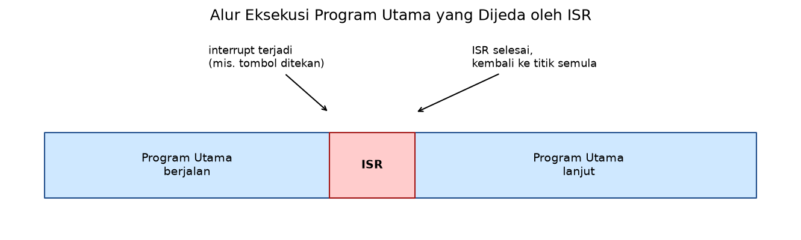
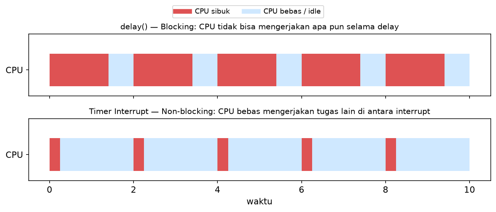
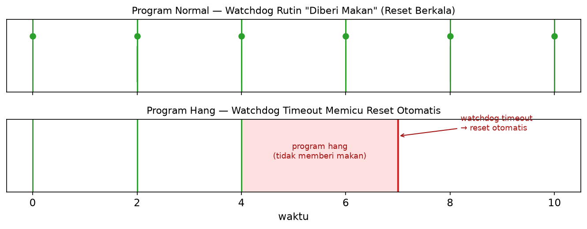
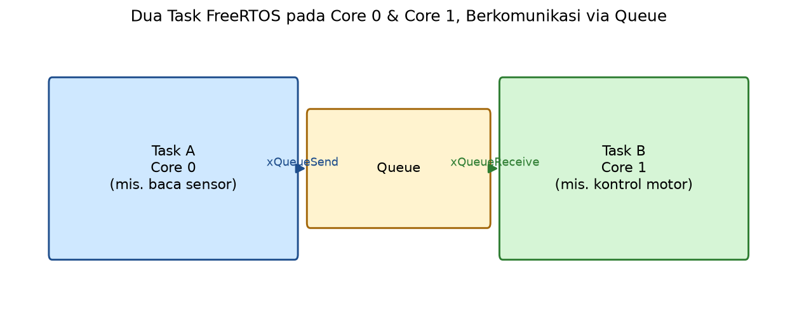

# MODUL 4
# INTERRUPT, TIMER, WATCHDOG, & MULTITASKING

**Mata Kuliah:** Praktikum Mikrokontroler & Embedded System
**Alokasi Waktu:** 5 x Percobaan (@ 100–150 menit)
**Platform:** ESP32 (Framework Arduino)
**IDE:** VSCode + PlatformIO

> **Catatan:** Modul ini melanjutkan penggunaan ESP32 dengan framework Arduino seperti pada Modul 1–3. Langkah instalasi VSCode, PlatformIO, dan driver USB-to-Serial tidak diulang di sini — lihat **[setup_vscode_platformio.md](setup_vscode_platformio.md)**. Seluruh contoh kode pada modul ini menggunakan platform PlatformIO resmi `espressif32` (Arduino-ESP32 **core versi 2.0.x**), konsisten dengan modul-modul lain dalam rangkaian praktikum ini — termasuk API Timer (`timerBegin`/`timerAttachInterrupt`/`timerAlarmWrite`) dan Watchdog (`esp_task_wdt_init`) versi core 2.x.

---

## Daftar Isi
- [MODUL 4](#modul-4)
- [INTERRUPT, TIMER, WATCHDOG, \& MULTITASKING](#interrupt-timer-watchdog--multitasking)
  - [Daftar Isi](#daftar-isi)
  - [A. Capaian Pembelajaran](#a-capaian-pembelajaran)
  - [B. Alat dan Bahan](#b-alat-dan-bahan)
  - [C. Dasar Teori](#c-dasar-teori)
    - [C.1 External Interrupt](#c1-external-interrupt)
    - [C.2 Timer Interrupt](#c2-timer-interrupt)
    - [C.3 Watchdog Timer (WDT)](#c3-watchdog-timer-wdt)
    - [C.4 Multitasking dengan FreeRTOS](#c4-multitasking-dengan-freertos)
  - [D. Persiapan Sebelum Praktikum](#d-persiapan-sebelum-praktikum)
  - [E. Kegiatan Praktikum](#e-kegiatan-praktikum)
    - [PERCOBAAN 1 — External Interrupt pada Kondisi Sistem Hang (Manual Recovery)](#percobaan-1--external-interrupt-pada-kondisi-sistem-hang-manual-recovery)
    - [PERCOBAAN 2 — External Interrupt: Decoding Quadrature Encoder (Pulsa \& Arah)](#percobaan-2--external-interrupt-decoding-quadrature-encoder-pulsa--arah)
    - [PERCOBAAN 3 — Timer Interrupt](#percobaan-3--timer-interrupt)
    - [PERCOBAAN 4 — Watchdog Timer](#percobaan-4--watchdog-timer)
    - [PERCOBAAN 5 — Multitasking dengan FreeRTOS](#percobaan-5--multitasking-dengan-freertos)
  - [F. Tugas Modul](#f-tugas-modul)
  - [G. Referensi](#g-referensi)

---

## A. Capaian Pembelajaran

Setelah menyelesaikan Modul 4, praktikan mampu:
1. Menjelaskan mengapa external interrupt tetap dapat berfungsi meskipun program utama mengalami hang, serta memanfaatkannya sebagai mekanisme pemulihan manual (manual recovery)
2. Menjelaskan konsep interrupt sebagai alternatif polling, dan mengimplementasikan external interrupt untuk penghitungan pulsa (encoder)
3. Mengimplementasikan timer interrupt untuk menjalankan tugas periodik tanpa memblokir program utama (`delay()`)
4. Menjelaskan fungsi watchdog timer dan mengimplementasikannya untuk menjaga keandalan sistem
5. Mengimplementasikan multitasking dasar menggunakan FreeRTOS, termasuk komunikasi antar task melalui queue

---

## B. Alat dan Bahan

| No | Nama Komponen | Spesifikasi | Jumlah |
|---|---|---|---|
| 1 | Board ESP32 DevKit | ESP32 DevKit v1 | 1 |
| 2 | Motor DC + encoder magnetik quadrature | **JGA25-370 (1000RPM)**, konektor JST 6-pin: M1 Merah = daya motor (+), M2 Putih = daya motor (−), C1 Kuning = encoder Channel A, C2 Hijau = encoder Channel B, Biru = VCC encoder (3.3–5V), Hitam = GND encoder — motor yang sama dari Modul 2 Percobaan 3 | 1 |
| 3 | LED + resistor 220Ω | untuk uji timer interrupt & indikator tombol darurat | 1 |
| 4 | Pushbutton (tactile) | dipakai ulang pada tombol darurat (Percobaan 1) dan multitasking + queue (Percobaan 5) | 1 |
| 5 | Breadboard | 830 titik | 1 |
| 6 | Kabel jumper male-male | — | secukupnya |
| 7 | Laptop/PC | VSCode + PlatformIO terinstal | 1 |

---

## C. Dasar Teori

### C.1 External Interrupt
Pendekatan **polling** memeriksa status suatu pin secara terus-menerus di dalam `loop()`, yang kurang efisien untuk event yang jarang terjadi atau butuh respons cepat. **Interrupt** memungkinkan CPU merespons suatu event secara langsung — saat event terjadi (mis. perubahan sinyal pada pin GPIO), eksekusi program utama dihentikan sementara untuk menjalankan fungsi khusus yang disebut **ISR (Interrupt Service Routine)**, lalu kembali melanjutkan program utama.

Konsep penting terkait interrupt pada ESP32:
- **Trigger mode:** `RISING` (LOW→HIGH), `FALLING` (HIGH→LOW), atau `CHANGE` (kedua arah)
- **ISR harus singkat:** tidak boleh berisi operasi yang memblokir/lambat seperti `delay()` atau `Serial.print()` dalam jumlah banyak
- **Variabel `volatile`:** variabel yang diakses baik dari ISR maupun dari `loop()` harus dideklarasikan `volatile` agar compiler tidak melakukan optimisasi yang menyebabkan nilai terbaru tidak terbaca dengan benar
- **`IRAM_ATTR`:** menandai agar fungsi ISR dieksekusi dari RAM, bukan Flash — wajib pada ESP32 karena Flash dapat sedang diakses oleh proses lain saat interrupt terjadi
- **Proteksi variabel bersama (`portMUX_TYPE`):** karena ESP32 memiliki dua core, sepasang fungsi `noInterrupts()`/`interrupts()` (yang hanya menonaktifkan interrupt pada satu core) tidak cukup aman untuk melindungi variabel yang diakses bersama oleh ISR dan `loop()`. Pendekatan yang benar pada ESP32 adalah menggunakan **critical section** berbasis `portMUX_TYPE` beserta `portENTER_CRITICAL_ISR()`/`portEXIT_CRITICAL_ISR()` (di dalam ISR) dan `portENTER_CRITICAL()`/`portEXIT_CRITICAL()` (di luar ISR), yang benar-benar aman terhadap akses simultan dari kedua core
- **Interrupt tetap berjalan meski program hang:** karena ISR dipicu di level hardware, ISR akan tetap dieksekusi meskipun `loop()` sedang terjebak dalam kondisi blocking/infinite loop, selama interrupt global tidak dinonaktifkan — sifat ini dapat dimanfaatkan sebagai mekanisme pemulihan darurat (lihat Percobaan 1)



*Gambar 1: Diagram alur eksekusi program utama yang dijeda sesaat oleh ISR saat interrupt terjadi, lalu kembali melanjutkan program utama*

### C.2 Timer Interrupt
Selain interrupt yang dipicu oleh perubahan sinyal eksternal, ESP32 memiliki **hardware timer** internal yang dapat memicu interrupt secara **periodik** berdasarkan hitungan waktu, tanpa bergantung pada sinyal dari luar. Timer interrupt memungkinkan tugas periodik (mis. membaca sensor tiap interval tertentu) dijalankan secara presisi **tanpa memblokir** program utama — berbeda dengan `delay()` yang menghentikan seluruh eksekusi program selama periode tunggu.



*Gambar 2: Diagram garis waktu (timeline) yang membandingkan task periodik menggunakan `delay()` (blocking) vs timer interrupt (non-blocking)*

### C.3 Watchdog Timer (WDT)
Watchdog Timer adalah timer khusus yang akan **me-reset sistem secara otomatis** jika tidak "diberi makan" (direset ulang) dalam periode waktu tertentu. Tujuannya adalah menjaga keandalan sistem embedded — jika program mengalami *hang* (macet, mis. akibat infinite loop atau kondisi tak terduga), watchdog akan mendeteksi bahwa sistem tidak lagi responsif dan memicu reset otomatis agar sistem kembali berjalan normal, alih-alih macet tanpa batas waktu.



*Gambar 3: Diagram alur watchdog timer — program normal "memberi makan" (reset) watchdog secara berkala, dibandingkan dengan program hang yang gagal memberi makan sehingga watchdog memicu reset otomatis*

### C.4 Multitasking dengan FreeRTOS
Arduino-ESP32 core dibangun di atas **FreeRTOS**, sebuah RTOS (Real-Time Operating System) yang memungkinkan beberapa **task** berjalan secara "paralel" (sebenarnya bergantian sangat cepat oleh scheduler, atau benar-benar paralel karena ESP32 memiliki dua core CPU). Setiap task memiliki fungsi, ukuran stack, dan prioritas masing-masing, dibuat menggunakan `xTaskCreate()`/`xTaskCreatePinnedToCore()`. Task yang berjalan pada RTOS umumnya tidak menggunakan `delay()` biasa, melainkan `vTaskDelay()` agar tidak memblokir task lain secara tidak perlu. Komunikasi antar task dapat dilakukan melalui **queue** (`xQueueSend()`/`xQueueReceive()`), memungkinkan satu task mengirim data ke task lain secara aman.



*Gambar 4: Diagram dua task FreeRTOS berjalan pada Core 0 dan Core 1 ESP32, saling berkomunikasi melalui queue*

---

## D. Persiapan Sebelum Praktikum

1. Pastikan PlatformIO sudah terinstal (lihat **[setup_vscode_platformio.md](setup_vscode_platformio.md)**)
2. Buat project baru untuk Modul 4:
   - Name: `modul4-interrupt-timer-rtos`
   - Board: **"Espressif ESP32 Dev Module"**
   - Framework: **Arduino**
3. Pastikan `platformio.ini` berisi:
   ```ini
   [env:esp32dev]
   platform = espressif32
   board = esp32dev
   framework = arduino
   ```
4. Tidak ada library eksternal tambahan yang dibutuhkan pada modul ini — seluruh fitur (interrupt, timer, watchdog, FreeRTOS) sudah tersedia dalam Arduino-ESP32 core

---

## E. Kegiatan Praktikum

### PERCOBAAN 1 — External Interrupt pada Kondisi Sistem Hang (Manual Recovery)

**Tujuan:**
Mahasiswa mampu membuktikan bahwa external interrupt tetap dapat berjalan meskipun program utama (`loop()`) mengalami hang/macet total, serta memanfaatkannya sebagai mekanisme pemulihan manual (manual recovery) yang melengkapi watchdog timer otomatis pada Percobaan 4.

> **Konsep kunci:** Selama interrupt global tidak dinonaktifkan (mis. melalui `noInterrupts()` atau critical section yang berkepanjangan), CPU akan tetap menjalankan ISR kapan pun trigger-nya terjadi — **bahkan jika `loop()` sedang terjebak dalam `while(true) {}` atau kondisi blocking lainnya**. Ini karena interrupt bekerja di level hardware yang independen dari kode apa yang sedang dieksekusi CPU, selama interrupt tersebut tidak sedang di-mask.

**Skema Rangkaian:**

| Komponen | Pin ESP32 | Keterangan |
|---|---|---|
| LED (+resistor 220Ω) | GPIO 2 | Sebagai indikator visual sistem berjalan normal (akan dipakai kembali pada Percobaan 3 — Timer Interrupt) |
| Pushbutton "Darurat" | GPIO 27 | `INPUT_PULLUP`, dipasang ke interrupt (trigger `FALLING`) |

**`platformio.ini`:**
```ini
[env:esp32dev]
platform = espressif32
board = esp32dev
framework = arduino
```

**Langkah Kerja:**
1. Rangkai LED dan pushbutton sesuai skema
2. Implementasikan program normal: LED berkedip + status dicetak ke Serial berkala
3. Pasang ISR pada pushbutton yang **langsung memanggil `esp_restart()`** — tombol sebagai "tombol darurat"
4. Uji tombol darurat dalam kondisi normal — pastikan board restart
5. Uncomment `// simulateHang();` pada `loop()`, amati LED dan Serial berhenti (sistem macet)
6. Saat hang, tekan tombol darurat — amati board tetap restart meski `loop()` terjebak total
7. Diskusikan mekanisme ini dibanding Watchdog Timer (Percobaan 4) — kapan masing-masing sebaiknya dipakai?

**Kode Program (Tombol Darurat — Restart Manual Saat Sistem Hang):**
```cpp
#include <Arduino.h>
#include <esp_system.h>

#define BUTTON_PIN 27
#define LED_PIN 2

void IRAM_ATTR emergencyISR()
{
    // Pengecualian terhadap aturan "ISR harus singkat": karena loop()
    // mungkin sedang hang, restart HARUS dilakukan langsung di dalam ISR
    // agar benar-benar dapat memulihkan sistem kapan pun dibutuhkan
    esp_restart();
}

void simulateHang()
{
    // Simulasi sistem hang: program terjebak di sini tanpa henti.
    // LED berhenti berkedip & Serial berhenti mencetak — coba tekan tombol darurat sekarang.
    Serial.println("Mensimulasikan hang! LED & Serial akan berhenti...");
    while (true)
    {
    }
}

void setup()
{
    Serial.begin(115200);
    pinMode(LED_PIN, OUTPUT);
    pinMode(BUTTON_PIN, INPUT_PULLUP);

    attachInterrupt(digitalPinToInterrupt(BUTTON_PIN), emergencyISR, FALLING);

    Serial.println("Sistem berjalan normal. Tombol darurat siap kapan saja.");
}

void loop()
{
    digitalWrite(LED_PIN, HIGH);
    delay(300);
    digitalWrite(LED_PIN, LOW);
    delay(300);
    Serial.println("loop() berjalan normal...");

    // simulateHang(); // Uncomment baris berikut untuk mensimulasikan sistem hang:
}
```

**Penjelasan Kode:**
| Bagian | Penjelasan |
|---|---|
| `esp_restart()` dipanggil langsung di `emergencyISR()` | Berbeda dari praktik umum (ISR hanya set flag, aksi berat dilakukan di `loop()`), di sini aksi pemulihan **harus** terjadi di dalam ISR — karena jika `loop()` sedang hang, ia tidak akan pernah sempat memeriksa flag apa pun |
| `simulateHang()` (dipanggil saat di-uncomment) | Fungsi berisi `while (true) {}` yang mewakili kondisi hang nyata (mis. akibat bug, sensor yang tidak merespons, atau kondisi tak terduga lainnya) — program benar-benar berhenti merespons pada `loop()`. Dibungkus sebagai fungsi agar cukup satu baris `// simulateHang();` yang perlu di-uncomment |
| Tombol darurat tetap berfungsi saat hang | Membuktikan bahwa ISR berjalan independen dari status `loop()`, selama interrupt global tidak dinonaktifkan |
| Perbandingan dengan Watchdog (Percobaan 4) | Watchdog mendeteksi hang secara **otomatis** berdasarkan timeout tanpa perlu campur tangan manusia; tombol darurat bersifat **manual** (perlu ditekan pengguna) namun dapat merespons **lebih cepat dan kapan saja**, tanpa menunggu periode timeout — keduanya saling melengkapi, bukan saling menggantikan |

---

### PERCOBAAN 2 — External Interrupt: Decoding Quadrature Encoder (Pulsa & Arah)

**Tujuan:**
Mahasiswa mampu mengimplementasikan external interrupt untuk melakukan decoding sinyal quadrature encoder (2 channel), menghitung jumlah pulsa sekaligus arah putaran secara periodik.

**Skema Rangkaian:**

| Komponen | Pin ESP32 | Keterangan |
|---|---|---|
| Encoder : Channel A (C1) | GPIO 32 | `INPUT_PULLUP`, dipasang ke interrupt (trigger `RISING`) : kabel **Kuning** |
| Encoder : Channel B (C2) | GPIO 33 | `INPUT_PULLUP`, dibaca di dalam ISR untuk menentukan arah : kabel **Hijau** |
| Encoder : VCC | 3.3V–5V (sesuai modul) | kabel **Biru** |
| Encoder : GND | GND | kabel **Hitam** |


*Gambar 5: Wiring modul encoder quadrature (Channel A/kuning, Channel B/hijau, VCC/biru, GND/hitam) ke ESP32*

**`platformio.ini`:**
```ini
[env:esp32dev]
platform = espressif32
board = esp32dev
framework = arduino
```

**Langkah Kerja:**
1. Rangkai encoder sesuai skema — kabel motor tidak dipakai di percobaan ini
2. Implementasikan ISR pada Channel A (`RISING`) yang membaca Channel B untuk menentukan arah
3. Gunakan `portMUX_TYPE` untuk melindungi `encoderCount` yang diakses ISR dan `loop()`
4. Tampilkan jumlah pulsa dan arah secara periodik (tiap 100ms) via `millis()` non-blocking
5. Amati pulsa dan arah di Serial Monitor sambil memutar poros dua arah
6. Putar poros pelan lalu cepat, analisis hubungan kecepatan putar dengan nilai `Delta`
7. Tukar Channel A dan B (tanpa ubah kode), amati arah yang terbaca
8. Analisis mengapa pertukaran itu membalik hasil pembacaan arah

**Kode Program (Decoding Quadrature Encoder via External Interrupt):**
```cpp
#include <Arduino.h>

#define ENCODER_A_PIN 32
#define ENCODER_B_PIN 33

volatile int32_t encoderCount = 0;
portMUX_TYPE encoderMux = portMUX_INITIALIZER_UNLOCKED;

int32_t previousCount = 0;
unsigned long previousMillis = 0;

void IRAM_ATTR encoderA_ISR()
{
    bool channelB = digitalRead(ENCODER_B_PIN);

    portENTER_CRITICAL_ISR(&encoderMux);
    if (channelB == HIGH)
    {
        encoderCount++; // arah maju (CW)
    }
    else
    {
        encoderCount--; // arah mundur (CCW)
    }
    portEXIT_CRITICAL_ISR(&encoderMux);
}

void setup()
{
    Serial.begin(115200);

    pinMode(ENCODER_A_PIN, INPUT_PULLUP);
    pinMode(ENCODER_B_PIN, INPUT_PULLUP);

    attachInterrupt(
        digitalPinToInterrupt(ENCODER_A_PIN),
        encoderA_ISR,
        RISING);

    Serial.println("ESP32 Quadrature Encoder Decoder (External Interrupt)");
}

void loop()
{
    unsigned long currentMillis = millis();

    if (currentMillis - previousMillis >= 100)
    {
        previousMillis = currentMillis;

        int32_t currentCount;
        portENTER_CRITICAL(&encoderMux);
        currentCount = encoderCount;
        portEXIT_CRITICAL(&encoderMux);

        int32_t deltaCount = currentCount - previousCount;
        previousCount = currentCount;

        Serial.printf("Total Pulsa: %ld | Delta: %ld | Arah: %s\n",
                      (long)currentCount,
                      (long)deltaCount,
                      deltaCount > 0 ? "Maju (CW)" : (deltaCount < 0 ? "Mundur (CCW)" : "Diam"));
    }
}
```

**Penjelasan Kode:**
| Bagian | Penjelasan |
|---|---|
| `attachInterrupt(..., encoderA_ISR, RISING)` | Interrupt hanya dipasang pada Channel A; Channel B dibaca langsung (bukan interrupt) di dalam ISR untuk menentukan arah |
| Logika arah (`channelB == HIGH`) | Prinsip decoding quadrature — urutan/fase antara Channel A dan Channel B saat transisi menentukan apakah poros berputar maju atau mundur |
| `portMUX_TYPE encoderMux` + `portENTER_CRITICAL_ISR()`/`portEXIT_CRITICAL_ISR()` | Melindungi akses ke `encoderCount` dari dalam ISR terhadap kemungkinan akses bersamaan oleh core lain — lebih aman dibanding `noInterrupts()`/`interrupts()` pada ESP32 dual-core |
| `portENTER_CRITICAL()`/`portEXIT_CRITICAL()` (di `loop()`) | Versi critical section untuk kode di luar ISR, digunakan saat membaca nilai `encoderCount` agar tidak bentrok dengan ISR yang mungkin berjalan di core lain |
| `deltaCount` (dibandingkan tiap 100ms) | Selisih jumlah pulsa antar periode — tandanya (positif/negatif/nol) menunjukkan arah putaran saat ini; nilai mentah ini yang akan diolah lebih lanjut menjadi RPM pada Modul 5 |

---

### PERCOBAAN 3 — Timer Interrupt

**Tujuan:**
Mahasiswa mampu mengimplementasikan timer interrupt untuk menjalankan tugas periodik (toggle LED) tanpa memblokir program utama.

**Skema Rangkaian:**

| Komponen | Pin ESP32 | Keterangan |
|---|---|---|
| LED (+resistor 220Ω) | GPIO 2 | Anoda ke GPIO, katoda ke GND melalui resistor |

**`platformio.ini`:**
```ini
[env:esp32dev]
platform = espressif32
board = esp32dev
framework = arduino
```

**Langkah Kerja:**
1. Rangkai LED sesuai skema
2. Upload kode di bawah — timer hardware sudah diatur memicu interrupt tiap 500 ms
3. Perhatikan pola pada kode: ISR cuma ubah flag `volatile bool`, toggle LED dikerjakan di `loop()`
4. Amati LED kedip tiap 500 ms dan Serial Monitor mencetak pesan tiap interrupt
5. Uncomment `// Serial.println("loop jalan terus");`, upload ulang, amati kedip LED tetap stabil 500 ms
6. Ubah nilai alarm `timerAlarmWrite(timer, 500000, true)` ke `100000` lalu `1000000`, amati kecepatan kedip tiap nilai
7. Catat hubungan nilai alarm dengan periode kedip yang teramati

**Kode Program (Timer Interrupt — Toggle LED):**
```cpp
#include <Arduino.h>

#define LED_PIN 2

hw_timer_t *timer = NULL;
volatile bool toggleFlag = false;

void IRAM_ATTR onTimer()
{
    toggleFlag = true;
}

void setup()
{
    Serial.begin(115200);
    pinMode(LED_PIN, OUTPUT);

    timer = timerBegin(0, 80, true);             // timer 0, prescaler 80 (80MHz/80 = 1MHz -> 1 tick = 1us), count up
    timerAttachInterrupt(timer, &onTimer, true); // edge-triggered (satu-satunya mode yang didukung ESP32)
    timerAlarmWrite(timer, 500000, true);        // alarm setiap 500.000 tick (500ms), autoreload
    timerAlarmEnable(timer);

    Serial.println("Timer interrupt aktif, LED akan toggle tiap 500ms");
}

void loop()
{
    if (toggleFlag)
    {
        toggleFlag = false;
        digitalWrite(LED_PIN, !digitalRead(LED_PIN));
        Serial.println("Timer interrupt terpicu");
    }

    // Langkah 5: uncomment baris berikut, lalu amati kedip LED tetap stabil 500 ms
    // Serial.println("loop jalan terus");
}
```

**Penjelasan Kode:**
| Bagian | Penjelasan |
|---|---|
| `timerBegin(0, 80, true)` | Menginisialisasi hardware timer nomor 0 (ESP32 memiliki 4 timer hardware, indeks 0–3) dengan prescaler 80 (clock dasar 80MHz dibagi 80 = 1MHz, setiap tick = 1 mikrodetik), `true` = mode hitung naik (count up) |
| `timerAttachInterrupt(timer, &onTimer, true)` | Mendaftarkan fungsi `onTimer()` sebagai ISR; parameter `true` menandakan mode edge-triggered |
| `timerAlarmWrite(timer, 500000, true)` | Mengatur nilai alarm 500.000 tick (setara 500ms pada frekuensi 1MHz), `true` mengaktifkan autoreload (berulang otomatis) |
| `timerAlarmEnable(timer)` | Mengaktifkan alarm agar timer mulai menghasilkan interrupt sesuai nilai yang diatur |
| `toggleFlag` (flag, bukan langsung `digitalWrite` di ISR) | Praktik terbaik — ISR hanya menandai bahwa event terjadi, sedangkan aksi yang lebih "berat" (toggle LED, print) dilakukan di `loop()` |

---

### PERCOBAAN 4 — Watchdog Timer

**Tujuan:**
Mahasiswa mampu mengimplementasikan watchdog timer untuk mendeteksi dan memulihkan sistem dari kondisi hang.

> Percobaan ini tidak memerlukan rangkaian tambahan — cukup gunakan board ESP32 yang sudah terhubung ke PC via USB.

**`platformio.ini`:**
```ini
[env:esp32dev]
platform = espressif32
board = esp32dev
framework = arduino
```

**Langkah Kerja:**
1. Implementasikan Task Watchdog dengan timeout 3 detik sesuai kode di bawah
2. Jalankan normal — di `loop()`, "beri makan" watchdog berkala (`esp_task_wdt_reset()`)
3. Amati Serial Monitor, program berjalan normal tanpa reset
4. Uncomment `// while (true) {}` pada `loop()`, upload ulang, amati board **restart otomatis** setelah 3 detik
5. Ubah `WDT_TIMEOUT_S` ke `1` lalu `6`, ukur berapa lama board butuh waktu untuk restart tiap nilai
6. Analisis risiko `WDT_TIMEOUT_S` terlalu kecil pada sistem dengan tugas berat/lambat di `loop()`

**Kode Program (Watchdog Timer):**
```cpp
#include <Arduino.h>
#include <esp_task_wdt.h>

#define WDT_TIMEOUT_S 3

void setup()
{
    Serial.begin(115200);

    esp_task_wdt_init(WDT_TIMEOUT_S, true); // timeout dalam detik, true = panic/restart otomatis saat timeout
    esp_task_wdt_add(NULL);                 // daftarkan task saat ini (loop utama) ke watchdog

    Serial.println("Watchdog Timer aktif (timeout 3 detik)");
}

void loop()
{
    Serial.println("Sistem berjalan normal");
    esp_task_wdt_reset(); // "memberi makan" watchdog
    delay(1000);

    // Uncomment baris berikut untuk mensimulasikan sistem hang:
    // while (true) {}
}
```

**Penjelasan Kode:**
| Bagian | Penjelasan |
|---|---|
| `esp_task_wdt_init(WDT_TIMEOUT_S, true)` | Menginisialisasi Task Watchdog dengan batas waktu dalam **detik**, parameter kedua (`true`) membuat sistem panic/restart otomatis saat timeout terlampaui |
| `esp_task_wdt_add(NULL)` | Mendaftarkan task yang sedang berjalan (dalam hal ini loop utama Arduino) agar diawasi oleh watchdog |
| `esp_task_wdt_reset()` | "Memberi makan" watchdog — memberi tahu sistem bahwa task masih berjalan normal, sehingga timer watchdog direset kembali ke 0 |
| `while (true) {}` (disimulasikan) | Program berhenti merespons — karena `esp_task_wdt_reset()` tidak lagi terpanggil, watchdog akan timeout dan me-restart sistem secara otomatis |

---

### PERCOBAAN 5 — Multitasking dengan FreeRTOS

**Tujuan:**
Mahasiswa mampu mengimplementasikan beberapa task yang berjalan "paralel" menggunakan FreeRTOS, serta komunikasi antar task melalui queue.

**Skema Rangkaian:**

| Komponen | Pin ESP32 | Keterangan |
|---|---|---|
| LED (+resistor 220Ω) | GPIO 2 | Anoda ke GPIO, katoda ke GND melalui resistor (dikendalikan `taskBlink`) |
| Pushbutton (tactile) | GPIO 27 | Satu kaki ke GPIO, kaki lain ke GND, gunakan `INPUT_PULLUP` (dibaca `taskButton`) |

**`platformio.ini`:**
```ini
[env:esp32dev]
platform = espressif32
board = esp32dev
framework = arduino
```

**Langkah Kerja:**
1. Rangkai LED (GPIO 2) dan pushbutton (GPIO 27) sesuai skema
2. Upload kode di bawah — tiga task dibuat di `setup()`, `loop()` dibiarkan kosong
3. Amati LED kedip 500 ms tanpa henti sambil tekan tombol beberapa kali — kedua aktivitas berjalan bersamaan tanpa saling menunggu
4. Perhatikan alur queue: `taskButton` kirim via `xQueueSend()`, `taskDisplay` terima via `xQueueReceive()` lalu cetak
5. Naikkan priority `taskButton` lebih tinggi dari `taskBlink` (mis. `2` dan `1`), amati apakah kedipan LED terpengaruh
6. Analisis bagaimana scheduler FreeRTOS menangani prioritas berbeda pada core yang sama
7. Pindahkan `taskButton` ke core yang sama dengan `taskBlink`, amati apakah tombol tetap responsif
8. Diskusikan trade-off satu core vs dua core untuk banyak task

**Kode Program (Multitasking FreeRTOS — 3 Task + Queue):**
```cpp
#include <Arduino.h>

#define LED_PIN 2
#define BUTTON_PIN 27

QueueHandle_t pressQueue;

// Task 1: kedipkan LED setiap 500 ms
void taskBlink(void *pv)
{
    pinMode(LED_PIN, OUTPUT);
    while (true)
    {
        digitalWrite(LED_PIN, !digitalRead(LED_PIN));
        vTaskDelay(pdMS_TO_TICKS(500));
    }
}

// Task 2: baca tombol, kirim jumlah penekanan ke queue
void taskButton(void *pv)
{
    pinMode(BUTTON_PIN, INPUT_PULLUP);
    int lastState = HIGH;
    int count = 0;
    while (true)
    {
        int reading = digitalRead(BUTTON_PIN);
        if (reading == LOW && lastState == HIGH)
        {
            count++;
            xQueueSend(pressQueue, &count, portMAX_DELAY);
        }
        lastState = reading;
        vTaskDelay(pdMS_TO_TICKS(20)); // beri jalan task lain + debounce sederhana
    }
}

// Task 3: terima data dari queue, tampilkan ke Serial
void taskDisplay(void *pv)
{
    int received;
    while (true)
    {
        if (xQueueReceive(pressQueue, &received, portMAX_DELAY) == pdTRUE)
        {
            Serial.printf("Tombol ditekan! Total: %d\n", received);
        }
    }
}

void setup()
{
    Serial.begin(115200);

    pressQueue = xQueueCreate(10, sizeof(int));

    xTaskCreatePinnedToCore(taskBlink,   "Blink",   2048, NULL, 1, NULL, 1);
    xTaskCreatePinnedToCore(taskButton,  "Button",  2048, NULL, 1, NULL, 1);
    xTaskCreatePinnedToCore(taskDisplay, "Display", 2048, NULL, 1, NULL, 0);
}

void loop()
{
    // Kosong — seluruh pekerjaan dilakukan oleh task FreeRTOS
}
```

**Penjelasan Kode:**
| Bagian | Penjelasan |
|---|---|
| `xTaskCreatePinnedToCore(fn, name, stackSize, param, priority, handle, coreID)` | Membuat task baru; `coreID` menentukan task berjalan pada core 0 atau core 1 |
| `vTaskDelay(pdMS_TO_TICKS(ms))` | Delay berbasis FreeRTOS tick — memberi kesempatan task lain berjalan selama menunggu, tidak memblokir seperti `delay()` |
| `loop()` kosong | Seluruh pekerjaan dipindah ke task buatan; scheduler FreeRTOS yang mengatur pergantian task |
| `xQueueCreate(10, sizeof(int))` | Membuat queue berkapasitas 10 data bertipe `int` sebagai jalur komunikasi antar task yang aman (*thread-safe*) |
| `xQueueSend(...)` / `xQueueReceive(..., portMAX_DELAY)` | Kirim/terima data via queue; penerima "tidur" (tidak memakai CPU) selama menunggu data baru masuk |

---

## F. Tugas Modul

**Tugas 1 — Reproduksi Manual Recovery (Wokwi):**
1. Buat project Wokwi baru dengan board **ESP32**, rangkai pushbutton darurat (Percobaan 1) dan LED indikator
2. Implementasikan ulang skenario program hang (`while(true){}` tanpa `yield`) beserta ISR tombol darurat yang memanggil `esp_restart()`
3. Verifikasi pada Serial Monitor Wokwi bahwa sistem benar-benar restart (tampil ulang pesan boot) setelah tombol darurat ditekan, meskipun `loop()` sedang hang
4. Bandingkan dengan pendekatan **watchdog timer** (Percobaan 4) pada skenario hang yang sama — mana yang lebih cepat memulihkan sistem, dan apa trade-off masing-masing (kontrol manual vs otomatis)?

**Tugas 2 — Timer Interrupt + Queue (Wokwi):**
Gabungkan timer interrupt (Percobaan 3, logging status tiap 1 detik) dengan multitasking FreeRTOS (Percobaan 5) dalam satu project Wokwi: satu task membaca status sebuah pushbutton virtual dan mengirim jumlah penekanan ke queue, sementara timer interrupt terpisah men-trigger flag yang dibaca task lain untuk mencetak status queue setiap detik ke Serial Monitor.

**Tugas 3 (Bonus) — Implementasi Level Register:**
Percobaan 4 (Watchdog Timer) pada modul ini dapat diimplementasikan ulang **tanpa `esp_task_wdt`**, langsung memanipulasi register Timer Group (MWDT0) sesuai Technical Reference Manual. Kerjakan (boleh dikerjakan di Wokwi maupun hardware asli):

| Percobaan | API yang diganti | Register/peripheral terkait | Petunjuk |
|---|---|---|---|
| Percobaan 4 (Watchdog Timer) | `esp_task_wdt_init()`/`esp_task_wdt_add()`/`esp_task_wdt_reset()` | Register MWDT0 (`TIMG_WDTCONFIG0_REG`, `TIMG_WDTCONFIG1_REG`, `TIMG_WDTCONFIG2_REG`, `TIMG_WDTFEED_REG`, `TIMG_WDTWPROTECT_REG`) | Buka write-protect (`TIMG_WDT_WKEY_VALUE`) sebelum menulis config/feed, lalu kunci kembali setelahnya |

> **Catatan:** register `TIMG_WDTCONFIG*` adalah watchdog hardware yang sama yang juga dipakai bootloader untuk *flashboot protection* — pastikan fungsi inisialisasi watchdog hanya dipanggil sekali di `setup()` (bukan berulang di `loop()`), dan verifikasi nama field terhadap versi ESP-IDF yang terpasang (`soc/timer_group_reg.h`) sebelum digunakan.

**Deliverable:** kode program level-register, penjelasan tiap register yang ditulis (rujuk ke ESP32 Technical Reference Manual bab Timer Group), dan perbandingan perilaku dengan versi API tingkat tinggi pada Percobaan aslinya.

**Pengumpulan:** Sertakan link project Wokwi (mode *share*, pastikan visibility public/unlisted) beserta laporan singkat pada berkas terpisah.

---

## G. Referensi
1. Espressif Systems, *ESP32 Technical Reference Manual — Interrupt, Timer, Task Watchdog*
2. Espressif Systems, *ESP-IDF Programming Guide — FreeRTOS, Task Watchdog Timer*, https://docs.espressif.com/projects/esp-idf/
3. Arduino-ESP32 Core Documentation — Timer, https://docs.espressif.com/projects/arduino-esp32/
4. FreeRTOS Official Documentation — Queue Management, https://www.freertos.org/
5. sss2022, *Closed-Loop Speed Control of a DC Motor With Encoder Using a Discrete PI Controller on Arduino*, Instructables — rujukan umum wiring motor gearbox + encoder (modul ini memakai JGA25-370), https://www.instructables.com/Closed-Loop-Speed-Control-of-a-DC-Motor-With-Encod/
