# MODUL 5
# PEMROSESAN DATA SENSOR & DASAR SISTEM KONTROL (FILTERING & PID)

**Mata Kuliah:** Praktikum Mikrokontroler & Embedded System
**Alokasi Waktu:** 5 x Percobaan (@ 100–150 menit)
**Platform:** ESP32 (Framework Arduino)
**IDE:** VSCode + PlatformIO

> **Catatan:** Modul ini merupakan modul kapstone yang menggabungkan **Modul 2** (motor DC + PWM), **Modul 3** (MPU6500), dan **Modul 4 Percobaan 2** (quadrature encoder via external interrupt). Pastikan rangkaian motor+encoder+driver dan modul MPU6500 dari modul-modul tersebut sudah berfungsi sebelum memulai modul ini. Seluruh contoh kode menggunakan platform PlatformIO resmi `espressif32` (Arduino-ESP32 **core versi 2.0.x**), konsisten dengan Modul 2–4, termasuk API LEDC berbasis channel (`ledcSetup`/`ledcAttachPin`/`ledcWrite`) untuk kontrol PWM motor DC.
>
> Grafik sinyal contoh (quadrature encoder, filter alpha, filter Kalman, on-off vs P, respons PID) pada modul ini adalah **data simulasi/dummy**, bukan hasil pengukuran alat sungguhan — dibuat dengan skrip Python **[scripts/generate_modul5_signals.py](scripts/generate_modul5_signals.py)** (`matplotlib` + `numpy`) untuk memberi gambaran bentuk sinyal yang diharapkan di Serial Plotter. Bentuk sinyal asli hasil praktikum bisa berbeda.

---

## Daftar Isi
- [MODUL 5](#modul-5)
- [PEMROSESAN DATA SENSOR \& DASAR SISTEM KONTROL (FILTERING \& PID)](#pemrosesan-data-sensor--dasar-sistem-kontrol-filtering--pid)
  - [Daftar Isi](#daftar-isi)
  - [A. Capaian Pembelajaran](#a-capaian-pembelajaran)
  - [B. Alat dan Bahan](#b-alat-dan-bahan)
  - [C. Dasar Teori](#c-dasar-teori)
    - [C.1 Dari Pulsa Encoder ke RPM](#c1-dari-pulsa-encoder-ke-rpm)
    - [C.2 Filtering Sederhana — Low-Pass Filter Alpha](#c2-filtering-sederhana--low-pass-filter-alpha)
    - [C.3 Filtering Lanjut — Kalman Filter](#c3-filtering-lanjut--kalman-filter)
    - [C.4 Sistem Kontrol Closed-Loop](#c4-sistem-kontrol-closed-loop)
    - [C.5 Kontrol PID](#c5-kontrol-pid)
  - [D. Persiapan Sebelum Praktikum](#d-persiapan-sebelum-praktikum)
  - [E. Kegiatan Praktikum](#e-kegiatan-praktikum)
    - [PERCOBAAN 1 — Filtering Alpha pada MPU6500 (Akselerometer)](#percobaan-1--filtering-alpha-pada-mpu6500-akselerometer)
    - [PERCOBAAN 2 — Dari Pulsa ke RPM dengan Filtering Alpha](#percobaan-2--dari-pulsa-ke-rpm-dengan-filtering-alpha)
    - [PERCOBAAN 3 — Filtering dengan Kalman Filter](#percobaan-3--filtering-dengan-kalman-filter)
    - [PERCOBAAN 4 — Kontrol Closed-Loop: On-Off vs Proportional (P)](#percobaan-4--kontrol-closed-loop-on-off-vs-proportional-p)
    - [PERCOBAAN 5 — Kontrol PID Lengkap \& Tuning](#percobaan-5--kontrol-pid-lengkap--tuning)
  - [F. Tugas Modul](#f-tugas-modul)
  - [G. Referensi](#g-referensi)

---

## A. Capaian Pembelajaran

Setelah menyelesaikan Modul 5, praktikan mampu:
1. Mengonversi data pulsa mentah dari encoder menjadi kecepatan putar (RPM)
2. Menerapkan filtering sederhana (low-pass filter berbasis alpha) untuk mengurangi noise, baik pada sinyal sensor sederhana (akselerometer MPU6500) maupun sinyal RPM encoder
3. Menerapkan Kalman filter sebagai metode filtering alternatif, serta membandingkannya dengan filter alpha
4. Menjelaskan konsep sistem kontrol closed-loop, serta mengimplementasikan kontrol on-off dan Proportional (P)
5. Mengimplementasikan kontrol PID lengkap untuk mengatur kecepatan motor DC berdasarkan target RPM, serta melakukan tuning parameter

---

## B. Alat dan Bahan

| No | Nama Komponen | Spesifikasi | Jumlah |
|---|---|---|---|
| 1 | Board ESP32 DevKit | ESP32 DevKit v1 | 1 |
| 2 | Modul IMU MPU6500 | mode I2C (sama seperti Modul 3 Percobaan 2) | 1 |
| 3 | Motor DC + encoder magnetik quadrature | **JGA25-370 (1000RPM)**, konektor JST 6-pin (sama seperti Modul 4) | 1 |
| 4 | Driver motor | L298N (sama seperti Modul 2) | 1 |
| 5 | Catu daya eksternal | sesuai kebutuhan motor (jangan gunakan 5V dari USB langsung) | 1 |
| 6 | Pushbutton (tactile) | 2 buah — tombol naik/turun target RPM | 2 |
| 7 | Breadboard | 830 titik | 1 |
| 8 | Kabel jumper male-male | — | secukupnya |
| 9 | Laptop/PC | VSCode + PlatformIO terinstal, Serial Plotter | 1 |

---

## C. Dasar Teori

> **Istilah penting di modul ini** (versi singkat, penjelasan lengkap ada di tiap subbab):
> | Istilah | Maksudnya secara sederhana |
> |---|---|
> | **RPM** | Kecepatan putar — berapa kali poros berputar penuh dalam satu menit |
> | **CPR** | Jumlah pulsa encoder untuk satu kali putaran penuh |
> | **Noise** | "Getaran" kecil yang tidak diinginkan pada nilai sensor — nilainya naik-turun sendiri padahal kondisi sebenarnya stabil |
> | **Filter** | Cara menghaluskan nilai yang naik-turun (noise) tadi, tanpa perlu mengganti sensor |
> | **Setpoint** | Nilai target yang ingin dicapai (mis. "motor harus berputar 100 RPM") |
> | **Error** | Selisih antara target (setpoint) dan nilai sebenarnya saat ini |
> | **Steady-state error** | Selisih kecil yang tetap tersisa meski sistem sudah "stabil" — target tidak pernah tercapai persis |
> | **PID** | Tiga cara mengoreksi error (Proportional, Integral, Derivative) yang digabung jadi satu sinyal kontrol |
> | **Tuning** | Proses coba-coba mengatur angka-angka PID sampai responsnya bagus |
> | **Overshoot** | Kelebihan target sesaat sebelum akhirnya stabil (mis. target 100 RPM, motor sempat naik ke 120 RPM dulu baru turun ke 100) |

### C.1 Dari Pulsa Encoder ke RPM
Setiap kali poros encoder berputar, sejumlah pulsa listrik dihasilkan — semakin cepat putarannya, semakin banyak pulsa yang muncul dalam satu detik. Dari sinilah kecepatan putar (**RPM** — putaran per menit) bisa dihitung.

Untuk motor bergearbox (seperti JGA25-370 yang dipakai di modul ini), jumlah pulsa yang terhitung di **poros output** (poros akhir setelah gearbox, tempat roda/beban terpasang) sudah dikalikan rasio reduksi gearbox — jadi bukan sekadar resolusi encoder mentah (disebut **CPR**, singkatan *Counts Per Revolution* = jumlah pulsa per satu putaran):

```
CPR_TOTAL = CPR_encoder × Rasio_Gearbox
```

RPM lalu dihitung dari berapa banyak pulsa bertambah dalam satu periode waktu tertentu:

```
RPM = (Jumlah_Pulsa_Bertambah / Waktu_dalam_detik) × (60 / CPR_TOTAL)
```

Angka CPR dan rasio gearbox pada datasheet/toko online sering tidak akurat — cara paling presisi adalah **kalibrasi langsung** (memutar poros output sejumlah putaran penuh yang diketahui, lalu menghitung pulsa yang tercatat). Pada modul ini, `CPR_TOTAL` cukup memakai **nilai estimasi dari spesifikasi motor** (untuk JGA25-370 1000RPM: ±102, lihat Percobaan 2) — cukup memadai untuk keperluan praktikum, meski nilai motor Anda sendiri bisa sedikit berbeda.

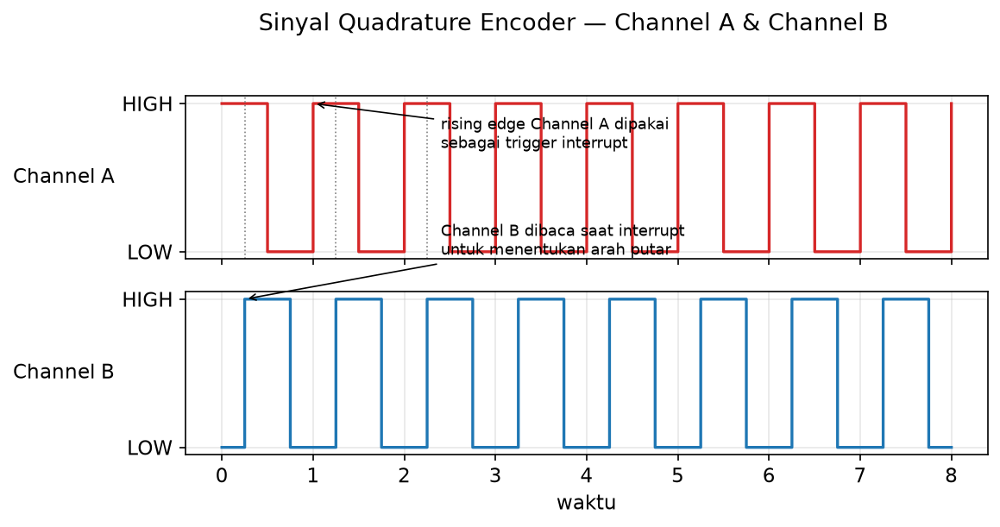

*Gambar 1: Diagram sinyal quadrature encoder Channel A dan Channel B beserta pulsa yang terhitung per putaran poros*

### C.2 Menghaluskan Sinyal — Filter Alpha
Nilai RPM mentah dari encoder biasanya **tidak mulus** — angkanya bisa melompat-lompat sedikit antar pembacaan (disebut *noise*), terutama saat motor berputar pelan. Cara paling sederhana untuk menghaluskannya adalah **filter alpha** (juga disebut *low-pass filter*), dengan rumus:

```
nilai_halus_baru = α × nilai_halus_lama + (1-α) × nilai_mentah_baru
```

`α` (dibaca "alpha") adalah angka antara 0–1 yang menentukan seberapa besar nilai lama dipertahankan. Semakin besar `α`, hasilnya semakin halus — tapi juga semakin lambat mengikuti perubahan nyata (istilahnya *lag*, alias "telat merespons"). Filter ini cukup satu angka (`α`) untuk diatur, jadi paling mudah diterapkan — tapi karena angkanya tetap, filter ini tidak bisa "menyesuaikan diri" saat kondisi sinyal berubah.

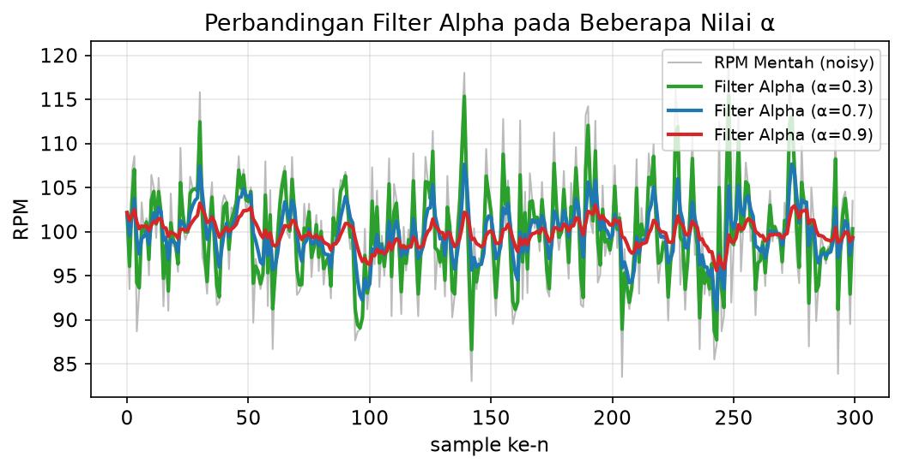

*Gambar 2: Grafik perbandingan sinyal RPM mentah (noisy) vs hasil filter alpha pada beberapa nilai α berbeda, menunjukkan trade-off kehalusan vs lag*

### C.3 Filter yang Lebih Pintar — Kalman Filter
Bayangkan Anda punya dua sumber informasi tentang kecepatan motor: **perkiraan** (berdasarkan pembacaan sebelumnya) dan **pengukuran baru** dari sensor. **Kalman filter** menggabungkan keduanya secara otomatis, dengan lebih "percaya" pada sumber mana pun yang saat itu lebih bisa diandalkan.

Berbeda dari filter alpha yang bobotnya (`α`) selalu tetap, Kalman filter menghitung ulang bobot terbaiknya (disebut **Kalman gain**, `K`) di setiap pembacaan, berdasarkan dua angka yang kita atur:
- **Q (process noise):** seberapa cepat nilai sebenarnya diperkirakan berubah — Q besar = motor dianggap sering berubah kecepatan
- **R (measurement noise):** seberapa "berisik"/tidak akurat sensornya — R besar = sensor dianggap kurang bisa dipercaya

Versi sederhana Kalman filter ini bekerja dua tahap tiap siklus — **Predict** (menaikkan ketidakpastian sedikit karena waktu berlalu) lalu **Update** (mengoreksi pakai data sensor baru):
```
// Predict
P = P + Q

// Update
K = P / (P + R)
X = X + K × (measurement - X)
P = (1 - K) × P
```
`X` adalah tebakan terbaik nilai saat ini, dan `P` adalah seberapa yakin kita pada tebakan itu (semakin kecil `P`, semakin yakin). Karena `K` dihitung ulang tiap siklus, Kalman filter otomatis lebih "percaya" ke sensor saat belum yakin, dan lebih "percaya" ke perkiraannya sendiri saat sudah stabil — perilaku adaptif yang tidak dimiliki filter alpha.

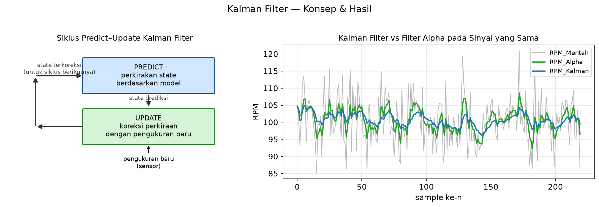

*Gambar 3: Diagram blok siklus predict-update Kalman filter, beserta grafik perbandingan hasil Kalman filter vs filter alpha pada sinyal RPM yang sama*

### C.4 Sistem Kontrol Closed-Loop (Loop Tertutup)
Sistem kontrol closed-loop bekerja seperti termostat AC: alat terus **mengukur** kondisi sebenarnya, **membandingkannya** dengan target, lalu **mengoreksi** — berulang-ulang. Target yang ingin dicapai disebut **setpoint**, nilai sebenarnya yang diukur sensor disebut **feedback**, dan selisih antara keduanya disebut **error**:

```
error = setpoint - nilai_terukur
```

Dua cara paling dasar mengoreksi error:
- **Kontrol On-Off (seperti termostat murah):** aktuator dinyalakan penuh kalau nilai masih di bawah target, dimatikan total kalau sudah tercapai. Simpel, tapi hasilnya berosilasi naik-turun terus di sekitar target (tidak pernah benar-benar diam)
- **Kontrol Proportional (P):** koreksi yang diberikan sebanding dengan besar error (`output = Kp × error`) — makin jauh dari target, makin besar koreksinya. Lebih halus dari on-off, tapi biasanya menyisakan sedikit selisih yang tidak pernah hilang (disebut **steady-state error**)

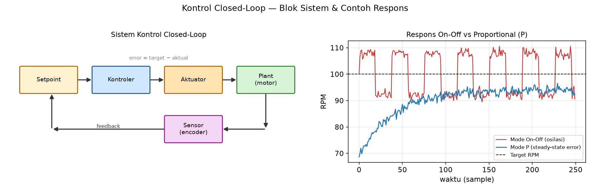

*Gambar 4: Diagram blok sistem kontrol closed-loop (setpoint → kontroler → aktuator → plant → sensor → feedback ke pembanding), beserta grafik respons on-off (osilasi) vs P (steady-state error)*

### C.5 Kontrol PID
PID menyempurnakan kontrol P dengan menambah dua "asisten" koreksi lain:
- **Integral (I):** menjumlahkan error dari waktu ke waktu — semakin lama error tersisa, semakin besar dorongan tambahan ini, sampai akhirnya menghabiskan sisa steady-state error yang tidak bisa diatasi kontrol P sendirian
- **Derivative (D):** melihat seberapa cepat error berubah — membantu "mengerem" sebelum motor melewati target (mengurangi *overshoot*) dan membuat sistem lebih cepat stabil

Ketiganya dijumlahkan jadi satu sinyal kontrol (bentuk diskret, cocok untuk mikrokontroler dengan interval sampling tetap):

```
output = Kp·error + Ki·(jumlah error dari waktu ke waktu) + Kd·(kecepatan perubahan error)
```

Tiga hal praktis yang perlu diperhatikan saat menerapkan PID di dunia nyata:
- **Integral windup:** bagian Integral bisa "menumpuk" jadi sangat besar kalau target sulit dicapai dalam waktu lama — nilainya perlu dibatasi (di-*clamp*) supaya tidak kebablasan
- **PWM minimum:** motor DC sering butuh tenaga minimum tertentu untuk mulai bergerak (melawan gesekan) — kalau output PID kecil tapi bukan nol, nilainya perlu dinaikkan ke ambang minimum ini
- **Tuning:** mencari angka Kp, Ki, Kd yang pas biasanya lewat coba-coba terarah — ubah satu angka, amati responsnya, ulangi (ada juga metode lebih sistematis seperti **Ziegler-Nichols**, di luar cakupan modul ini)

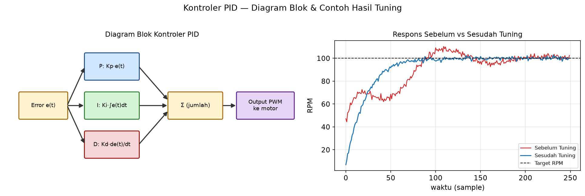

*Gambar 5: Diagram blok kontroler PID (jalur Proportional, Integral, Derivative dijumlahkan menjadi output), beserta grafik respons sistem sebelum dan sesudah tuning*

---

## D. Persiapan Sebelum Praktikum

1. Pastikan PlatformIO sudah terinstal (lihat **[setup_vscode_platformio.md](setup_vscode_platformio.md)**)
2. Instal ekstensi **Serial Plotter** pada VSCode — dibutuhkan untuk memvisualisasikan data pada seluruh Percobaan modul ini, karena VSCode (berbeda dari Arduino IDE) tidak memiliki Serial Plotter bawaan:
   - Buka **Extensions** pada VSCode (`Ctrl+Shift+X`), cari **"Serial Plotter"** (oleh badlogic), klik **Install**
   - Repository resmi: https://github.com/badlogic/serial-plotter
   - Setelah terinstal, buka melalui **Command Palette** (`Ctrl+Shift+P`) → ketik **"Serial Plotter: Open pane"**
   - Pada panel yang terbuka: pilih **port** serial ESP32 dan **baud rate** (115200, sesuai `Serial.begin()` pada kode), lalu klik **Start**
   - Ekstensi ini membaca format baris `>nama_variabel:nilai,nama_variabel2:nilai2` — persis format yang digunakan pada seluruh contoh kode `Serial.print()` di modul ini
   - **Penting:** port serial hanya dapat diakses satu proses dalam satu waktu — klik **Stop** pada Serial Plotter sebelum melakukan Upload program baru, agar proses upload tidak gagal karena port sedang terpakai
3. Pastikan rangkaian motor DC + driver (Modul 2), encoder quadrature (Modul 4 Percobaan 2), dan modul MPU6500 mode I2C (Modul 3) masing-masing sudah berfungsi normal — motor dan encoder berasal dari modul fisik yang sama
4. Buat project baru untuk Modul 5:
   - Name: `modul5-filtering-pid`
   - Board: **"Espressif ESP32 Dev Module"**
   - Framework: **Arduino**
5. Pastikan `platformio.ini` berisi:
   ```ini
   [env:esp32dev]
   platform = espressif32
   board = esp32dev
   framework = arduino
   ```
6. Tidak ada library eksternal tambahan yang dibutuhkan — seluruh fitur (interrupt, LEDC PWM) sudah tersedia dalam Arduino-ESP32 core, tidak perlu menambahkan baris `lib_deps` apa pun pada `platformio.ini`
7. **Alur kerja tiap Percobaan:** seluruh Percobaan pada modul ini (1–5) menggunakan **satu project PlatformIO yang sama** dari langkah 4–5 di atas. Setiap kode program pada modul ini bersifat **lengkap dan berdiri sendiri (self-contained)** — untuk berpindah ke Percobaan berikutnya, cukup **hapus seluruh isi** `src/main.cpp` dan **ganti dengan kode program Percobaan yang bersangkutan**, lalu **Build & Upload** ulang. Tidak perlu menggabungkan potongan kode dari beberapa Percobaan secara manual.

---

## E. Kegiatan Praktikum

### PERCOBAAN 1 — Filtering Alpha pada MPU6500 (Akselerometer)

**Tujuan:**
Mahasiswa mampu mengidentifikasi noise pada sinyal sensor mentah dan menerapkan low-pass filter alpha untuk menghaluskannya, sebagai pengantar konsep filtering sebelum diterapkan pada sinyal RPM yang lebih kompleks di Percobaan 2.

**Skema Rangkaian:**

| Komponen | Pin ESP32 | Keterangan |
|---|---|---|
| MPU6500 — SDA | GPIO 21 | Mode I2C |
| MPU6500 — SCL | GPIO 22 | Mode I2C |
| MPU6500 — CS/NCS | 3.3V (ditarik tetap) | Wajib, agar modul beroperasi dalam mode I2C |
| MPU6500 — VCC/GND | 3.3V, GND | — |

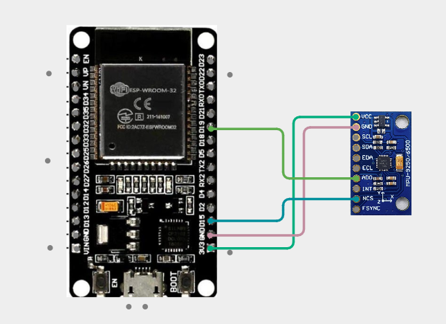

*Gambar 6: Wiring MPU6500 mode I2C ke ESP32*

**`platformio.ini`:**
```ini
[env:esp32dev]
platform = espressif32
board = esp32dev
framework = arduino
```

**Langkah Kerja:**
1. Rangkai MPU6500 mode I2C sesuai skema
2. Upload kode di bawah, amati akselerometer mentah di **Serial Plotter**
3. Ketuk meja pelan atau goyangkan sensor — amati `Accel_Mentah` naik-turun tajam (noise)
4. Implementasikan low-pass filter alpha, tampilkan `Accel_Mentah` dan `Accel_Alpha` bersamaan
5. Uji α = 0.3, lalu 0.7, lalu 0.9 — Build & Upload ulang tiap nilai. Analisis trade-off: α besar lebih halus tapi lebih telat merespons

**Kode Program (MPU6500 + Low-Pass Filter Alpha):**
```cpp
#include <Arduino.h>
#include <Wire.h>

#define MPU6500_ADDR 0x68
#define PWR_MGMT_1   0x6B
#define ACCEL_XOUT_H 0x3B

#define FILTER_ALPHA 0.7 // sesuaikan: makin besar = makin halus, makin lambat merespons

float rawAccel = 0.0;
float filteredAccel = 0.0;

void writeRegister(uint8_t reg, uint8_t value)
{
    Wire.beginTransmission(MPU6500_ADDR);
    Wire.write(reg);
    Wire.write(value);
    Wire.endTransmission();
}

int16_t read16(uint8_t reg)
{
    Wire.beginTransmission(MPU6500_ADDR);
    Wire.write(reg);
    Wire.endTransmission(false); // repeated start, bus tetap dikuasai

    Wire.requestFrom(MPU6500_ADDR, 2);

    uint8_t high = Wire.read();
    uint8_t low  = Wire.read();

    return (high << 8) | low;
}

void setup()
{
    Serial.begin(115200);
    Wire.begin(21, 22); // SDA, SCL

    writeRegister(PWR_MGMT_1, 0x00); // bangunkan dari sleep mode
    delay(100);
}

void loop()
{
    int16_t az = read16(ACCEL_XOUT_H + 4); // sumbu Z

    // Sensitivitas default +-2g -> 16384 LSB/g
    rawAccel = az / 16384.0;

    // Low-pass filter alpha
    filteredAccel = FILTER_ALPHA * filteredAccel + (1.0 - FILTER_ALPHA) * rawAccel;

    Serial.print(">");
    Serial.print("Accel_Mentah:");
    Serial.print(rawAccel, 3);
    Serial.print(",Accel_Alpha:");
    Serial.print(filteredAccel, 3);
    Serial.println();

    delay(50);
}
```

**Penjelasan Kode:**
| Bagian | Penjelasan |
|---|---|
| `writeRegister()` / `read16()` | Fungsi baca/tulis register MPU6500 via I2C |
| `az / 16384.0` | Konversi nilai mentah 16-bit ke satuan g, sesuai sensitivitas default ±2g |
| `filteredAccel = FILTER_ALPHA * filteredAccel + (1.0 - FILTER_ALPHA) * rawAccel` | Implementasi rumus low-pass filter alpha pada Dasar Teori C.2 — persis sama dengan yang dipakai untuk RPM di Percobaan 2 |
| `delay(50)` | Sampling lebih cepat dibanding percobaan RPM (100ms) karena sinyal akselerometer berubah lebih cepat |

---

### PERCOBAAN 2 — Dari Pulsa ke RPM dengan Filtering Alpha

**Tujuan:**
Mahasiswa mampu mengonversi data pulsa mentah dari encoder (Modul 4 Percobaan 2) menjadi nilai RPM menggunakan konstanta estimasi dari spesifikasi motor, serta menerapkan low-pass filter alpha untuk menghaluskan sinyal RPM.

**Skema Rangkaian:**

| Komponen | Pin ESP32 | Keterangan |
|---|---|---|
| Encoder — Channel A (C1, kabel Kuning) | GPIO 32 | `INPUT_PULLUP`, dipasang ke interrupt (trigger `RISING`) — sama seperti Modul 4 Percobaan 2 |
| Encoder — Channel B (C2, kabel Hijau) | GPIO 33 | `INPUT_PULLUP`, dibaca di dalam ISR untuk menentukan arah |
| Encoder — VCC (kabel Biru) | 3.3V–5V | — |
| Encoder — GND (kabel Hitam) | GND | — |

> Kabel daya motor (M1 Merah / M2 Putih) **tidak digunakan** pada percobaan ini — motor diputar dengan tangan.

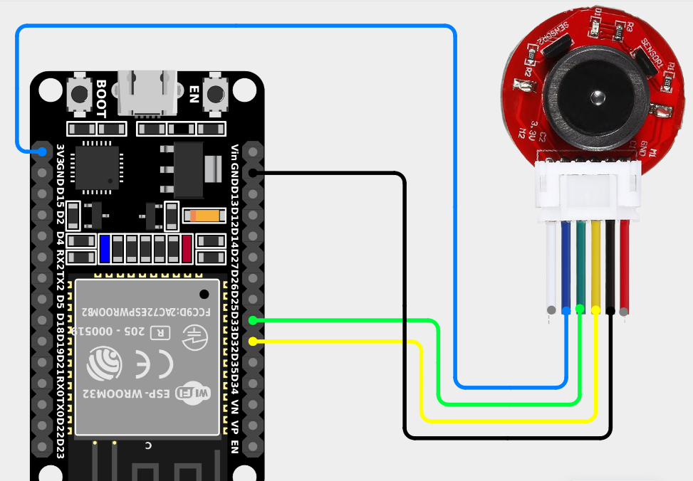

*Gambar 7: Wiring diagram encoder quadrature (Channel A, Channel B, VCC, GND) ke ESP32, sama seperti Modul 4 Percobaan 2*

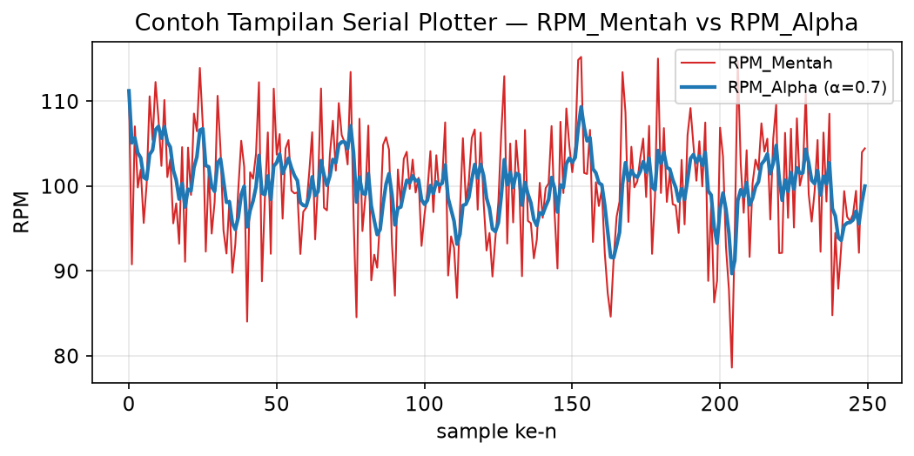

*Gambar 8: Contoh tampilan Serial Plotter yang diharapkan — garis RPM_Mentah bergerigi tajam berdampingan dengan garis RPM_Alpha yang jauh lebih halus*

**`platformio.ini`:**
```ini
[env:esp32dev]
platform = espressif32
board = esp32dev
framework = arduino
```

**Langkah Kerja:**
1. Gunakan kode decoding quadrature dari Modul 4 Percobaan 2 sebagai basis
2. Tambahkan rumus RPM dari Dasar Teori C.1, pakai `PULSES_PER_REV = 102.0` (lihat kode di bawah)
3. Upload, putar poros dengan tangan — amati RPM berubah langsung. Kalau tetap 0, cek Channel A/B tertukar pin
4. Amati RPM mentah di **Serial Plotter** — lebih bergerigi dibanding akselerometer di Percobaan 1
5. Implementasikan filter alpha yang sama seperti Percobaan 1, tampilkan `RPM_Mentah` dan `RPM_Alpha` bersamaan (lihat Gambar 8)
6. Uji α = 0.3, lalu 0.7, lalu 0.9 — Build & Upload ulang tiap nilai. Analisis kapan α besar/kecil lebih menguntungkan

**Kode Program (Encoder + RPM + Low-Pass Filter Alpha — Program Lengkap):**
```cpp
#include <Arduino.h>

#define ENCODER_A_PIN 32
#define ENCODER_B_PIN 33

// Estimasi dari spesifikasi motor JGA25-370 1000RPM (11 PPR x rasio gearbox ~9.28)
// Bukan hasil kalibrasi manual, sehingga bisa meleset dari motor sungguhan Anda
const float PULSES_PER_REV = 102.0;

#define FILTER_ALPHA 0.7 // sesuaikan: makin besar = makin halus, makin lambat merespons

volatile int32_t encoderCount = 0;
portMUX_TYPE encoderMux = portMUX_INITIALIZER_UNLOCKED;

int32_t previousCount = 0;
unsigned long previousMillis = 0;
const unsigned long SAMPLE_INTERVAL_MS = 100;

float rawRPM = 0.0;
float filteredRPM = 0.0;

void IRAM_ATTR encoderA_ISR()
{
    bool channelB = digitalRead(ENCODER_B_PIN);

    portENTER_CRITICAL_ISR(&encoderMux);
    if (channelB == HIGH)
    {
        encoderCount++;
    }
    else
    {
        encoderCount--;
    }
    portEXIT_CRITICAL_ISR(&encoderMux);
}

void setup()
{
    Serial.begin(115200);

    pinMode(ENCODER_A_PIN, INPUT_PULLUP);
    pinMode(ENCODER_B_PIN, INPUT_PULLUP);

    attachInterrupt(digitalPinToInterrupt(ENCODER_A_PIN), encoderA_ISR, RISING);
}

void loop()
{
    unsigned long currentMillis = millis();

    if (currentMillis - previousMillis >= SAMPLE_INTERVAL_MS)
    {
        float deltaTime = (currentMillis - previousMillis) / 1000.0;
        previousMillis = currentMillis;

        int32_t currentCount;
        portENTER_CRITICAL(&encoderMux);
        currentCount = encoderCount;
        portEXIT_CRITICAL(&encoderMux);

        int32_t deltaCount = currentCount - previousCount;
        previousCount = currentCount;

        // Konversi pulsa -> RPM
        rawRPM = (deltaCount / deltaTime) * (60.0 / PULSES_PER_REV);

        // Filtering alpha
        filteredRPM = FILTER_ALPHA * filteredRPM + (1.0 - FILTER_ALPHA) * rawRPM;

        // Format khusus agar terbaca oleh ESP32 Serial Plotter (Serial Monitor -> Plotter)
        Serial.print(">");
        Serial.print("RPM_Mentah:");
        Serial.print(rawRPM, 2);
        Serial.print(",");
        Serial.print("RPM_Alpha:");
        Serial.print(filteredRPM, 2);
        Serial.println();
    }
}
```

**Penjelasan Kode:**
| Bagian | Penjelasan |
|---|---|
| `PULSES_PER_REV` | Estimasi dari spesifikasi motor (11 pulsa/putaran motor × rasio gearbox ~9.28) — bukan hasil kalibrasi manual, jadi bisa berbeda dari motor sungguhan Anda |
| `deltaTime = (currentMillis - previousMillis) / 1000.0` | Interval waktu sampling dikonversi ke detik, agar hasil RPM sesuai satuan (menit) |
| `rawRPM = (deltaCount / deltaTime) * (60.0 / PULSES_PER_REV)` | Implementasi langsung rumus RPM pada Dasar Teori C.1 |
| `filteredRPM = FILTER_ALPHA * filteredRPM + (1.0 - FILTER_ALPHA) * rawRPM` | Implementasi rumus low-pass filter alpha yang sama seperti Percobaan 1, kali ini pada sinyal RPM |

---

### PERCOBAAN 3 — Filtering dengan Kalman Filter

**Tujuan:**
Mahasiswa mampu menerapkan Kalman filter 1D sebagai metode filtering alternatif untuk sinyal RPM, serta membandingkan hasilnya dengan low-pass filter alpha pada Percobaan 2.

> **Catatan:** Sama seperti Percobaan 2, fokusnya adalah **membandingkan bentuk tiga garis** pada grafik, bukan mengubah kecepatan motor.

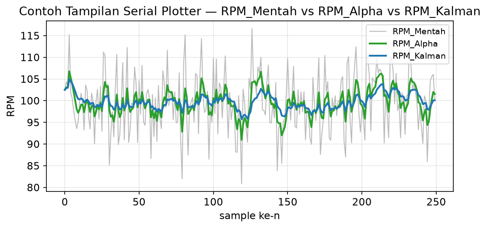

*Gambar 9: Contoh tampilan Serial Plotter dengan tiga garis (RPM_Mentah, RPM_Alpha, RPM_Kalman) pada kondisi RPM yang sama, untuk perbandingan visual*

**Skema Rangkaian:**

| Komponen | Pin ESP32 | Keterangan |
|---|---|---|
| Encoder — Channel A | GPIO 32 | `INPUT_PULLUP`, trigger `RISING` |
| Encoder — Channel B | GPIO 33 | `INPUT_PULLUP`, dibaca di dalam ISR |
| Encoder — VCC / GND | 3.3V–5V / GND | — |

**`platformio.ini`:**
```ini
[env:esp32dev]
platform = espressif32
board = esp32dev
framework = arduino
```

**Langkah Kerja:**
1. Upload kode di bawah — sudah mencakup RPM + filter alpha sebagai pembanding, ditambah Kalman filter baru
2. Perhatikan implementasi kelas `KalmanFilter` pada kode
3. Tampilkan `RPM_Mentah`, `RPM_Alpha`, dan `RPM_Kalman` bersamaan di Serial Plotter (lihat Gambar 9)
4. Uji Q/R default (0.001, 0.1), lalu ubah ke Q=0.1, R=5 — amati perubahan bentuk garis `RPM_Kalman`
5. Bandingkan visual: `RPM_Kalman` harus lebih halus namun lebih cepat merespons dibanding `RPM_Alpha` — tuliskan pengamatan ini

**Kode Program (Encoder + RPM + Filter Alpha + Kalman Filter — Program Lengkap):**
```cpp
#include <Arduino.h>

#define ENCODER_A_PIN 32
#define ENCODER_B_PIN 33

// Estimasi dari spesifikasi motor JGA25-370 1000RPM — bukan hasil kalibrasi manual
const float PULSES_PER_REV = 102.0;

#define FILTER_ALPHA 0.7 // filter alpha, sebagai pembanding

volatile int32_t encoderCount = 0;
portMUX_TYPE encoderMux = portMUX_INITIALIZER_UNLOCKED;

int32_t previousCount = 0;
unsigned long previousMillis = 0;
const unsigned long SAMPLE_INTERVAL_MS = 100;

float rawRPM = 0.0;
float filteredRPM = 0.0; // hasil filter alpha

class KalmanFilter
{
private:
    float Q = 0.001; // process noise - seberapa besar nilai sebenarnya diperkirakan berubah
    float R = 0.1;   // measurement noise - seberapa "berisik" hasil pengukuran sensor
    float X = 0;     // estimasi nilai saat ini
    float P = 1;     // estimasi ketidakpastian (error covariance)
    float K = 0;     // Kalman gain

public:
    float update(float measurement)
    {
        // Predict
        P += Q;

        // Update
        K = P / (P + R);
        X = X + K * (measurement - X);
        P = (1 - K) * P;

        return X;
    }
};

KalmanFilter rpmKalman;
float kalmanRPM = 0.0; // hasil Kalman filter

void IRAM_ATTR encoderA_ISR()
{
    bool channelB = digitalRead(ENCODER_B_PIN);

    portENTER_CRITICAL_ISR(&encoderMux);
    if (channelB == HIGH)
    {
        encoderCount++;
    }
    else
    {
        encoderCount--;
    }
    portEXIT_CRITICAL_ISR(&encoderMux);
}

void setup()
{
    Serial.begin(115200);

    pinMode(ENCODER_A_PIN, INPUT_PULLUP);
    pinMode(ENCODER_B_PIN, INPUT_PULLUP);

    attachInterrupt(digitalPinToInterrupt(ENCODER_A_PIN), encoderA_ISR, RISING);
}

void loop()
{
    unsigned long currentMillis = millis();

    if (currentMillis - previousMillis >= SAMPLE_INTERVAL_MS)
    {
        float deltaTime = (currentMillis - previousMillis) / 1000.0;
        previousMillis = currentMillis;

        int32_t currentCount;
        portENTER_CRITICAL(&encoderMux);
        currentCount = encoderCount;
        portEXIT_CRITICAL(&encoderMux);

        int32_t deltaCount = currentCount - previousCount;
        previousCount = currentCount;

        // Konversi pulsa -> RPM
        rawRPM = (deltaCount / deltaTime) * (60.0 / PULSES_PER_REV);

        // Filtering alpha (pembanding)
        filteredRPM = FILTER_ALPHA * filteredRPM + (1.0 - FILTER_ALPHA) * rawRPM;

        // Filtering Kalman
        kalmanRPM = rpmKalman.update(rawRPM);

        Serial.print(">");
        Serial.print("RPM_Mentah:");
        Serial.print(rawRPM, 2);
        Serial.print(",RPM_Alpha:");
        Serial.print(filteredRPM, 2);
        Serial.print(",RPM_Kalman:");
        Serial.print(kalmanRPM, 2);
        Serial.println();
    }
}
```

**Penjelasan Kode:**
| Bagian | Penjelasan |
|---|---|
| `P += Q` (tahap Predict) | Menaikkan ketidakpastian estimasi seiring waktu, sebelum ada pengukuran baru yang menguranginya kembali |
| `K = P / (P + R)` | Kalman gain — rasio ketidakpastian model terhadap total ketidakpastian (model + pengukuran); menentukan seberapa besar pengukuran baru "dipercaya" |
| `X = X + K * (measurement - X)` (tahap Update) | Estimasi diperbarui sebagian menuju nilai pengukuran baru, sebesar proporsi `K` |
| `P = (1 - K) * P` | Ketidakpastian berkurang setelah menggabungkan informasi dari pengukuran baru |
| Nilai `Q` dan `R` sebagai parameter tuning | Berbeda dari filter alpha yang hanya punya 1 parameter, Kalman filter punya 2 parameter yang saling memengaruhi — lebih fleksibel namun juga lebih kompleks untuk di-tuning |

**Latihan Tambahan:**
Bandingkan jumlah parameter yang perlu di-tuning (filter alpha: 1 parameter vs Kalman filter: 2 parameter) serta kompleksitas komputasi keduanya. Diskusikan: dalam kondisi seperti apa kompleksitas tambahan Kalman filter sepadan dengan manfaatnya dibanding filter alpha yang jauh lebih sederhana?

---

### PERCOBAAN 4 — Kontrol Closed-Loop: On-Off vs Proportional (P)

**Tujuan:**
Mahasiswa mampu mengimplementasikan dan membandingkan kontrol on-off dengan kontrol Proportional (P) untuk mengatur kecepatan motor DC menuju target RPM.

> **Catatan:** Percobaan ini adalah yang pertama di modul ini di mana motor dikendalikan oleh program (closed-loop) — bukan diputar tangan lagi seperti percobaan-percobaan sebelumnya.

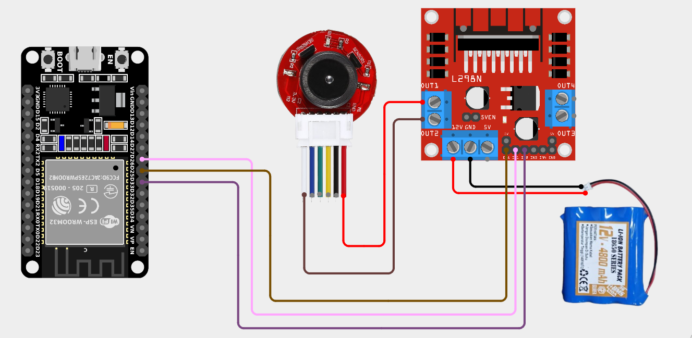

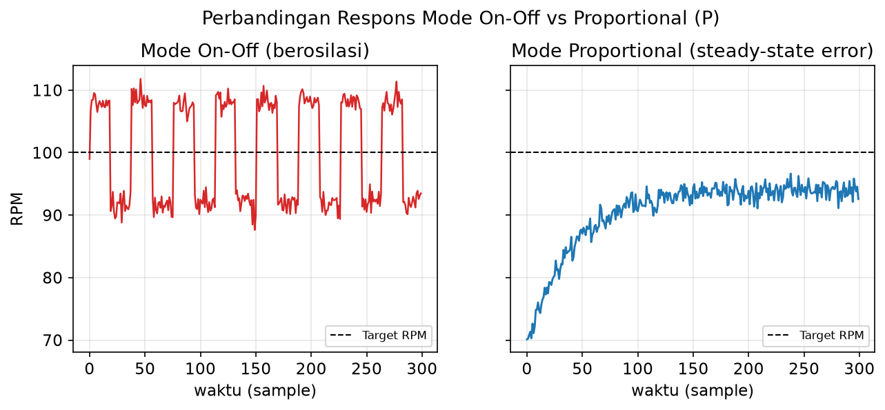

*Gambar 11: Contoh grafik Serial Plotter perbandingan mode on-off (berosilasi di sekitar target) vs mode Proportional (stabil namun menyisakan selisih dari target)*

**Skema Rangkaian:**

| Komponen | Pin ESP32 | Keterangan |
|---|---|---|
| Encoder — Channel A / B | GPIO 32 / GPIO 33 | `INPUT_PULLUP`, decoding quadrature |
| Driver motor — ENA | GPIO 25 | Sinyal PWM kecepatan (channel LEDC) |
| Driver motor — IN1 | GPIO 26 | Arah putar motor |
| Driver motor — IN2 | GPIO 27 | Arah putar motor |
| Motor DC — M1 (Merah, +) | Driver OUT1 | Menukar M1/M2 membalik arah putar default motor |
| Motor DC — M2 (Putih, −) | Driver OUT2 | — |
| Motor DC — daya | Catu daya eksternal via driver (L298N) | **Jangan** ambil dari 5V USB langsung |

> Pin ENA/IN1/IN2 mengikuti Modul 2 Percobaan 3, kecuali IN2 dipindah ke GPIO 27 karena GPIO 33 kini dipakai encoder. Lihat Gambar 10 untuk wiring gabungan encoder + driver motor dalam satu rangkaian. Gunakan filter alpha sebagai sumber RPM terfilter.

**`platformio.ini`:**
```ini
[env:esp32dev]
platform = espressif32
board = esp32dev
framework = arduino
```

**Langkah Kerja:**
1. Rangkai motor DC + driver + encoder sesuai Gambar 10, pakai catu daya eksternal untuk motor (bukan 5V USB)
2. Tentukan target RPM = 100 di kode
3. Coba mode **on-off** dulu — amati Serial Plotter: RPM naik-turun terus di sekitar target dan motor bergetar, ini **normal** untuk mode on-off (bandingkan Gambar 11)
4. Ganti ke mode **Proportional** (`Kp = 3.0`) — RPM lebih stabil, tapi berhenti sedikit di bawah target (disebut *steady-state error*), ini juga normal untuk kontrol P
5. Screenshot Serial Plotter kedua mode, lalu hitung kasar *steady-state error* mode P (target dikurangi RPM rata-rata saat stabil)
6. Kalau motor tidak bergerak sama sekali, cek wiring driver (Gambar 10) dan urutan `IN1`/`IN2` sebelum `ledcWrite()` dipanggil

**Kode Program (Encoder + Filter + Kontrol On-Off/Proportional — Program Lengkap):**
```cpp
#include <Arduino.h>

// ==================== ENCODER ====================
#define ENCODER_A_PIN 32
#define ENCODER_B_PIN 33

// Estimasi dari spesifikasi motor JGA25-370 1000RPM — bukan hasil kalibrasi manual
const float PULSES_PER_REV = 102.0;

volatile int32_t encoderCount = 0;
portMUX_TYPE encoderMux = portMUX_INITIALIZER_UNLOCKED;

int32_t previousCount = 0;
unsigned long previousMillis = 0;
const unsigned long SAMPLE_INTERVAL_MS = 100;

float rawRPM = 0.0;
float filteredRPM = 0.0;
#define FILTER_ALPHA 0.7 // filter alpha

// ==================== DRIVER MOTOR (Modul 2) ====================
#define ENA 25
#define IN1 26
#define IN2 27

const int pwmChannel = 0;
const int pwmFreq = 1000;
const int pwmResolution = 8; // 0-255

// ==================== KONTROL ====================
const float targetRPM = 100.0;
const float Kp = 3.0; // untuk mode Proportional, sesuaikan hasil pengamatan

bool useProportional = true; // ganti false untuk menguji mode on-off

void IRAM_ATTR encoderA_ISR()
{
    bool channelB = digitalRead(ENCODER_B_PIN);

    portENTER_CRITICAL_ISR(&encoderMux);
    if (channelB == HIGH)
    {
        encoderCount++;
    }
    else
    {
        encoderCount--;
    }
    portEXIT_CRITICAL_ISR(&encoderMux);
}

void applyControl(float rpmInput)
{
    float error = targetRPM - rpmInput;
    int pwmOutput = 0;

    if (useProportional)
    {
        // Kontrol Proportional
        pwmOutput = (int)(Kp * error);
    }
    else
    {
        // Kontrol On-Off
        pwmOutput = (error > 0) ? 255 : 0;
    }

    pwmOutput = constrain(pwmOutput, 0, 255);
    ledcWrite(pwmChannel, pwmOutput);

    Serial.print(">");
    Serial.print("Target:");
    Serial.print(targetRPM, 2);
    Serial.print(",RPM:");
    Serial.print(rpmInput, 2);
    Serial.print(",PWM:");
    Serial.print(pwmOutput);
    Serial.println();
}

void setup()
{
    Serial.begin(115200);

    pinMode(ENCODER_A_PIN, INPUT_PULLUP);
    pinMode(ENCODER_B_PIN, INPUT_PULLUP);
    attachInterrupt(digitalPinToInterrupt(ENCODER_A_PIN), encoderA_ISR, RISING);

    pinMode(IN1, OUTPUT);
    pinMode(IN2, OUTPUT);
    ledcSetup(pwmChannel, pwmFreq, pwmResolution);
    ledcAttachPin(ENA, pwmChannel);

    digitalWrite(IN1, HIGH);
    digitalWrite(IN2, LOW);
}

void loop()
{
    unsigned long currentMillis = millis();

    if (currentMillis - previousMillis >= SAMPLE_INTERVAL_MS)
    {
        float deltaTime = (currentMillis - previousMillis) / 1000.0;
        previousMillis = currentMillis;

        int32_t currentCount;
        portENTER_CRITICAL(&encoderMux);
        currentCount = encoderCount;
        portEXIT_CRITICAL(&encoderMux);

        int32_t deltaCount = currentCount - previousCount;
        previousCount = currentCount;

        // Konversi pulsa -> RPM
        rawRPM = (deltaCount / deltaTime) * (60.0 / PULSES_PER_REV);

        // Filtering alpha
        filteredRPM = FILTER_ALPHA * filteredRPM + (1.0 - FILTER_ALPHA) * rawRPM;

        // Kontrol on-off / proportional
        applyControl(filteredRPM);
    }
}
```

**Penjelasan Kode:**
| Bagian | Penjelasan |
|---|---|
| `useProportional` | Flag sederhana untuk beralih antara mode on-off dan Proportional tanpa mengubah struktur program |
| `pwmOutput = (error > 0) ? 255 : 0` | Kontrol on-off — hanya dua kemungkinan output, penuh atau mati sama sekali |
| `pwmOutput = (int)(Kp * error)` | Kontrol Proportional — output berskala langsung dengan besar error |
| `constrain(pwmOutput, 0, 255)` | Membatasi output PWM agar tetap berada pada rentang valid 8-bit, mencegah nilai negatif atau melebihi batas maksimum |

---

### PERCOBAAN 5 — Kontrol PID Lengkap & Tuning

**Tujuan:**
Mahasiswa mampu mengimplementasikan kontrol PID lengkap untuk mengatur kecepatan motor DC menuju target RPM yang dapat diubah secara interaktif, serta melakukan tuning parameter Kp, Ki, dan Kd.

> **Catatan:** Percobaan ini adalah puncak/akhir dari seluruh modul — menggabungkan encoder, filtering, dan kontrol dari percobaan-percobaan sebelumnya menjadi satu sistem PID lengkap.

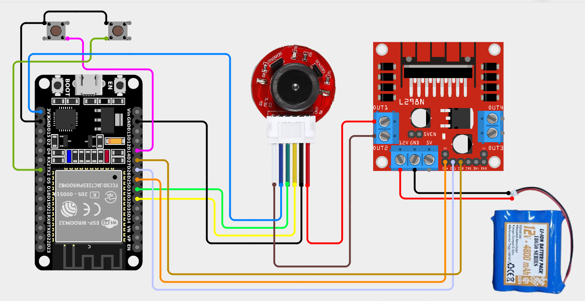

*Gambar 12: Wiring diagram sistem lengkap Percobaan 5 — encoder + driver motor + 2 tombol target RPM, seluruhnya terhubung ke satu ESP32*

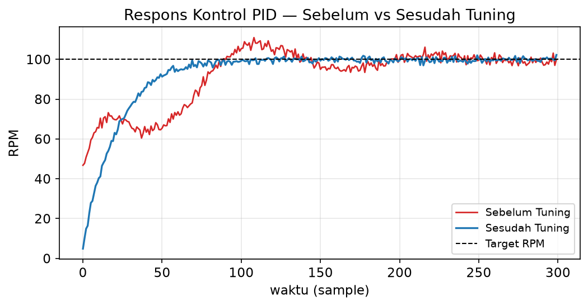

*Gambar 13: Contoh grafik Serial Plotter respons sistem sebelum tuning (lambat/berosilasi/overshoot besar) dibandingkan setelah tuning (cepat stabil, overshoot terkendali)*

**Skema Rangkaian:**

| Komponen | Pin ESP32 | Keterangan |
|---|---|---|
| Encoder — Channel A / B | GPIO 32 / GPIO 33 | `INPUT_PULLUP`, decoding quadrature |
| Driver motor — ENA / IN1 / IN2 | GPIO 25 / GPIO 26 / GPIO 27 | Sinyal PWM & arah putar motor |
| Tombol Naik Target RPM | GPIO 14 | `INPUT_PULLUP` |
| Tombol Turun Target RPM | GPIO 16 (RX2) | `INPUT_PULLUP` |

Lihat Gambar 12 untuk wiring gabungan seluruh komponen di atas dalam satu rangkaian.

**`platformio.ini`:**
```ini
[env:esp32dev]
platform = espressif32
board = esp32dev
framework = arduino
```

**Langkah Kerja:**
1. Rangkai encoder, driver motor, dan dua tombol target RPM sesuai Gambar 12
2. Upload kode di bawah
3. Tekan tombol naik sampai target ≈ 100 RPM — motor otomatis mengejar
4. Amati Serial Plotter — respons awal biasanya belum bagus. Screenshot sebagai **"sebelum tuning"**
5. **Tuning** satu parameter per waktu:
   - Naikkan **Kp** sampai respons cepat tapi belum berosilasi liar
   - Tambah **Ki** sampai target tercapai (steady-state error hilang)
   - Tambah **Kd** kalau masih overshoot
   - Screenshot hasil akhir sebagai **"setelah tuning"** (bandingkan Gambar 13)
6. Bandingkan bentuk respons yang Anda dapatkan di sepanjang proses tuning dengan jenis-jenis hasil umum pada Gambar 14 — analisis kombinasi Kp/Ki/Kd apa yang kira-kira menyebabkan tiap jenis respons tersebut

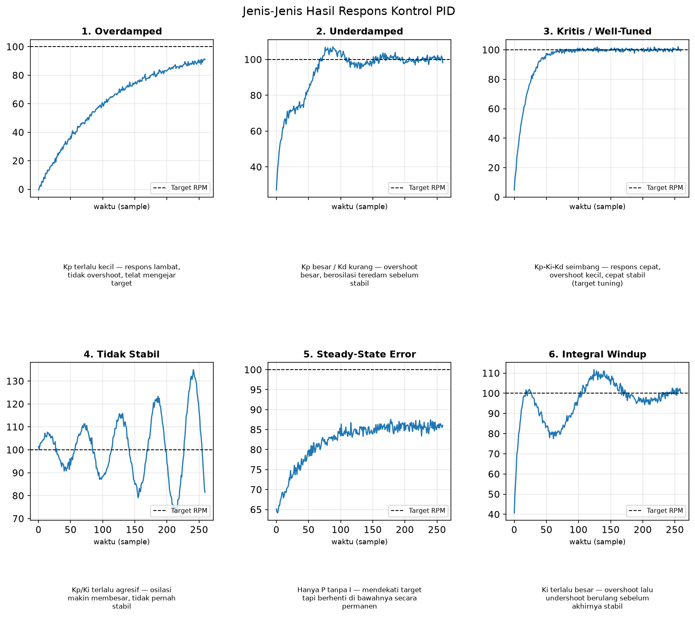

*Gambar 14: Jenis-jenis hasil respons kontrol PID — overdamped, underdamped, kritis/well-tuned, tidak stabil, steady-state error, dan integral windup*

**Kode Program (Kontrol PID Lengkap — Encoder, Filter, PID, Tombol Target):**
```cpp
#include <Arduino.h>
#include <math.h>

// ==================== ENCODER ====================
constexpr uint8_t ENCODER_A_PIN = 32;
constexpr uint8_t ENCODER_B_PIN = 33;

// Estimasi dari spesifikasi motor JGA25-370 1000RPM — bukan hasil kalibrasi manual
constexpr float PULSES_PER_OUTPUT_REV = 102.0f;

volatile int32_t encoderCount = 0;
portMUX_TYPE encoderMux = portMUX_INITIALIZER_UNLOCKED;

int32_t previousCount = 0;
uint32_t previousSampleTime = 0;
constexpr uint32_t SAMPLE_INTERVAL_MS = 100;

// ==================== DRIVER MOTOR (L298N) ====================
constexpr uint8_t ENA_PIN = 25;
constexpr uint8_t IN1_PIN = 26;
constexpr uint8_t IN2_PIN = 27;

constexpr int PWM_CHANNEL = 0;
constexpr uint32_t PWM_FREQUENCY = 1000;
constexpr uint8_t PWM_RESOLUTION = 8;

constexpr int PWM_MIN = 0;
constexpr int PWM_MIN_RUN = 55; // PWM minimum agar motor benar-benar berputar
constexpr int PWM_MAX = 255;

// ==================== TOMBOL TARGET RPM ====================
constexpr uint8_t BUTTON_UP_PIN = 14;
constexpr uint8_t BUTTON_DOWN_PIN = 16;
constexpr float TARGET_STEP_RPM = 10.0f;
constexpr float TARGET_MIN_RPM = 0.0f;
constexpr float TARGET_MAX_RPM = 200.0f;
constexpr uint32_t DEBOUNCE_MS = 40;

float targetRPM = 0.0f;

struct Button
{
    uint8_t pin;
    bool lastRawState;
    bool stableState;
    uint32_t lastChangeTime;
};

Button buttonUp = {BUTTON_UP_PIN, HIGH, HIGH, 0};
Button buttonDown = {BUTTON_DOWN_PIN, HIGH, HIGH, 0};

// ==================== FILTER (ALPHA) ====================
constexpr float FILTER_ALPHA = 0.70f;

float rawRPM = 0.0f;
float filteredRPM = 0.0f;

// ==================== PID ====================
// Nilai awal untuk memulai tuning — BUKAN nilai final
float Kp = 2.0f;
float Ki = 0.8f;
float Kd = 0.05f;

constexpr float INTEGRAL_MIN = -150.0f;
constexpr float INTEGRAL_MAX = 150.0f;

float integralError = 0.0f;
float previousError = 0.0f;
int currentPWM = 0;

// ==================== INTERRUPT ENCODER ====================
void IRAM_ATTR encoderA_ISR()
{
    bool channelB = digitalRead(ENCODER_B_PIN);

    portENTER_CRITICAL_ISR(&encoderMux);
    if (channelB == HIGH)
        encoderCount++;
    else
        encoderCount--;
    portEXIT_CRITICAL_ISR(&encoderMux);
}

// ==================== PEMBACAAN TOMBOL (DEBOUNCE) ====================
bool buttonPressed(Button &button)
{
    bool rawState = digitalRead(button.pin);

    if (rawState != button.lastRawState)
    {
        button.lastRawState = rawState;
        button.lastChangeTime = millis();
    }

    if (millis() - button.lastChangeTime >= DEBOUNCE_MS && rawState != button.stableState)
    {
        button.stableState = rawState;
        if (button.stableState == LOW)
        {
            return true;
        }
    }
    return false;
}

// ==================== KONTROL MOTOR ====================
void applyMotorPWM(int pwm)
{
    pwm = constrain(pwm, PWM_MIN, PWM_MAX);
    currentPWM = pwm;

    if (pwm == 0)
    {
        ledcWrite(PWM_CHANNEL, 0);
        digitalWrite(IN1_PIN, LOW);
        digitalWrite(IN2_PIN, LOW);
        return;
    }

    digitalWrite(IN1_PIN, HIGH);
    digitalWrite(IN2_PIN, LOW);
    ledcWrite(PWM_CHANNEL, pwm);
}

void stopMotor()
{
    applyMotorPWM(0);
    integralError = 0.0f;
    previousError = 0.0f;
}

// ==================== PERHITUNGAN PID ====================
void updatePID(float deltaTime)
{
    if (targetRPM <= 0.0f)
    {
        stopMotor();
        return;
    }

    float error = targetRPM - filteredRPM;
    integralError += error * deltaTime;
    integralError = constrain(integralError, INTEGRAL_MIN, INTEGRAL_MAX);

    float derivativeError = (error - previousError) / deltaTime;

    float pidOutput = (Kp * error) + (Ki * integralError) + (Kd * derivativeError);

    // Jika output PID kecil tapi target belum nol, beri PWM minimum agar motor mulai bergerak
    if (pidOutput > 0.0f && pidOutput < PWM_MIN_RUN)
    {
        pidOutput = PWM_MIN_RUN;
    }

    pidOutput = constrain(pidOutput, (float)PWM_MIN, (float)PWM_MAX);
    applyMotorPWM((int)pidOutput);

    previousError = error;
}

// ==================== SETUP ====================
void setup()
{
    Serial.begin(115200);

    pinMode(ENCODER_A_PIN, INPUT_PULLUP);
    pinMode(ENCODER_B_PIN, INPUT_PULLUP);
    attachInterrupt(digitalPinToInterrupt(ENCODER_A_PIN), encoderA_ISR, RISING);

    pinMode(BUTTON_UP_PIN, INPUT_PULLUP);
    pinMode(BUTTON_DOWN_PIN, INPUT_PULLUP);

    pinMode(IN1_PIN, OUTPUT);
    pinMode(IN2_PIN, OUTPUT);
    ledcSetup(PWM_CHANNEL, PWM_FREQUENCY, PWM_RESOLUTION); // konfigurasi channel PWM (core 2.x)
    ledcAttachPin(ENA_PIN, PWM_CHANNEL);                   // hubungkan channel ke pin ENA

    stopMotor();
    previousSampleTime = millis();
}

// ==================== LOOP ====================
void loop()
{
    if (buttonPressed(buttonUp))
    {
        targetRPM = constrain(targetRPM + TARGET_STEP_RPM, TARGET_MIN_RPM, TARGET_MAX_RPM);
    }

    if (buttonPressed(buttonDown))
    {
        targetRPM = constrain(targetRPM - TARGET_STEP_RPM, TARGET_MIN_RPM, TARGET_MAX_RPM);
        if (targetRPM <= 0.0f)
        {
            stopMotor();
        }
    }

    uint32_t currentTime = millis();
    if (currentTime - previousSampleTime >= SAMPLE_INTERVAL_MS)
    {
        float deltaTime = (currentTime - previousSampleTime) / 1000.0f;

        int32_t currentCount;
        portENTER_CRITICAL(&encoderMux);
        currentCount = encoderCount;
        portEXIT_CRITICAL(&encoderMux);

        int32_t deltaCount = currentCount - previousCount;
        previousCount = currentCount;

        // Konversi pulsa -> RPM
        rawRPM = fabsf((deltaCount * 60.0f) / (PULSES_PER_OUTPUT_REV * deltaTime));

        // Filtering alpha (dapat diganti Kalman filter — lihat Latihan Tambahan)
        filteredRPM = FILTER_ALPHA * filteredRPM + (1.0f - FILTER_ALPHA) * rawRPM;

        // Kontrol PID
        updatePID(deltaTime);

        // Output untuk Serial Plotter
        Serial.print(">Target:");
        Serial.print(targetRPM, 2);
        Serial.print(",RPM:");
        Serial.print(filteredRPM, 2);
        Serial.print(",PWM:");
        Serial.print(currentPWM);
        Serial.println();

        previousSampleTime = currentTime;
    }
}
```

**Penjelasan Kode:**
| Bagian | Penjelasan |
|---|---|
| `updatePID()` | Implementasi langsung persamaan PID diskret pada Dasar Teori C.5, termasuk integral clamping dan PWM minimum |
| `integralError = constrain(integralError, INTEGRAL_MIN, INTEGRAL_MAX)` | Mencegah *integral windup* — akumulasi error yang membesar tanpa batas saat sistem tidak dapat mengejar target dalam waktu lama |
| `PWM_MIN_RUN` | Mengatasi *deadzone* motor — output PID kecil namun bukan nol dinaikkan ke ambang minimum agar motor benar-benar mulai berputar |
| `buttonPressed()` dengan `struct Button` | Debouncing berbasis state machine (sama seperti Modul 1) untuk kedua tombol target RPM, mencegah satu kali tekan terhitung berkali-kali |
| Alur `loop()` | Menggabungkan seluruh tahapan modul ini dalam satu siklus sampling: decoding encoder → konversi RPM → filtering → kontrol PID → tampilkan hasil |

---

## F. Tugas Modul

*(Sementara dikosongkan — akan diisi ulang menyesuaikan struktur baru modul ini.)*

---

## G. Referensi
1. sss2022, *Closed-Loop Speed Control of a DC Motor With Encoder Using a Discrete PI Controller on Arduino*, Instructables — rujukan formula RPM, filter, dan struktur kontrol PI, https://www.instructables.com/Closed-Loop-Speed-Control-of-a-DC-Motor-With-Encod/
2. Greg Welch & Gary Bishop, *An Introduction to the Kalman Filter*, University of North Carolina at Chapel Hill — referensi dasar teori Kalman filter
3. Espressif Systems, *ESP32 Arduino Core Documentation — LEDC*, https://docs.espressif.com/projects/arduino-esp32/
4. Katsuhiko Ogata, *Modern Control Engineering*, Pearson — referensi dasar teori kontrol PID
5. PlatformIO Documentation, https://docs.platformio.org/
6. badlogic, *Serial Plotter — VSCode Extension*, digunakan untuk visualisasi data Serial Plotter pada seluruh Percobaan modul ini, https://github.com/badlogic/serial-plotter
